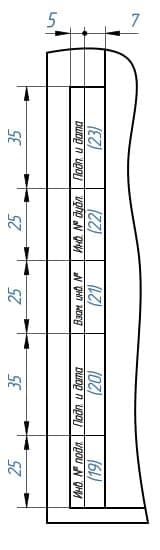

Content

- [Word](#Word)
- [Expression](#Expression)

### Word

| русский                 | 中文              |
|-------------------------|-------------------|
| инженерная графика        | 工程图形        |
| начертательная геометрия  | 描述性几何学      |
| инструмент                | 工具          |
| стирательная резинка      | 橡皮          |
| линейка                   | 直尺          |
| деревянный                | 木制的         |
| пластиковый               | 塑料的         |
| рейсшина                  | 丁字尺         |
| транспортир               | 量角器         |
| циркуль                   | 圆规          |
| лекало                    | 曲线板         |
| черчение                  | 制图，绘图       |
| формат                    | 大小，图纸规格     |
| располагать расположить   | 排列，布置       |
| масштаб                   | 比例          |
| размер                    | 大小          |
| чертеж                    | 平面图，图纸      |
| объект                    | 目标          |
| натура                    | 自然，实际       |
| истинный                  | 真正的         |
| чертежный                 | 绘图的         |
| шрифт                     | 字体          |
| параметр                  | 参数          |
| основный                  | 主要的         |
| прописочный               | 注册的         |
| миллиметр                 | 毫米          |
| стандарт                  | 标准，规格       |
| устанавливать             | 制定，规定       |
| наклон                    | 倾斜          |
| строка                    | 行           |
| шаг                       | 间距          |
| строчной                  | 小写的         |
| толщина                   | 厚度，粗度       |
| наименование              | 名称          |
| сплошной                  | 实心的         |
| основная                  | 基线          |
| тонкий                    | 细的          |
| волнистая                 | 波浪线         |
| Штриховая                 | 阴影线         |
| Штрихпунктирный           | 虚线的         |
| утолщенный                | 稍厚的         |
| разомкнутый               | 断开的         |
| сплошной                  | 连续的         |
| излом                     | 拐点，折点       |
| Начертание                | 图形          |
| линия                     | 线           |
| назначение                | 用途，功能       |
| видимый                   | 可见的，表面的     |
| контур                    | 外形，轮廓       |
| разрез                    | 剖面          |
| состав                    | 组成          |
| наложенный                | 叠加的         |
| размерный                 | 尺度的，合乎度量标准的 |
| выносной                  | 外设的，引出的     |
| штриховка                 | 截面线         |
| подчеркивание             | 强调，重点       |
| обрыв                     | 断裂，断线       |
| разграничение             | 划分          |
| осевой                    | 轴的          |
| симметрия                 | 对称          |
| подлежащий                | 可能的         |
| термообработка            | 热处理         |
| изображение               | 图像，描述       |
| секущий                   | 切开的         |
| сгиб                      | 弯曲的         |
| развертка                 | 展开图         |
| промежуточный             | 中间的，过渡的     |
| совмещенный               | 重合的，组合的     |
| выноска                   | 附图          |

### Expression

国标直线标准CN

| 命名     | 图形 | 厚度         | 用途                                 |
|--------|----|------------|------------------------------------|
| 实心基准线  |    | s          | 可见轮廓线；可见过渡线；断面轮廓线呈现并包含在断面中。        |
| 实心细线   |    | s/3 ~ s/2  | 叠加轮廓线；尺寸线和延长线；截面线；附图线；标题的下划线。      |
| 实心波浪线  |    | s/3 ~ s/2  | 断裂线；划分线和断面分界线。                     |
| 阴影线    |    | s/3 ~ s/2  | 不可见的轮廓线；不可见的过渡线。                   |
| 虚细线    |    | s/3 ~ s/2  | 轴线和中心线；剖面线是叠加或勾勒剖面的对称轴。            |
| 虚粗线    |    | s/2 ~ 2s/3 | 表示要进行热处理的表面的线条；表示切割面前面的元素的线条       |
| 截面线    |    | s ~ 3s/2   | 分段线                                |
| 折线     |    | s/3 ~ s/2  | 长长的断裂线                             |
| 双点阴影细线 |    | s/3 ~ s/2  | 铰刀上的弯曲线；表示边缘或中间位置产品的线；表示铰刀与视图结合的线。 |

俄标直线标准PY

| Наименование               | Начертание          | Толщина линии  | Основное назначение                                                                                                                                   |
|----------------------------|---------------------|----------------|-------------------------------------------------------------------------------------------------------------------------------------------------------|
| Сплошная основная          |   | s              | Линии видимого контура; линии перехода видимые; линии контура сечения, вынесенного и входящего в состав разреза                                       |
| Сплошная тонкая            |    | От s/3 до s/2  | Линии контура наложенного сечения; размерные и выносные линии; линии штриховки; линии-выноски; полки линий-выносок и подчеркивание надписей           |
| Сплошная волнистая         |   | От s/3 до s/2  | Линии обрыва; линии разграничения вида и разреза                                                                                                      |
| Штриховая                  |     | От s/3 до s/2  | Линии невидимого контура; невидимые линии перехода                                                                                                    |
| Штрихпунктирная тонкая     |     | От s/3 до s/2  | Осевые и центровые линии; линии сечений, являющихся осями симметрии для наложенных или вынесенных сечений                                             |
| Штрихпунктирная утолщенная |     | От s/2 до 2s/3 | Линии, обозначающие поверхности, подлежащие термообработке; линии для изображения элементов, расположенных перед секущей плоскостью                   |
| Разомкнутая                |     | От s до 3s/2   | Линии сечений                                                                                                                                         |
| Сплошная тонкая с изломом  |      | От s/3 до s/2  | Длинные линии обрывов                                                                                                                                 |
| Штрихпунктирная тонкая     |  | От s/3 до s/2  | Линии сгиба на развертках; линии для изображения изделий в крайних или промежуточных положениях; линии для изображения развертки, совмещенной с видом |

制图字体标准
- 字号参数h：由大写字母的高度决定，单位是毫米
- A型和B型字体可以不倾斜，也可以倾斜到75°左右。
- A型字体：字体的所有参数（间距，线条粗细等）都是h/14的倍数
- B型字体：字体的所有参数（间距，线条粗细等）都是h/10的倍数
  - 字体线粗细-h/10
  - 小写字母的高度--7h/10
  - 字母间距-2h/10
  - 最小行距--17h/10
  - 词与词之间的最小距离--6h/10
  
  

标题栏标准
- A4幅面的扉页（左）A4幅面的尾页（右）

- 
- 标题栏位置
  - 标题栏在A4图纸上的位置
    -  
    
  - 标题栏在尺寸大于A4的图纸沿长边的位置
    - 
  - 标题栏在尺寸大于A4的图纸沿短边的位置
    - 

- 标题栏内容
  - 图纸和图表的基本说明（上）及后续的图纸、图表和文件的基本说明（下）

  
  
    - 1-工件名称，应符合技术术语，并尽量简短，并以单数一格形式书写。当名称由多个词组成时，名词排在最前面。例如«Колесо зубчатое»。名称中不说明产品的用途和位置。
    - 2-文件标记，以书面符号的形式记录。文件标记由数字和字母按一定顺序书写。每份文件都有一个由点号分隔的字符组成的标记。其中的产品索引可以用字母或等价的数字表示，如«УЧ-01.10.06.01» 或者 «202.10.06.01»，其中：
      - 202 或 УЧ-01 -开发人员设置的索引
      - 10 -产品中包含的装配单元的序列号
      - 06 -装配编号
      - 01 -零件编号
    - 3-材料栏，用于标明工件的材料，仅在工件图纸上进行填写，例如：Сталь 08кп ГОСТ 1050 – 88
    - 4-文件代号，此处应填写字母，该字母表示文件的发展阶段，字母代号如下：
      - П-技术提案
      - Э-概念设计（初步设计）
      - Т-技术设计
      - О-生产试点
      - А-根据生产试点结果调整后的文件
      - Б-根据以代号为A的图纸文件进行产品制造的结果，进一步调整后的文件
    - 5-产品质量，一般填写工件的实际质量（即通过机械称量确定的产品质量数值），以不含计量标记的数字表示，允许指示度量单位，例如：0,25 т，15 т。在以下情况中，允许填写工件的计量质量：
      - 1-在生产试点之前，工件不存在实际质量，可以填写计量质量
      - 2-在生产试点后，该工件因为过大等原因，难以通过机械称重确定其实际质量，可以填写计量值，允许指出在技术要求中质量的最大偏差值
      - ** 补充说明：在原型图，尺寸图和安装图中不标明质量 ** 
    - 6-比例，即图像尺寸与零件实际尺寸的比值，应根据所描绘的零件实际尺寸以及纸张大小选择。
    - 7-图纸页码，当只有一份图纸时不得标注页码
    - 8-图纸总页数，仅在文件第一页注明
    - 9-发行该文件的公司名称
    - 10-附加行。开发人员根据情况另外填写的一行，例如：“Начальник департамента”，“Начальник бюро”。
    - 11-签署文件的人员的姓
    - 12-签名处，至少由开发商和负责监管的人员签署，且必须无误
    - 13-文件签署日期
    - 14-18栏是用来进行修改的

    
    
    - 19-原文件的库存编号，为便于记录和保管，每份原始文件都有一个库存编号，不计入纸张数。如果文件仅由多张纸组成，则对每张纸应用这种标识符
    - 20-技术部门收到文件的人的签名栏，注明日期
    - 21-更改文档时，在这里填写原件的附加库存编号，而不是文档的先前的库存编号。先前的库存编号会被保留
    - 22-副本的库存编号，无论纸张数量多少，重复副本都会分配一个库存编号并标注在每一张纸上。
    - 23-技术部门收到副本的人的签名，并注明日期
    - 24-这里写的是文件代号，而不是签发文件的纸张
    - 25-这一栏表示首次记录的文件。

    
    - 26-文件名称代码，相对于图纸的工作区域旋转180°
    - 27-客户提供的规范性技术文件设置标志。
    - 28-相关诉讼文件的编号和批准日期。
    - 29-文件批准的编号和日期
    - 30-客户编码
    - 31-文件复印员
    - 32-纸张格式
    - 33-指明产品修改部分所在的区域
    - 34-开发人员的证书编号  
  [标题栏规范材料原文](http://gk-drawing.ru/plotting/inscription.php)
- 尺寸标注
  - 作用：为了确定被描绘的产品以及其各个部分的尺寸大小。
  - 分类：尺寸分为线和角度。线的尺寸描述了产品被测量部分的长度、宽度、厚度、高度、直径或半径。角度的尺寸描述了一个角度的大小。
  - 规范：线性尺寸在图纸上以毫米为单位表示，但不标明计量单位。角度尺寸以度、分、秒为单位，并注明计量单位。
  - 要求：在满足产品制造以及检验的需求下，尽可能地使图纸中标注的尺寸数量最少。

