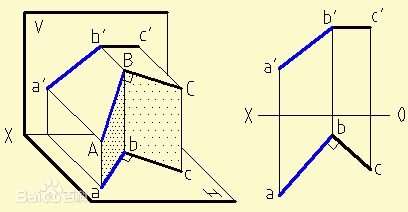

Content

- [Word](#Word)
- [Expression](#Expression)

### Word

| русский                 | 中文              |
|-------------------------|-------------------|

### Expression
- 图形几何学(Начертательная геометрия)
  - 概念：图形几何学是组成工程教育的基础科学之一。它研究平面内空间几何图形的表示方法，以及利用这些表示方法解决空间中的度量和位置问题。
  - 应用：图形几何学的方法可以解决许多特殊工程学科的应用问题（力学、化学、晶体学、制图学、仪器科学等）。
  - 图形几何学发展了人类的空间思维，没有空间思维，任何工程创意都是不可想象的。
  - 历史：图形几何学作为一门科学，是由法国伟大的几何学家和工程师加斯帕德-蒙日（Гаспаром Монжем，1746-1818）在18世纪末创立的。
早在蒙日之前的16世纪，德国数学家和艺术家阿尔布雷希特-丢勒(Альбрехтом Дюрером，1471-1528)就首次提出了空间图形在平面上正交投影的思想，他发展了圆锥截面和一些空间曲线的正交表现方法。
1637年，法国几何学家、哲学家勒内-笛卡尔（Рене Декарт，1596-1650）创立了坐标法，奠定了解析几何学的基础；他的同胞、工程师和数学家吉拉尔-德萨格（Жирар Дезаг，1593-1662）用这种坐标法构造透视投影，创立了轴测投影理论。
17世纪，俄罗斯成功地发展了按比例绘制的平面图和剖面图的技术图纸。在这里，首先应该提到俄国杰出的机械师和发明家I.P.库里宾（И.П.Кулибина，1735-1818）的图纸。

- 投影
  - 中央投影  
    概念：所有的投影线都交于同一中央点S，这样的投影就是中央投影  
    中央投影特点：
    - 1，点的投影是一个点
    - 2，直线的投影是一条直线
    - 3，几条平行直线点在上的投影就是点在该直线的投影上的投影。
  - 平行投影  
    概念：所有的投影线都平行于给定的方向т，这种投影就是平行投影  
    平行投影特点：
    - 拥有中央投影的特点
    - 4，平行投影的投影线是平行的
    - 5，位于平行线或同一条线上的线段的投影比例等于线段本身的比例
    - 6，在投影平面平行移动时，图形的投影不发生变化
  - 正投影  
    概念：正交投影是平行投影的特殊情况：即投影方向т垂直于投影平面
    正交投影特点：  
    - 正交投影具有平行投影和中央投影的所有特点
    - 满足直角投影定理
  - 直角投影定理：直角投影定理，垂直相交的两直线，若其中一直线平行于某投影面，则两直线在该投影面上的投影仍然反映直角关系。
  - 证明：如图5-15所示，AB、BC为相交成直角的两直线，其中直线BC平行于H面（即水平线），直线AB为一般位置直线。现证明两直线的水平投影ab和bc仍相互垂直，即bc⊥ab 。
证明：如图5-15所示，因为BC⊥Bb，BC⊥AB ， 所以BC⊥平面AB ba;又因BC∥bc，所以bc也垂直于平面AB ba。根据立体几何定理可知bc垂直于平面ABba上的所有直线，故bc⊥ab。  
    
  - 适用于图形投影的主要要求：
    - обратимость：可以通过投影还原原件图像，能够确定对象的形状和尺寸，描述其大小，位置及与环境的关系
    - Наглябность：图像应创造出物体形状的空间表现
    - Точность：在图纸上绘出的图形必须给出合理准确的结果
    - Простота：图像的结构应简单，并应允许以一连串图形操作的形式对对象进行明确的描述