# 工程制图

## 第一章：制图标准
    
### §1.1. 直线标准
- 国标直线标准CN

    | 命名         | 图形 | 厚度                 | 用途                                 |
    |--------|----|------------|------------------------------------|
    | 实心基准线    |        | s                    | 可见轮廓线；可见过渡线；断面轮廓线呈现并包含在断面中。                |
    | 实心细线     |      | s/3 ~ s/2    | 叠加轮廓线；尺寸线和延长线；截面线；附图线；标题的下划线。            |
    | 实心波浪线    |      | s/3 ~ s/2    | 断裂线；划分线和断面分界线。                                         |
    | 阴影线        |        | s/3 ~ s/2    | 不可见的轮廓线；不可见的过渡线。                                     |
    | 虚细线        |      | s/3 ~ s/2    | 轴线和中心线；剖面线是叠加或勾勒剖面的对称轴。                        |
    | 虚粗线        |      | s/2 ~ 2s/3 | 表示要进行热处理的表面的线条；表示切割面前面的元素的线条             |
    | 截面线        |        | s ~ 3s/2     | 分段线                                                                |
    | 折线         |      | s/3 ~ s/2    | 长长的断裂线                                                         |
    | 双点阴影细线 |      | s/3 ~ s/2    | 铰刀上的弯曲线；表示边缘或中间位置产品的线；表示铰刀与视图结合的线。 |

- 俄标直线标准PY

    | Наименование | Начертание | Толщина линии | Основное назначение |
    |--------------|------------|---------------|---------------------|
    | Сплошная основная |  | s | Линии видимого контура; линии перехода видимые; линии контура сечения, вынесенного и входящего в состав разреза |
    | Сплошная тонкая |  | От s/3 до s/2 | Линии контура наложенного сечения; размерные и выносные линии; линии штриховки; линии-выноски; полки линий-выносок и подчеркивание надписей |
    | Сплошная волнистая |  | От s/3 до s/2 | Линии обрыва; линии разграничения вида и разреза |
    | Штриховая |  | От s/3 до s/2 | Линии невидимого контура; невидимые линии перехода |
    | Штрихпунктирная тонкая |  | От s/3 до s/2 | Осевые и центровые линии; линии сечений, являющихся осями симметрии для наложенных или вынесенных сечений |
    | Штрихпунктирная утолщенная |  | От s/2 до 2s/3 | Линии, обозначающие поверхности, подлежащие термообработке; линии для изображения элементов, расположенных перед секущей плоскостью |
    | Разомкнутая |  | От s до 3s/2 | Линии сечений |
    | Сплошная тонкая с изломом |  | От s/3 до s/2 | Длинные линии обрывов |
    | Штрихпунктирная тонкая |  | От s/3 до s/2 | Линии сгиба на развертках; линии для изображения изделий в крайних или промежуточных положениях; линии для изображения развертки, совмещенной с видом |

### §1.2. 制图字体标准
- 字号参数h：由大写字母的高度决定，单位是毫米
- A型和B型字体可以不倾斜，也可以倾斜到75°左右。
- A型字体：字体的所有参数（间距，线条粗细等）都是h/14的倍数
- B型字体：字体的所有参数（间距，线条粗细等）都是h/10的倍数
    - 字体线粗细-h/10
    - 小写字母的高度--7h/10
    - 字母间距-2h/10
    - 最小行距--17h/10
    - 词与词之间的最小距离--6h/10
    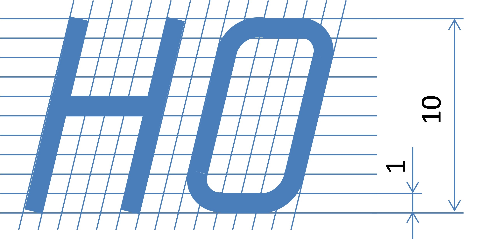
    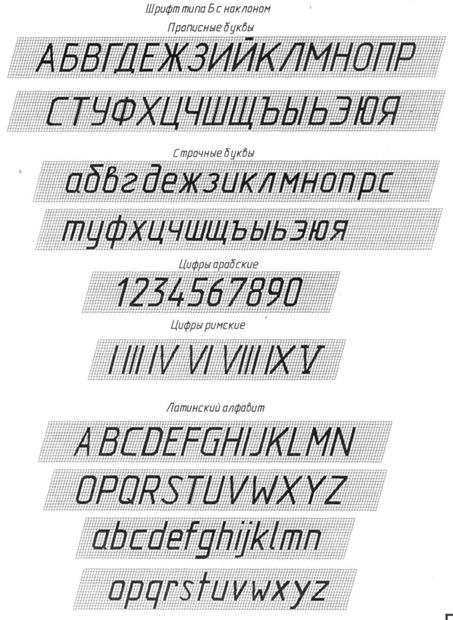

### §1.3. 标题栏标准
- A4幅面的扉页（左）A4幅面的尾页（右）

- 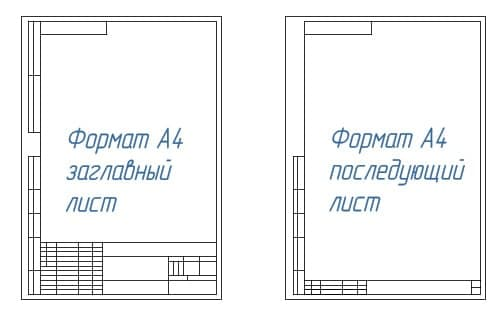
- 标题栏位置
    - 标题栏在A4图纸上的位置
        -  
        
    - 标题栏在尺寸大于A4的图纸沿长边的位置
        - 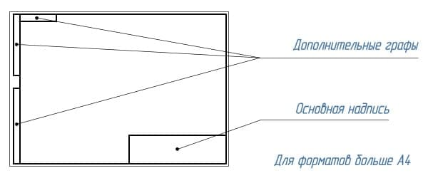
    - 标题栏在尺寸大于A4的图纸沿短边的位置
        - 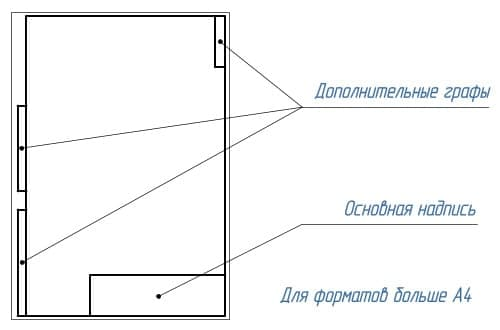

- 标题栏内容
    - 图纸和图表的基本说明（上）及后续的图纸、图表和文件的基本说明（下）

    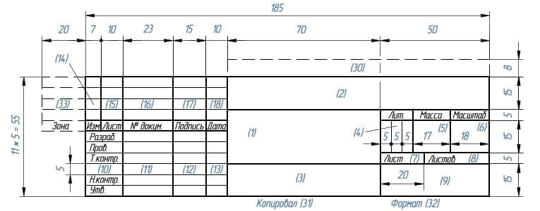
    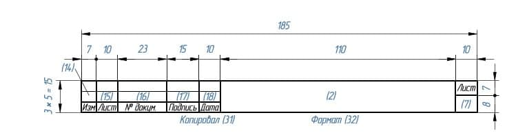
    - 1-工件名称，应符合技术术语，并尽量简短，并以单数一格形式书写。当名称由多个词组成时，名词排在最前面。例如«Колесо зубчатое»。名称中不说明产品的用途和位置。
    - 2-文件标记，以书面符号的形式记录。文件标记由数字和字母按一定顺序书写。每份文件都有一个由点号分隔的字符组成的标记。其中的产品索引可以用字母或等价的数字表示，如«УЧ-01.10.06.01» 或者 «202.10.06.01»，其中：
        - 202 或 УЧ-01 -开发人员设置的索引
        - 10 -产品中包含的装配单元的序列号
        - 06 -装配编号
        - 01 -零件编号
    - 3-材料栏，用于标明工件的材料，仅在工件图纸上进行填写，例如：Сталь 08кп ГОСТ 1050 – 88
    - 4-文件代号，此处应填写字母，该字母表示文件的发展阶段，字母代号如下：
        - П-技术提案
        - Э-概念设计（初步设计）
        - Т-技术设计
        - О-生产试点
        - А-根据生产试点结果调整后的文件
        - Б-根据以代号为A的图纸文件进行产品制造的结果，进一步调整后的文件
    - 5-产品质量，一般填写工件的实际质量（即通过机械称量确定的产品质量数值），以不含计量标记的数字表示，允许指示度量单位，例如：0,25 т，15 т。在以下情况中，允许填写工件的计量质量：
        - 1-在生产试点之前，工件不存在实际质量，可以填写计量质量
        - 2-在生产试点后，该工件因为过大等原因，难以通过机械称重确定其实际质量，可以填写计量值，允许指出在技术要求中质量的最大偏差值
        - ** 补充说明：在原型图，尺寸图和安装图中不标明质量 ** 
    - 6-比例，即图像尺寸与零件实际尺寸的比值，应根据所描绘的零件实际尺寸以及纸张大小选择。
    - 7-图纸页码，当只有一份图纸时不得标注页码
    - 8-图纸总页数，仅在文件第一页注明
    - 9-发行该文件的公司名称
    - 10-附加行。开发人员根据情况另外填写的一行，例如：“Начальник департамента”，“Начальник бюро”。
    - 11-签署文件的人员的姓
    - 12-签名处，至少由开发商和负责监管的人员签署，且必须无误
    - 13-文件签署日期
    - 14-18栏是用来进行修改的

    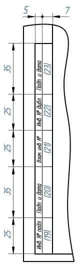
    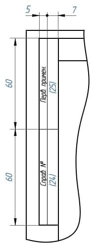
    - 19-原文件的库存编号，为便于记录和保管，每份原始文件都有一个库存编号，不计入纸张数。如果文件仅由多张纸组成，则对每张纸应用这种标识符
    - 20-技术部门收到文件的人的签名栏，注明日期
    - 21-更改文档时，在这里填写原件的附加库存编号，而不是文档的先前的库存编号。先前的库存编号会被保留
    - 22-副本的库存编号，无论纸张数量多少，重复副本都会分配一个库存编号并标注在每一张纸上。
    - 23-技术部门收到副本的人的签名，并注明日期
    - 24-这里写的是文件代号，而不是签发文件的纸张
    - 25-这一栏表示首次记录的文件。

    
    - 26-文件名称代码，相对于图纸的工作区域旋转180°
    - 27-客户提供的规范性技术文件设置标志。
    - 28-相关诉讼文件的编号和批准日期。
    - 29-文件批准的编号和日期
    - 30-客户编码
    - 31-文件复印员
    - 32-纸张格式
    - 33-指明产品修改部分所在的区域
    - 34-开发人员的证书编号

### §1.4. 尺寸标注
- 作用：为了确定被描绘的产品以及其各个部分的尺寸大小。
- 分类：尺寸分为线和角度。线的尺寸描述了产品被测量部分的长度、宽度、厚度、高度、直径或半径。角度的尺寸描述了一个角度的大小。
- 规范：
    国标：具体详见 [中华人民共和国国家标准 GB/T 16675.2-2012](http://c.gb688.cn/bzgk/gb/showGb?type=online&hcno=B417261FEA72D7DFA7511F436BCC5344)
    俄标：`待补充`

## 第二章：图形几何学

### §2.1. 图形几何学简介
- 概念：图形几何学(Начертательная геометрия)是组成工程教育的基础科学之一。它研究平面内空间几何图形的表示方法，以及利用这些表示方法解决空间中的度量和位置问题

- 应用：图形几何学的方法可以解决许多特殊工程学科的应用问题（力学、化学、晶体学、制图学、仪器科学等）

- 图形几何学发展了人类的空间思维，没有空间思维，任何工程创意都是不可想象的
- 历史：图形几何学作为一门科学，是由法国伟大的几何学家和工程师加斯帕德-蒙日（Гаспаром Монжем，1746-1818）在18世纪末创立的。  
早在蒙日之前的16世纪，德国数学家和艺术家阿尔布雷希特-丢勒(Альбрехтом Дюрером，1471-1528)就首次提出了空间图形在平面上正交投影的思想，他发展了圆锥截面和一些空间曲线的正交表现方法。  
1637年，法国几何学家、哲学家勒内-笛卡尔（Рене Декарт，1596-1650）创立了坐标法，奠定了解析几何学的基础；他的同胞、工程师和数学家吉拉尔-德萨格（Жирар Дезаг，1593-1662）用这种坐标法构造透视投影，创立了轴测投影理论。  
17世纪，俄罗斯成功地发展了按比例绘制的平面图和剖面图的技术图纸。在这里，首先应该提到俄国杰出的机械师和发明家I.P.库里宾（И.П.Кулибина，1735-1818）的图纸。

### §2.2. 投影
- 中央投影    
    概念：所有的投影线都交于同一中央点S，这样的投影就是中央投影    
    中央投影特点：
    - 1，点的投影是一个点
    - 2，直线的投影是一条直线
    - 3，几条平行直线点在上的投影就是点在该直线的投影上的投影。
- 平行投影    
    概念：所有的投影线都平行于给定的方向т，这种投影就是平行投影    
    平行投影特点：
    - 拥有中央投影的特点
    - 4，平行投影的投影线是平行的
    - 5，位于平行线或同一条线上的线段的投影比例等于线段本身的比例
    - 6，在投影平面平行移动时，图形的投影不发生变化
- 正投影    
    概念：正交投影是平行投影的特殊情况：即投影方向т垂直于投影平面
    正交投影特点：    
    - 正交投影具有平行投影和中央投影的所有特点
    - 满足直角投影定理
- 直角投影定理：直角投影定理，垂直相交的两直线，若其中一直线平行于某投影面，则两直线在该投影面上的投影仍然反映直角关系。
    - 证明：如图5-15所示，AB、BC为相交成直角的两直线，其中直线BC平行于H面（即水平线），直线AB为一般位置直线。现证明两直线的水平投影ab和bc仍相互垂直，即bc⊥ab 。
    证明：如图5-15所示，因为BC⊥Bb，BC⊥AB ， 所以BC⊥平面AB ba;又因BC∥bc，所以bc也垂直于平面AB ba。根据立体几何定理可知bc垂直于平面ABba上的所有直线，故bc⊥ab。    
        

- 适用于图形投影的主要要求：
    - обратимость：可以通过投影还原原件图像，能够确定对象的形状和尺寸，描述其大小，位置及与环境的关系
    - Наглябность：图像应创造出物体形状的空间表现
    - Точность：在图纸上绘出的图形必须给出合理准确的结果
    - Простота：图像的结构应简单，并应允许以一连串图形操作的形式对对象进行明确的描述

- 轴测投影法
    - 轴测投影
        - 定义：将物体放在三个坐标面和投影线都不平行的位置，使它的三个坐标面在一个投影上都能看到，从而具有立体感，称为“轴测投影”。这样绘出的图形，称为“轴测图”。
    - 分类：
        - 1、按照投影方向与轴测投影面的夹角的不同，轴测图可以分为： 
            1. 正轴测图——轴测投影方向（投影线）与轴测投影面垂直时投影所得到的轴测图；
            2. 斜轴测图——轴测投影方向（投影线）与轴测投影面倾斜时投影所得到的轴测图。
        - 2、按照轴向伸缩系数的不同，轴测图可以分为： 
            1. 正（或斜）等测轴测图——p1=q1=r1 ，简称正（斜）等测图
            2. 正（或斜）二等测轴测图——p1=r1≠q1 ，简称正（斜）二测图
            3. 正（或斜）三等测轴测图——p1≠q1≠r1 ，简称正（斜）三测图
        - 其中常有的有以下两种：
            - 斜二等轴测图
                - 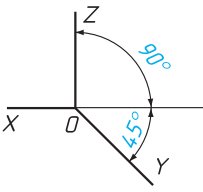
                - x轴于z轴垂直，y轴于x轴z轴的夹角为135°
                - 平行于x轴z轴的线段长度不变，平行于y轴的线段长度缩减为原来的一般（斜二测画法）
            - 正等轴测图
                - 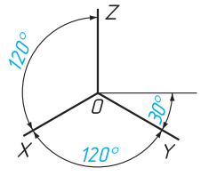
                - xyz轴彼此之间的夹角为120°，x轴，y轴于水平夹角为30°
                - 平行于xyz轴的所有线段长度都不变
- 圆的轴测投影
    - 圆的正等轴测投影
        - 
        - 各椭圆长短轴的简化伸缩系数：
            - 长轴=1.22直径
            - 短轴=0.7半径
    - 四心椭圆法画圆
        - 1. 画出正方形
            - 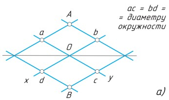
        - 2. 以 B 为圆心，B,a 为半径，画圆，依此类推。
            - 
        - 3. 连接 B,a，交于点 C，以点 C 为圆心，C,a 为半径画圆，依此类推。
            - 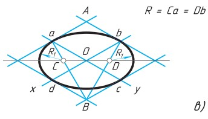
        - 4. 正方形的其他面的椭圆画法依此类推。

### §2.3. 三维空间中的点、面、坐标轴
- 点的三面投影
    - <table><tr><td>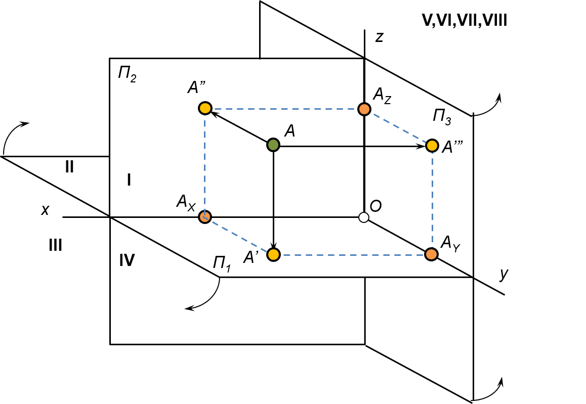</td><td>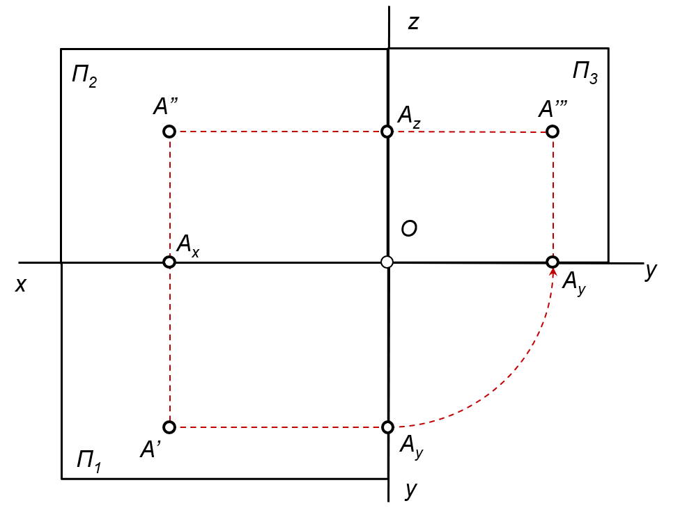</td></tr></table>

- 点的关系
    - 真实点 => 面投影点 => 坐标轴点
    - 象限 => 坐标轴面 => 坐标轴

- 象限中的对称点
    |对称条件|对称中心|
    |-|-|
    |П1|A'|
    |П2|A''|
    |П3|A'''|
    |Ox|Ax|
    |Oy|Ay|
    |Oz|Az|
    |O|O|

- 面
    | 面 | 确定面的坐标轴 | 面投影点 | 面投影点对应的坐标轴点 |
    |---------------|---------|------|-----------------------------|
    | П1 | xy            | A'     | Ax&Ay |
    | П2 | xz            | A''    | Ax&Az |
    | П3 | yz            | A''' | Ay&Az |

- 坐标轴：x y z 三线垂直
    |坐标轴|坐标轴点|确定坐标轴点的面投影点|
    |-|-|-|
    |x|Ax|A'&A''|
    |y|Ay|A'&A'''|
    |z|Az|A''&A'''|

- 象限的正负轴对应关系

- |象限|x轴|y轴|z轴|
    |-|-|-|-|
    |I|+|+|+|
    |II|+|-|+|
    |III|+|-|-|
    |IV|+|+|-|
    |V|-|+|+|
    |VI|-|-|+|
    |VII|-|-|-|
    |VIII|-|+|-|
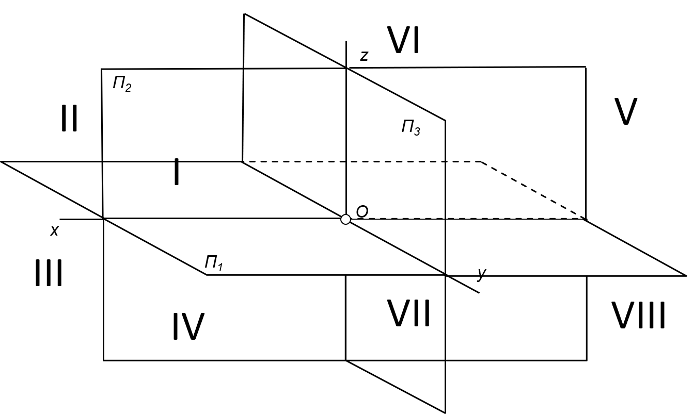

- 平面图反推象限方法
    - [根据面投影点反推坐标轴点](#s1)
    - 根据坐标轴点反推坐标轴正负关系
    - [根据坐标轴正负关系反推象限](#s3)

## §2.4：三维空间中的物体

- 物体的视图
    - 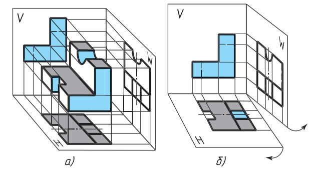
    - 由多个矩形投影组成的图样称为矩形投影系统的图样(чертежом в системе прямоугольных проекций)。根据物体几何形状的复杂程度，可以用一个、两个或多个投影来表示。
    - 物体的三视图
        - 
        - 正视图：由前往后在从正面投影在竖直平面上的图像称为正视图。这个视图一般被设定为图纸中的主图像。因此，这种视图也被称为主视图。在作图时，物体相对于投影的正面平面的位置，应使主视图能最完整地表现物体的形状和尺寸。
        - 俯视图：由上往下投影水平面上的图像称为俯视图。
        - 左视图：由左往右投影的竖直平面上的图像称为左视图。
        - 右，底，后视图：除了前、上、左视图外，必要时还可以用右、底、后视图来表示一个对象。但是，图中的视图数量应该在保证足以充分显示出物体的形状和大小的前提下是最小的。为了减少视图的数量，必要时可以用虚线显示物体表面不可见的部分。为达到同样的目的，也可以使用标准规定的各种符号、标志和铭文。
        - 
        - 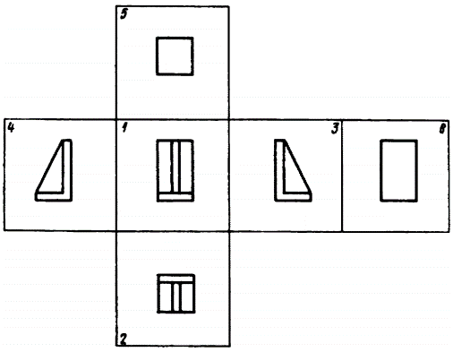
            1. 正视图（主视图）
            2. 俯视图
            3. 左视图
            4. 右视图
            5. 底视图
            6. 后视图
        - 局部视图(местным видом)
            - 对物体表面个别的、有限的区域的描绘称为局部视图。当需要显示单个零件（法兰、键槽等）的形状和尺寸时使用。
            - 局部视图可以通过断线、对称轴等进行约束。可以在图纸上和文字上方标注。它可以自由地放置在图纸中，也可以与其他图像发生投影关系。
            - 使用局部视图可以减少图形工作量，节省绘图领域的空间。
            - 

- 几何体的展开图
    - 展开图
        - 定义：展开图是将制件的表面按一定顺序而连续地摊平在一个平面上所得到的图样
        - 绘图方法：画制件的展开图就是要求画出它的各个表面的实形，并将它们顺序地连画在一起。一般地，我们有两种方法：
            - 计算法
                - 概念：计算法就是用求立体表面积的公式算出展开图的尺寸，按尺寸画图
                - 特点：计算法虽然比较准确，但是对于形状不太规则的曲面，就不便于精确计算或者计算起来显得太繁杂，因此应用这种方法受到一定的限制
            - 图解法
                - 概念：图解法就是用画法几何的作图原理和方法，求画制件各表面的实形，并顺序地连成片，得到制件的展开图，用图解法画其展开图就是先将它们的表面分成若干部分，每一部分又用平面来代替，再顺序而连续地将它们摊平，即得表面展开图
                - 特点：这种展开图是近似的，但只要等分数量恰当，则其误差不会太大，为实际生产所允许
            - 在许多情况下，可综合采用计算法和图解法来画制件的表面展开图，这样既准确又简便
    - 一些典型几何体的展开图实例
        - 棱柱：矩形棱柱的展开图，是由侧面的多个矩形和底面的两个多边形组成的平面图形
        - 圆柱：圆柱体的展开图，是由一个矩形和两个圆组成
        - 圆锥：圆锥面的展开图，是由一个扇形（即侧面的展开图）和一个圆形的底面组成的平面图形。
        - 棱锥：棱锥的展开图由侧面的三角形和地面的多边形组成的平面图形

- 圆的几何构造
    - 圆的等分
        - 4 等分与 8 等分
        - 
        - 
        - 3 等分
        - 
        - 6 等分
        - 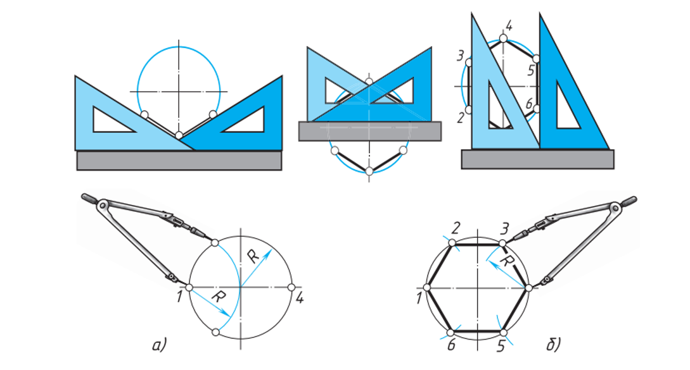
        - 5 分
        - 
    - 圆弧连接
        - 在绘图时，经常会遇到用圆弧来光滑连接已知直线或圆弧的情况，光滑连接也就是在连接处相切。为了保证相切，在作图时就必须准确地作出连接圆弧的圆心和切点。
        - 用已知半径的圆弧连接两条直线
        - 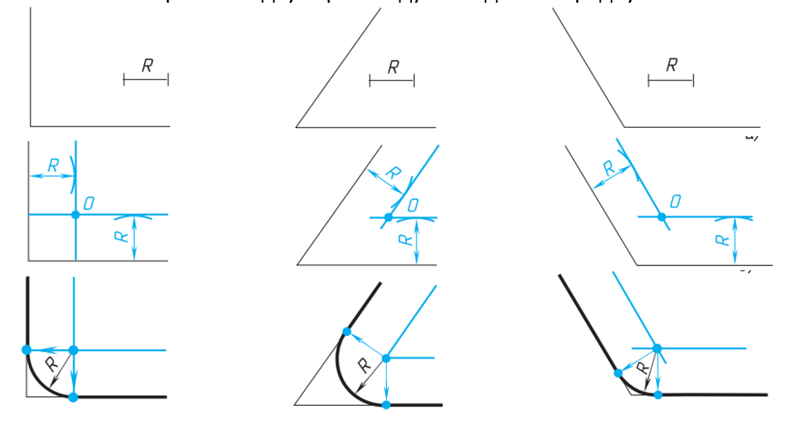
        
    - 共轭圆
        - 给定半径，两圆相切
        - 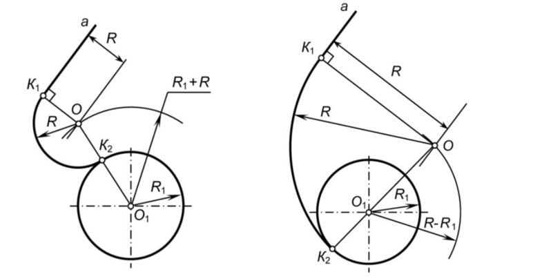
        - 两个圆与第三个圆相切
        - 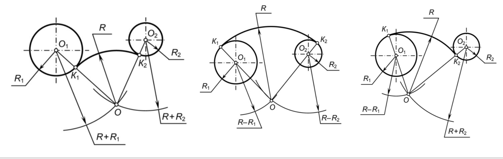
        - 圆的切线与共切线
        - 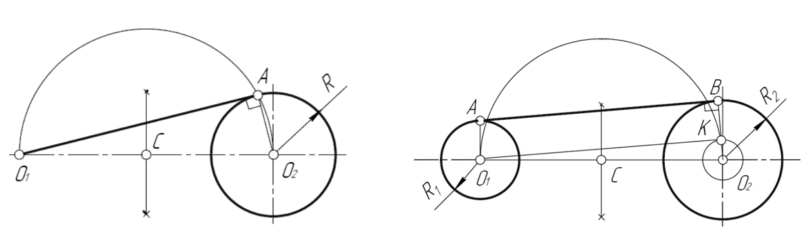

## 第三章 读图
### §3.1 阅读零件图纸
- 要求：阅读图纸包括从平面图像中想象出物体的体积形状，并确定其尺寸
- 步骤：
    1. 阅读图纸上的标题栏。从中你可以了解到零件的名称、制作材料的名称、图像的比例等信息。
    2. 确定图纸上有零件的哪些视图，哪一个是零件的主视图
    3. 通过分析图纸中给出的图像，从图纸上想象出图案各部分的几何形状后，在心里把它们组合成一个整体。
    4. 从图纸上确定图案的尺寸及其元素。

## 参考文献：

- 预科工程制图课件：
    - 《ЕСКД Шрифт ПО.pptx》
    - 《Размеры.pptx》
    - 《Предмет начертательной геометрии.pptx》
    - 《Проецирование точки.pptx》
    - 《Геом построения.pptx》 
- 来自http://gk-drawing.ru/：《[Основная надпись чертежа](http://gk-drawing.ru/plotting/inscription.php)》
