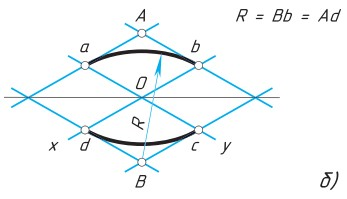
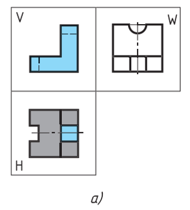
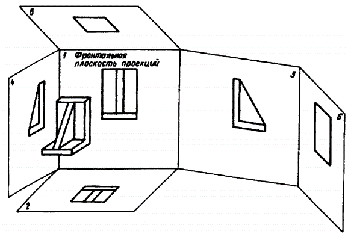

# 工程制图

## 第一章：制图标准
    
### §1.1. 直线标准
- 直线标准CN

    | 命名         | 图形 | 厚度  | 用途         |
    |--------|----|------------|------------------------------------|
    | 实心基准线    |        | s | 可见轮廓线；可见过渡线；断面轮廓线呈现并包含在断面中。 |
    | 实心细线     |      | s/3 ~ s/2    | 叠加轮廓线；尺寸线和延长线；截面线；附图线；标题的下划线。 |
    | 实心波浪线    |      | s/3 ~ s/2    | 断裂线；划分线和断面分界线。  |
    | 阴影线        |        | s/3 ~ s/2    | 不可见的轮廓线；不可见的过渡线。 |
    | 虚细线        |      | s/3 ~ s/2    | 轴线和中心线；剖面线是叠加或勾勒剖面的对称轴。     |
    | 虚粗线        |      | s/2 ~ 2s/3 | 表示要进行热处理的表面的线条；表示切割面前面的元素的线条 |
    | 截面线        |        | s ~ 3s/2     | 分段线 |
    | 折线         |      | s/3 ~ s/2    | 长长的断裂线         |
    | 双点阴影细线 |      | s/3 ~ s/2    | 铰刀上的弯曲线；表示边缘或中间位置产品的线；表示铰刀与视图结合的线。 |

- 直线标准RN

    | Наименование | Начертание | Толщина линии | Основное назначение |
    |--------------|------------|---------------|---------------------|
    | Сплошная основная |  | s | Линии видимого контура; линии перехода видимые; линии контура сечения, вынесенного и входящего в состав разреза |
    | Сплошная тонкая |  | От s/3 до s/2 | Линии контура наложенного сечения; размерные и выносные линии; линии штриховки; линии-выноски; полки линий-выносок и подчеркивание надписей |
    | Сплошная волнистая |  | От s/3 до s/2 | Линии обрыва; линии разграничения вида и разреза |
    | Штриховая |  | От s/3 до s/2 | Линии невидимого контура; невидимые линии перехода |
    | Штрихпунктирная тонкая |  | От s/3 до s/2 | Осевые и центровые линии; линии сечений, являющихся осями симметрии для наложенных или вынесенных сечений |
    | Штрихпунктирная утолщенная |  | От s/2 до 2s/3 | Линии, обозначающие поверхности, подлежащие термообработке; линии для изображения элементов, расположенных перед секущей плоскостью |
    | Разомкнутая |  | От s до 3s/2 | Линии сечений |
    | Сплошная тонкая с изломом |  | От s/3 до s/2 | Длинные линии обрывов |
    | Штрихпунктирная тонкая |  | От s/3 до s/2 | Линии сгиба на развертках; линии для изображения изделий в крайних или промежуточных положениях; линии для изображения развертки, совмещенной с видом |

### §1.2. 制图字体标准
- 字号参数h：由大写字母的高度决定，单位是毫米
- A型和B型字体可以不倾斜，也可以倾斜到75°左右。
- A型字体：字体的所有参数（间距，线条粗细等）都是h/14的倍数
- B型字体：字体的所有参数（间距，线条粗细等）都是h/10的倍数
    - 字体线粗细-h/10
    - 小写字母的高度--7h/10
    - 字母间距-2h/10
    - 最小行距--17h/10
    - 词与词之间的最小距离--6h/10
    
    

### §1.3. 标题栏标准
- A4幅面的扉页（左）A4幅面的尾页（右）

- 
- 标题栏位置
    - 标题栏在A4图纸上的位置
        -  
        
    - 标题栏在尺寸大于A4的图纸沿长边的位置
        - 
    - 标题栏在尺寸大于A4的图纸沿短边的位置
        - 

- 标题栏内容
    - 图纸和图表的基本说明（上）及后续的图纸、图表和文件的基本说明（下）

    
    
    - 1-工件名称，应符合技术术语，并尽量简短，并以单数一格形式书写。当名称由多个词组成时，名词排在最前面。例如«Колесо зубчатое»。名称中不说明产品的用途和位置。
    - 2-文件标记，以书面符号的形式记录。文件标记由数字和字母按一定顺序书写。每份文件都有一个由点号分隔的字符组成的标记。其中的产品索引可以用字母或等价的数字表示，如«УЧ-01.10.06.01» 或者 «202.10.06.01»，其中：
        - 202 或 УЧ-01 -开发人员设置的索引
        - 10 -产品中包含的装配单元的序列号
        - 06 -装配编号
        - 01 -零件编号
    - 3-材料栏，用于标明工件的材料，仅在工件图纸上进行填写，例如：Сталь 08кп ГОСТ 1050 – 88
    - 4-文件代号，此处应填写字母，该字母表示文件的发展阶段，字母代号如下：
        - П-技术提案
        - Э-概念设计（初步设计）
        - Т-技术设计
        - О-生产试点
        - А-根据生产试点结果调整后的文件
        - Б-根据以代号为A的图纸文件进行产品制造的结果，进一步调整后的文件
    - 5-产品质量，一般填写工件的实际质量（即通过机械称量确定的产品质量数值），以不含计量标记的数字表示，允许指示度量单位，例如：0,25 т，15 т。在以下情况中，允许填写工件的计量质量：
        - 1-在生产试点之前，工件不存在实际质量，可以填写计量质量
        - 2-在生产试点后，该工件因为过大等原因，难以通过机械称重确定其实际质量，可以填写计量值，允许指出在技术要求中质量的最大偏差值
        - ** 补充说明：在原型图，尺寸图和安装图中不标明质量 ** 
    - 6-比例，即图像尺寸与零件实际尺寸的比值，应根据所描绘的零件实际尺寸以及纸张大小选择。
    - 7-图纸页码，当只有一份图纸时不得标注页码
    - 8-图纸总页数，仅在文件第一页注明
    - 9-发行该文件的公司名称
    - 10-附加行。开发人员根据情况另外填写的一行，例如：“Начальник департамента”，“Начальник бюро”。
    - 11-签署文件的人员的姓
    - 12-签名处，至少由开发商和负责监管的人员签署，且必须无误
    - 13-文件签署日期
    - 14-18栏是用来进行修改的

    
    
    - 19-原文件的库存编号，为便于记录和保管，每份原始文件都有一个库存编号，不计入纸张数。如果文件仅由多张纸组成，则对每张纸应用这种标识符
    - 20-技术部门收到文件的人的签名栏，注明日期
    - 21-更改文档时，在这里填写原件的附加库存编号，而不是文档的先前的库存编号。先前的库存编号会被保留
    - 22-副本的库存编号，无论纸张数量多少，重复副本都会分配一个库存编号并标注在每一张纸上。
    - 23-技术部门收到副本的人的签名，并注明日期
    - 24-这里写的是文件代号，而不是签发文件的纸张
    - 25-这一栏表示首次记录的文件。

    
    - 26-文件名称代码，相对于图纸的工作区域旋转180°
    - 27-客户提供的规范性技术文件设置标志。
    - 28-相关诉讼文件的编号和批准日期。
    - 29-文件批准的编号和日期
    - 30-客户编码
    - 31-文件复印员
    - 32-纸张格式
    - 33-指明产品修改部分所在的区域
    - 34-开发人员的证书编号

### §1.4. 尺寸标注
- 作用：为了确定被描绘的产品以及其各个部分的尺寸大小。
- 分类：尺寸分为线和角度。线的尺寸描述了产品被测量部分的长度、宽度、厚度、高度、直径或半径。角度的尺寸描述了一个角度的大小。
- 规范：
    国标：具体详见 [中华人民共和国国家标准 GB/T 16675.2-2012](http://c.gb688.cn/bzgk/gb/showGb?type=online&hcno=B417261FEA72D7DFA7511F436BCC5344)
    俄标：`待补充`

## 第二章：图形几何学

### §2.1. 图形几何学简介
- 概念：图形几何学(Начертательная геометрия)是组成工程教育的基础科学之一。它研究平面内空间几何图形的表示方法，以及利用这些表示方法解决空间中的度量和位置问题

- 应用：图形几何学的方法可以解决许多特殊工程学科的应用问题（力学、化学、晶体学、制图学、仪器科学等）

- 图形几何学发展了人类的空间思维，没有空间思维，任何工程创意都是不可想象的
- 历史：图形几何学作为一门科学，是由法国伟大的几何学家和工程师加斯帕德-蒙日（Гаспаром Монжем，1746-1818）在18世纪末创立的。  
早在蒙日之前的16世纪，德国数学家和艺术家阿尔布雷希特-丢勒(Альбрехтом Дюрером，1471-1528)就首次提出了空间图形在平面上正交投影的思想，他发展了圆锥截面和一些空间曲线的正交表现方法。  
1637年，法国几何学家、哲学家勒内-笛卡尔（Рене Декарт，1596-1650）创立了坐标法，奠定了解析几何学的基础；他的同胞、工程师和数学家吉拉尔-德萨格（Жирар Дезаг，1593-1662）用这种坐标法构造透视投影，创立了轴测投影理论。  
17世纪，俄罗斯成功地发展了按比例绘制的平面图和剖视图的技术图纸。在这里，首先应该提到俄国杰出的机械师和发明家I.P.库里宾（И.П.Кулибина，1735-1818）的图纸。

### §2.2. 投影
- 中央投影    
    概念：所有的投影线都交于同一中央点S，这样的投影就是中央投影    
    中央投影特点：
    - 1，点的投影是一个点
    - 2，直线的投影是一条直线
    - 3，几条平行直线点在上的投影就是点在该直线的投影上的投影。
- 平行投影    
    概念：所有的投影线都平行于给定的方向т，这种投影就是平行投影    
    平行投影特点：
    - 拥有中央投影的特点
    - 4，平行投影的投影线是平行的
    - 5，位于平行线或同一条线上的线段的投影比例等于线段本身的比例
    - 6，在投影平面平行移动时，图形的投影不发生变化
- 正投影    
    概念：正交投影是平行投影的特殊情况：即投影方向т垂直于投影平面
    正交投影特点：    
    - 正交投影具有平行投影和中央投影的所有特点
    - 满足直角投影定理
- 直角投影定理：直角投影定理，垂直相交的两直线，若其中一直线平行于某投影面，则两直线在该投影面上的投影仍然反映直角关系。
    - 证明：如图5-15所示，AB、BC为相交成直角的两直线，其中直线BC平行于H面（即水平线），直线AB为一般位置直线。现证明两直线的水平投影ab和bc仍相互垂直，即bc⊥ab 。
    证明：如图5-15所示，因为BC⊥Bb，BC⊥AB ， 所以BC⊥平面AB ba;又因BC∥bc，所以bc也垂直于平面AB ba。根据立体几何定理可知bc垂直于平面ABba上的所有直线，故bc⊥ab。    
        

- 适用于图形投影的主要要求：
    - обратимость：可以通过投影还原原件图像，能够确定对象的形状和尺寸，描述其大小，位置及与环境的关系
    - Наглябность：图像应创造出物体形状的空间表现
    - Точность：在图纸上绘出的图形必须给出合理准确的结果
    - Простота：图像的结构应简单，并应允许以一连串图形操作的形式对对象进行明确的描述

- 轴测投影法
    - 轴测投影
        - 定义：将物体放在三个坐标面和投影线都不平行的位置，使它的三个坐标面在一个投影上都能看到，从而具有立体感，称为“轴测投影”。这样绘出的图形，称为“轴测图”。
    - 分类：
        - 1、按照投影方向与轴测投影面的夹角的不同，轴测图可以分为： 
            1. 正轴测图——轴测投影方向（投影线）与轴测投影面垂直时投影所得到的轴测图；
            2. 斜轴测图——轴测投影方向（投影线）与轴测投影面倾斜时投影所得到的轴测图。
        - 2、按照轴向伸缩系数的不同，轴测图可以分为： 
            1. 正（或斜）等测轴测图——p1=q1=r1 ，简称正（斜）等测图
            2. 正（或斜）二等测轴测图——p1=r1≠q1 ，简称正（斜）二测图
            3. 正（或斜）三等测轴测图——p1≠q1≠r1 ，简称正（斜）三测图
        - 其中常有的有以下两种：
            - 斜二等轴测图
                - 
                - x轴于z轴垂直，y轴于x轴z轴的夹角为135°
                - 平行于x轴z轴的线段长度不变，平行于y轴的线段长度缩减为原来的一般（斜二测画法）
            - 正等轴测图
                - 
                - xyz轴彼此之间的夹角为120°，x轴，y轴于水平夹角为30°
                - 平行于xyz轴的所有线段长度都不变
- 圆的轴测投影
    - 圆的正等轴测投影
        - 
        - 各椭圆长短轴的简化伸缩系数：
            - 长轴=1.22直径
            - 短轴=0.7半径
    - 四心椭圆法画圆
        - 1. 画出正方形
            - 
        - 2. 以 B 为圆心，B,a 为半径，画圆，依此类推。
            - 
        - 3. 连接 B,a，交于点 C，以点 C 为圆心，C,a 为半径画圆，依此类推。
            - 
        - 4. 正方形的其他面的椭圆画法依此类推。

### §2.3. 三维空间中的点、面、坐标轴
- 点的三面投影
    - <table><tr><td></td><td></td></tr></table>

- 点的关系
    - 真实点 => 面投影点 => 坐标轴点
    - 象限 => 坐标轴面 => 坐标轴

- 象限中的对称点
    |对称条件|对称中心|
    |-|-|
    |П1|A'|
    |П2|A''|
    |П3|A'''|
    |Ox|Ax|
    |Oy|Ay|
    |Oz|Az|
    |O|O|

- 面
    | 面 | 确定面的坐标轴 | 面投影点 | 面投影点对应的坐标轴点 |
    |---------------|---------|------|-----------------------------|
    | П1 | xy | A'     | Ax&Ay |
    | П2 | xz | A''    | Ax&Az |
    | П3 | yz | A''' | Ay&Az |

- 坐标轴：x y z 三线垂直
    |坐标轴|坐标轴点|确定坐标轴点的面投影点|
    |-|-|-|
    |x|Ax|A'&A''|
    |y|Ay|A'&A'''|
    |z|Az|A''&A'''|

- 象限的正负轴对应关系

- |象限|x轴|y轴|z轴|
    |-|-|-|-|
    |I|+|+|+|
    |II|+|-|+|
    |III|+|-|-|
    |IV|+|+|-|
    |V|-|+|+|
    |VI|-|-|+|
    |VII|-|-|-|
    |VIII|-|+|-|

- 平面图反推象限方法
    - [根据面投影点反推坐标轴点](#s1)
    - 根据坐标轴点反推坐标轴正负关系
    - [根据坐标轴正负关系反推象限](#s3)

### §2.4：三维空间中的物体

- 物体的视图
    - 
    - 由多个矩形投影组成的图样称为矩形投影系统的图样(чертежом в системе прямоугольных проекций)。根据物体几何形状的复杂程度，可以用一个、两个或多个投影来表示。
    - 物体的三视图
        - 
        - 正视图：由前往后在从正面投影在竖直平面上的图像称为正视图。这个视图一般被设定为图纸中的主图像。因此，这种视图也被称为主视图。在作图时，物体相对于投影的正面平面的位置，应使主视图能最完整地表现物体的形状和尺寸。
        - 俯视图：由上往下投影水平面上的图像称为俯视图。
        - 左视图：由左往右投影的竖直平面上的图像称为左视图。
        - 右，底，后视图：除了前、上、左视图外，必要时还可以用右、底、后视图来表示一个对象。但是，图中的视图数量应该在保证足以充分显示出物体的形状和大小的前提下是最小的。为了减少视图的数量，必要时可以用虚线显示物体表面不可见的部分。为达到同样的目的，也可以使用标准规定的各种符号、标志和铭文。
        - 
        - 
            1. 正视图（主视图）
            2. 俯视图
            3. 左视图
            4. 右视图
            5. 底视图
            6. 后视图
        - 局部视图(местным видом)
            - 对物体表面个别的、有限的区域的描绘称为局部视图。当需要显示单个零件（法兰、键槽等）的形状和尺寸时使用。
            - 局部视图可以通过断线、对称轴等进行约束。可以在图纸上和文字上方标注。它可以自由地放置在图纸中，也可以与其他图像发生投影关系。
            - 使用局部视图可以减少图形工作量，节省绘图领域的空间。
            - 

- 几何体的展开图
    - 展开图
        - 定义：展开图是将制件的表面按一定顺序而连续地摊平在一个平面上所得到的图样
        - 绘图方法：画制件的展开图就是要求画出它的各个表面的实形，并将它们顺序地连画在一起。一般地，我们有两种方法：
            - 计算法
                - 概念：计算法就是用求立体表面积的公式算出展开图的尺寸，按尺寸画图
                - 特点：计算法虽然比较准确，但是对于形状不太规则的曲面，就不便于精确计算或者计算起来显得太繁杂，因此应用这种方法受到一定的限制
            - 图解法
                - 概念：图解法就是用画法几何的作图原理和方法，求画制件各表面的实形，并顺序地连成片，得到制件的展开图，用图解法画其展开图就是先将它们的表面分成若干部分，每一部分又用平面来代替，再顺序而连续地将它们摊平，即得表面展开图
                - 特点：这种展开图是近似的，但只要等分数量恰当，则其误差不会太大，为实际生产所允许
            - 在许多情况下，可综合采用计算法和图解法来画制件的表面展开图，这样既准确又简便
    - 一些典型几何体的展开图实例
        - 棱柱：矩形棱柱的展开图，是由侧面的多个矩形和底面的两个多边形组成的平面图形
        - 圆柱：圆柱体的展开图，是由一个矩形和两个圆组成
        - 圆锥：圆锥面的展开图，是由一个扇形（即侧面的展开图）和一个圆形的底面组成的平面图形。
        - 棱锥：棱锥的展开图由侧面的三角形和地面的多边形组成的平面图形

- 圆的几何构造
    - 圆的等分
        - 4 等分与 8 等分
        - 
        - 
        - 3 等分
        - 
        - 6 等分
        - 
        - 5 分
        - 
    - 圆弧连接
        - 在绘图时，经常会遇到用圆弧来光滑连接已知直线或圆弧的情况，光滑连接也就是在连接处相切。为了保证相切，在作图时就必须准确地作出连接圆弧的圆心和切点。
        - 用已知半径的圆弧连接两条直线
        - 
        
    - 共轭圆
        - 给定半径，两圆相切
        - 
        - 两个圆与第三个圆相切
        - 
        - 圆的切线与共切线
        - 

## 第三章 图纸基本知识

### §3.1 零件图纸的阅读
- 要求：阅读图纸包括从平面图像中想象出物体的体积形状，并确定其尺寸
- 步骤：
    1. 阅读图纸上的标题栏。从中你可以了解到零件的名称、制作材料的名称、图像的比例等信息。
    2. 确定图纸上有零件的哪些视图，哪一个是零件的主视图
    3. 通过分析图纸中给出的图像，从图纸上想象出图案各部分的几何形状后，在心里把它们组合成一个整体。
    4. 从图纸上确定图案的尺寸及其元素。

### §3.2 草图与其绘制
- 草图（Эскиз）
    - 定义：草图是指在生产中一次性使用的图纸
    - 要求：草图中物体的形状是按照矩形投影的规则来制作的，但是只用眼睛观察被描绘物体各部分之间的比例，并且用手和铅笔绘制，不借助任何其他工具
    - 应用：例如，设计师在设计新机器时，会用到草图。草图也用于设备的维修，当代替故障的零件必须制作新的。然后从自然素描的细节中略过。在生产中，经常需要根据草图直接制作零件，所以应将其作为重要的设计文件
    - 标准：
        - 草图应按照ESKD的图纸标准制作
        - 必须保持零件图像之间的投影关系
        - 草图上的线条必须均匀、清晰
        - 所有题字都要用绘图字体
        - 主视图中的帽线数量应尽量少
        - 记住，可以通过使用$\varnothing$（直径）符号和 □（方形）符号、零件厚度的记号等来减少视图的数量。
- 尺寸测量工具
    - 直尺测量
        - 
    - 游标卡尺测量
        - 
- 草图绘制步骤
    1. 在绘图前，首先要了解零件的名称、材料以及在机器（或部件）中的位置、作用和与相邻零件的关系。并且要熟悉零件的几何结构以及各个部分的形态，分析零件由哪些一般几何形状构成，可以在头脑中把零件划分为具有简单几何体形状的零件。
    2. 其次，要选择主视图，它必须让人对图案形状有一个清晰、最完整的认识。
    3. 第三，要确定需要多少个视图才能充分展现图案的形状和尺寸。
    4. 按以下顺序在草图上画出该部位的图像：
        1. 在所选格式的图纸上绘制一个外部框架和一个图形的框架。并且标记并绘制出标题栏
        2. 确定如何最好地将图像放置在绘图区域上，确定要绘制的视图，并确定图形位置。如有必要，画出主、左视图的对称中心线和作图基准线
            -  
        3. 绘制出各个视图下零件可见的轮廓（粗实线），但暂时不描绘细小的结构
            -  
        4. 绘制出各个视图下零件不可见的轮廓（细虚线）和零件的细小结构
            -  
        5. 按照尺寸标注规范绘制出尺寸线
            -  
        6. 测量零件，标注上尺寸，必要时加上标记说明。在草图上圈出
            -  
        7. 填写标题栏的内容，需要表示零件的名称和制造零件的材料
    5. 最后，检查草图，要确保：
        1. 零件的主视图选择正确
        2. 图像正确且位于投影连接中
        3. 有足够的视图可以表示出零件的形状
        4. 尺寸标注正确
        5. 做出了必要的解释性注释
        6. 标题栏正确填写

### §3.3 断面图与剖视图
- 断面图（сечение）
    - 定义：断面图是指用平面假想地切割物体所得到的图形。断面仅显示切割平面内的内容
    -   
        其中：
        - 在图a)中，借助于切割平面A揭示了零件中间部分的横向形状，切割平面用蓝色突出显示
        - 在图b)中，在断面图中下 与切割平面相交的部分用斜线标记，斜线用细线画成45°角
    - 位置分布：断面图按其在图中的位置分为移除断面图（Вынесенное сечение）和重合断面图（Наложенное сечение）
        - 移出断面图（Вынесенное сечение）：画在视图外面的断面图称为移出断面图；移出断面图的轮廓线用粗实线画出，并尽量画在剖切符号或剖切面迹线的延长线上，必要时也可将移出断面图配置在其它适当的位置。如上面的移出断面图。画移出断面图时，应注意以下几点：
            - 当剖切平面通过回转而形成的孔或凹坑的轴线时，这些结构按剖视绘制
            - 由两个或多个相交平面剖切所得的移出断面图，中间一般应断开
            - 为了正确表达断面实形，剖切平面要垂直于所需表达机件结构的主要轮廓线或轴线
            - 当剖切平面通过非圆孔会导致出现完全分离的两个断面时，则这些结构按剖视绘制
            - 在不致于引起误解时，允许将移出断面图旋转
            - 
        - 重合断面图（Наложенное сечение）：画在视图之内的断面图称为重合断面图；画重合断面图时，轮廓线是细实线，当视图的轮廓线与重合断面的图形重叠时，视图中的轮廓线仍应连续画出，不可间断
            - 
    - 绘制
        1. 确定断面的位置与断面数量：
            - 选择断面位置时除注意使断面平行于投影面外，还需使其经过形体有代表性的位置，如孔、洞、槽位置（孔、洞、槽若有对称性则经过其中心线）
            - 确定断面图数量与形体的复杂程度有关。较简单的形体可只画一个，而较复杂的则应画多个断面，以能反映形体内外特征，便于识图理解为目的
        2. 绘制断面图：在断面图中剖切到轮廓用粗实线表示。断面图的剖切是假想的，所以在画断面图以外的投影图形时仍以完整形体画出
        3. 剖切符号和画法
            - 在建筑工程图中用剖切符号表示剖切平面的位置及其剖切开以后的投影方向。[《房屋建筑制图统一标准》](http://download.mohurd.gov.cn/bzgg/gjbz/GBT%2050001-2017%20%E6%88%BF%E5%B1%8B%E5%BB%BA%E7%AD%91%E5%88%B6%E5%9B%BE%E7%BB%9F%E4%B8%80%E6%A0%87%E5%87%86.pdf)中规定剖切符号由剖切位置线及剖视方向组成，均以粗实线绘制
            - 在剖切符号上应用阿拉伯数字加以编号，数字应写在剖视方向一边。在剖切图的下方应写上带有编号的图名，如1-1断面图、2-2断面图，在填图名下方画出图名线（粗实线）
        - 
    - 实例
        - 
        - 
        - 
        - 

- 剖视图（разрез）
    - 定义：剖视图是假想用一个剖切平面将物体剖开，移去介于观察者和剖切平面之间的部分，对于剩余的部分向投影面所做的正投影图
    
    
    
    - 剖面与断面的区别：断面图进显示切面上的内容，剖视图不仅显示了切面上的内容，还显示了切面后的内容
    - 绘制规则：
        对比本图中的零件视图和剖视图，注意以下几点：
        1. 在视图中所有的可见以及不可见的轮廓线，如果在剖面中可见，则用实心线勾勒出来
        2. 在零件的实体部分落入断面的地方用 45° 斜线填充
        3. 不显示显示位于对象的切割面前部未显示部分上内容
        - 
        - 
    - 种类：正切面的位置可以是垂直或水平的
        - 正剖面（Фронтальный разрез）- 主视图上的额剖面
            -  
        - 侧剖面（Профильный разрез）- 侧视图上的剖面
            - 
        - 水平剖面（Горизонтальный разрез）- 俯视图上的剖面
            - 
    - 剖面符号
        - 
        - 剖面通常位于投影图中：正剖面你位于主视图，侧剖面位于左视图，水平剖面位于顶视图。
        - 如果剖面与图案的对称面重合，且截面位于投影关系中，则不做标记。在其他情况下，剖面的标记方式与断面相同，都是用实线。带字母的箭头显示了观察的方向。在该部分的上方，同样的字母的箭头写。
    - 局部剖视图
        - 
        - 作用：为了显示实体局部的内部结构，我们采用局部切割的方法，只在单一的、狭义的区域内揭示物体的结构
        - 规则：
            1. 局部切割的边界在视图中以一条实心的细波浪线突出。它不得与图像的任何其他线条相重合
            - 
        - 局部剖视图与视图的组合
            - 自由组合：对于物件的同一个投影既做出一份视图又做出一份剖视图是不合理的，我们可以将视图与剖视图接合起来，并用一条实心的细波浪线分隔
            - 
                - 规则：
                    1. 局部切割的边界在视图中以一条实心的细波浪线突出。它不得与图像的任何其他线条相重合
            - 对半组合：当投影图轴对称时，你可以在对称轴的左右或上下分别绘制视图与剖视图。通过连接一半的视图和一半的剖面，你可以判断这两方面的情况：图案的外部和内部形状
            - 
            - 

            - 
            - 
            - 
            - 
                - 规则：
                    1. 视图和剖视图之间的边界应该是对称轴，即一条细的虚线
                    2. 图纸中的剖视图被放置在对称轴的右侧或下方
                    3. 描绘内部轮廓的虚线不得画在一半的视图上
                    4. 当横跨对称轴标注尺寸时，如果只有对称轴的一边绘制了轮廓线，那么就从该轮廓线延长出一条尺寸边界线，绘制尺寸线跨越对称轴，并在有轮廓线一侧的尺寸边界上标注箭头，另一侧只需将尺寸线画至对称处，无需标注箭头以及尺寸边界线
                        - 
                    5. 如果一条轮廓线与对称轴重合，那么就用一条连续的细波浪线来表示这条轮廓线
            
    - 薄面与辐条的切割 Тонкие стенки и спицы на разрезе
        - 如果剖面所在的平面（Тонкие стенки ）穿过一块较薄的结构，并且该结构只用视图就可以确定，而且会比剖面图更清楚，则不绘制物体的部分剖面
            - 
            - 
        - 如果剖面所在平面会在轮子运动的时候不会一直穿过轮子的辐条，则不用画出辐条的剖面
            - 
    - 截面中材料的符号

    | 材料           | Материал  | Г рафнческое обозначение
    |--------------|-----------------------------------------------------------|--------------------------
    | 金属和硬质合金      | Металлы и твердые сплавы          |
    | 非金属材料（除了下面的） | Неметаллические материалы (за исключением указанных ниже) | 
    | 木材横纹         | Древесина поперек волокон         |
    | 顺纹木          | Древесина вдоль волокон           |
    | 天然石材         | Камень естественный   |
    | 混凝土          | Бетон     |
    | 玻璃及其他半透明材料   | Стекло и другие светопрозрачные материалы  |
    | 液体           | Жидкости  |
    | 沙 | Песок     |
    | 天然土壤         | Грунт естественный |

    - 在立体图中切口的画法
        - 剖切平面应与投影平面平行
            - 
        - 剖面线应与所在投影平面平行的坐标轴平面的正方形的对角线平行
            - 
### §3.4 图像数量

- 选择图像的数量和主图像：
    - 绘图时，你必须正确确定图像的数量和零件在主图像中的位置。
    - 图像的数量（视图、横截面、剖面）应该是最小的，但要充分揭示物体的形状。
    - 主图像的图案位置的选择非常重要，它可以是一个视图或一个部分。它应该对零件的形状和尺寸给出最完整的概念。
    - 图案在主图案中的位置选择将极大地影响绘图中的图像数量。
    - 一个对象的定位应使其在主视图中的大部分元素都显示为可见。
        - 
    - 通常情况下，零件被显示在它在加工过程中所占据的位置。这就是为什么车削零件的轴线是水平放置的。这使机械师更容易按照图纸制造零件，因为在图纸上和在机器上他都能看到它在相同的位置。
        -   
        - 
- 图纸中的条件和简化：
    - 为了减少绘图中的图像数量，我们制定了一些惯例和简化措施，以方便执行。
    - 我么已经熟悉了Ø和□的符号。使用它们可以在一个图像中绘制具有圆柱形和方形部分的零件。厚度符号（s）也允许在一个投影中绘制平面物体。
    - 为了在不改变比例的情况下使长图案的绘制时间更短，有必要应用带有实心波浪线的撕裂。尺寸线没有被撕裂。不连续性用于具有相同或均匀变化的横截面的图案。 
    - 如果物体有几个等距的元素，如孔，允许画出其中的一个或两个，并标明数量，其他的位置则有条件地显示。
        - 

## 装配图
- 简介    
    - 装配图是表达机器或部件的工作原理、运动方式、零件间的连接及其装配关系的图样，它是生产中的主要技术文件之一。
    - 装配图是表达机器或部件的图样，主要表达其工作原理和装配关系。在机器设计过程中，装配图的绘制位于零件图之前，并且装配图与零件图的表达内容不同，它主要用于机器或部件的装配、调试、安装、维修等场合，也是生产中的一种重要的技术文件，具有非常的逻辑性。
- 组件的连接类型
    - 
    - 可卸连接是指可以在不破坏组成部件的情况下进行拆卸的连接。如上图中的1、2、3、4、5。
    - 不可拆卸的连接不能在不破坏部件的情况下进行拆卸。如上图中的6、7。
- 标准件（Стандартные детали）
    - 标准件是指结构、尺寸、画法、标记等各个方面已经完全标准化，并由专业厂生产的常用的零（部）件，如螺纹件、键、销、滚动轴承等等。因此一些部件和连接件的尺寸和形状的选择是有限的。各种产品类型被缩减到一定数量的样品标准。这使得在专门的公司生产这些产品成为可能。这提高了劳动生产率，降低了产品的成本。
    - 可替代性 —— 标准化创造了零件互换的可能性。国家标准包含用于确定最大和最小尺寸限制的表格。一个特定的尺寸可能在这些尺寸之间变化。因此，符合标准的部件可以相互交换。这是组织大规模和大批量生产的基础。
- 零件画法
- 螺纹
    - 外螺纹，如六角螺丝（如图二） 
      - 图一
      - 图二
    - 内螺纹，如六角螺母（如图四）
      - 图三 
      - 图四
    - 尺寸标准在外侧，即尺寸界线应从大径引出
    - 下图（图五）其外径在正视图和左视图中都用粗实线表示，其内径则用细实线表示。在左视图中，围绕着线的内径画了一个大约等于圆周 $\frac{3}{4}$ 的弧线，宽度为5$мм$。这个弧线可以在任何除中心线的地方断开.
      - 图五 
    - 不可见的螺纹外径和内径上都用虚线描述。
      - 图六
    - 剖面图中螺纹也画上阴影
      - 图七  

## 键链接与销连接
- 键连接
    - 
    - 
    - 定义：键连接是通过键实现轴和轴上零件间的周向固定以传递运动和转矩。其中，有些类型还可以实现轴向固定和传递轴向力，有些类型并能实现轴向动联接
        - 
    - 作用：键用于连接轴与安装在其上的套筒部件：如滑轮、齿轮、飞轮等。为使滑轮随轴旋转，在其上开出凹槽（键槽），并将键插入凹槽中
        - 
    - 分类：
        - 平键连接：平键按用途分有三种：普通平键、导向平键和滑键。平键的两侧面为工作面，平键连接是靠键和键槽侧面挤压传递转矩，键的上表面和轮毂槽底之间留有间隙。平键连接具有结构简单、装拆方便、对中性好等优点，因而应用广泛
            - 普通平键用于轮毂与轴间无相对滑动的静连接。按键的端部形状不同分为A型（圆头）、B型（方头）、C型（单圆头）三种：
                - A型普通平键的轴上键槽用指状铣刀在立式铣床上铣出，槽的形状与键相同，键在槽中固定良好，工作时不松动，但轴上键槽端部应力集中较大
                - B型普通平键轴槽是用盘状铣刀在卧式铣床上加工，轴的应力集中较小，但键在轴槽中易松动，故对尺寸较大的键，宜用紧定螺钉将键压在轴槽底部。
                - C型普通平键常用于轴端的连接
            - 导向平键和滑键均用于轮毂与轴间需要有相对滑动的动连接。导向平键用螺钉固定在轴上的键槽中，轮毂沿键的侧面作轴向滑动。滑键则是将键固定在轮毂上，随轮毂一起沿轴槽移动。导向平键用于轮毂沿轴向移动距离较小的场合，当轮毂的轴向移动距离较大时宜采用滑键连接
        - 半圆键连接
            - 半圆键连接的工作原理与平键连接相同。轴上键槽用与半圆键半径相同的盘状铣刀铣出，因此半圆键在槽中可绕其几何中心摆动以适应轮毂槽底面的斜度。半圆键连接的结构简单，制造和装拆方便，但由于轴上键槽较深，对轴的强度削弱较大，故一般多用于轻载连接，尤其是锥形轴端与轮毂的连接中
        - 楔键连接
            - 楔键的上下表面是工作面，键的上表面和轮毂键槽底面均具有 1:100 的斜度。装配后，键楔紧于轴槽和毂槽之间。工作时，靠键、轴、毂之间的摩擦力及键受到的偏压来传递转矩，同时能承受单方向的轴向载荷
        - 切向键连接
            - 切向键由两个斜度为 1:100 的普通楔键组成。装配时两个楔键分别从轮毂一端打入，使其两个斜面相对，共同楔紧在轴与轮毂的键槽内。其上、下两面（窄面）为工作面，其中一个工作面在通过轴心线的平面内，工作时工作面上的挤压力沿轴的切线作用。因此，切向键连接的工作原理是靠工作面的挤压来传递转矩。一个切向键只能传递单向转矩，若要传递双向转矩，必须用两个切向键，并错开 120度-135度 反向安装。切向键连接主要用于轴径大于 100mm 、对中性要求不高且载荷较大的重型机械中
- 销连接
    - 作用：销作为标准件，可用来作为定位零件，用以确定零件间的相互位置；也可起联接作用，以传递横向力或转矩；或作为安全装置中的过载切断零件
    - 分类：
        - 柱型销：圆柱销依靠少量过盈固定在孔中，对销孔的尺寸，形状，表面粗糙度等要求较高，销孔在装配前须铰削。通常被连接件的两孔应同时钻铰，孔壁的粗糙度不大于Ra0.6μm。装配时，在销上涂上润滑油，用铜棒将销打入孔中
        - 锥型销：圆锥销装配时，被连接件的两孔也应同时粘铰，但必须控制径、钻孔时按圆锥销小头直径选用钻头，用1：50锥度的铰刀铰孔。铰孔时用试装法控制孔径，以圆锥销自由插入全长的80%~85%为宜。然后用软锤敲入。敲入后销的大头可被连接件表面平齐。或露出不超过倒棱值
            - 
        - 异形销
    > 注：拆卸带内螺纹的圆柱销和圆锥时，可用拔销器拔出，有螺尾的圆锥销可用螺母旋出，通孔中的圆锥可以从小头向外敲出
    - 材料：销的材料一般采用Q235、35钢和45钢。圆柱销是靠微量过盈固定在销孔中的，故不宜经常装拆，否则会降低定位精度和联接的可靠性。圆锥销有1：50的锥度，其小端直径为标准值。圆锥销易于安装，有可靠的自锁性能，定位精度高于圆柱销，且在同一销孔中经过多次装拆不会影响定位精度和联接的可靠性，所以应用较为广泛。圆柱销和圆锥销的销孔一般均需铰制

## 螺栓和螺柱连接

- 螺栓和螺柱连接图纸
    - 在连接器连接中，螺纹的分布最为广泛。其中包括螺栓、螺柱和螺钉连接。螺栓（болты）、螺钉（винты）、螺柱（шпильки）、螺母（гайки）和垫圈（шайбы）的详细图纸具有标准形状、尺寸和图例。
    - 紧固件的图像主要出现在装配图上。在这些图纸上，螺栓、螺柱和螺钉连接按相对尺寸绘制。这意味着单个特征的大小取决于螺纹的外径 d。
    
- 螺栓的连接图像
    
    - 简化固定连接的图纸的规定
        - 六角形和方形螺栓和螺母头以及杆上的倒角不被描绘。
        - 允许不显示螺栓杆和待连接部件的孔之间的间隙。
    

    - 如果切割面沿其轴线方向，装配图中的螺栓显示为未切割。螺母和垫圈也显示为无螺纹。
    

- 螺柱连接的图片
    
    - 螺柱 5 是一个两端都有螺纹的杆。螺柱的一端（短端）的全部螺纹进入零件1中带有螺纹的盲孔（无螺纹）。另一端（长端）用一个螺母 4 拧上，下面放一个垫圈 3。要紧固的部件（1 和 2）因此被压在一起。第 2 部分的孔的直径比螺柱略大。
    
- 简化图像
    - 螺母和垫圈与螺栓连接一样，以简化的方式显示，即没有倒角，螺柱上也没有显示倒角。
    - 螺柱下端的螺纹边缘的线总是画在螺柱被拧入的零件表面的水平上。

    

## 参考文献：

- 预科工程制图课件：
    - 《ЕСКД Шрифт ПО.pptx》
    - 《Размеры.pptx》
    - 《Предмет начертательной геометрии.pptx》
    - 《Проецирование точки.pptx》
    - 《Геом построения.pptx》 
- 来自http://gk-drawing.ru/的 [《Основная надпись чертежа》](http://gk-drawing.ru/plotting/inscription.php)
- 中华人民共和国住房和城乡建设部 - [《房屋建筑制图统一标准》](http://download.mohurd.gov.cn/bzgg/gjbz/GBT%2050001-2017%20%E6%88%BF%E5%B1%8B%E5%BB%BA%E7%AD%91%E5%88%B6%E5%9B%BE%E7%BB%9F%E4%B8%80%E6%A0%87%E5%87%86.pdf)
