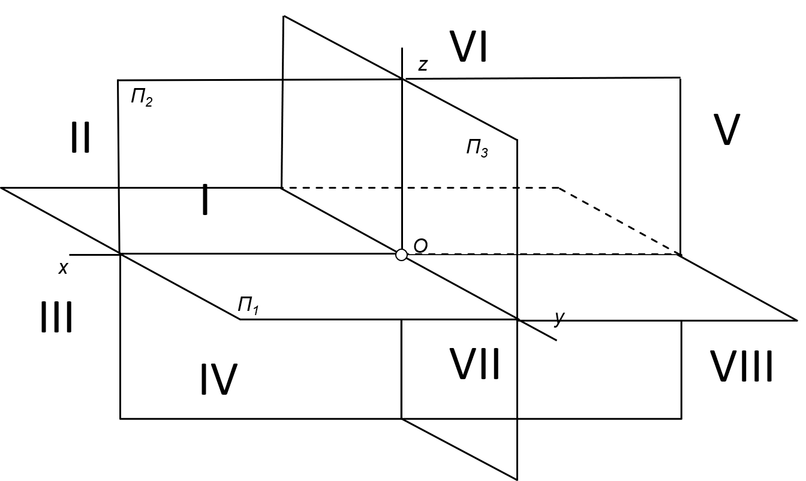

Content

- [Word](#Word)
- [Expression](#Expression)

### Word

| русский                 | 中文              |
|-------------------------|-------------------|
| объе́кт | 客体，对象，目标 |
| проеци́рование  | 投影 |
| взаи́мный | 互相的，彼此的 |
| представление  | 图象，表示，概念，观念 |
| относи́тельно  | 关于，对于 |
| пло́скость | 方面，平坦(性)，范围 |
| отме́тчик  | 标记，标线 |
| постро́ечный | 建筑的，建筑物的 |
| чёртеж | 图，图纸 |
| фигу́ра | 轮廓，形状，图形，花样 |
| перпендикуля́рный | 垂直的，正交的 |
| вертикальный | 垂直的，立式的 |
| наблюда́тель | 观察员，监督员 |
| фронта́льный | 正面的 |
| пересече́ние | 交叉点，截断，越过 |
| указа́нный | 指定的，规定的 |
| совмеще́ние  | 对准，重合 |
| эпюр | 图，线图 |

### Expression

<table><tr><td></td><td></td></tr></table>

- 三维空间中的点、面、坐标轴
    - 坐标轴：x y z 三线垂直

    |坐标轴|坐标轴点|确定坐标轴点的面投影点|
    |-|-|-|
    |x|Ax|A'&A''|
    |y|Ay|A'&A'''|
    |z|Az|A''&A'''|

    - 面

    | 面| 确定面的坐标轴 | 面投影点 | 面投影点对应的坐标轴点                 |
    |---------------|---------|------|-----------------------------|
    | П1 | xy      | A'   | Ax&Ay |
    | П2 | xz      | A''  | Ax&Az |
    | П3 | yz      | A''' | Ay&Az |

    - 点的关系
        - 真实点 => 面投影点 => 坐标轴点
        - 象限 => 坐标轴面 => 坐标轴

- 象限的正负轴对应关系

    |象限|x轴|y轴|z轴|
    |-|-|-|-|
    |I|+|+|+|
    |II|+|-|+|
    |III|+|-|-|
    |IV|+|+|-|
    |V|-|+|+|
    |VI|-|-|+|
    |VII|-|-|-|
    |VIII|-|+|-|

- 平面图反推象限方法
    - [根据面投影点反推坐标轴点](#s1)
    - 根据坐标轴点反推坐标轴正负关系
    - [根据坐标轴正负关系反推象限](#s3)