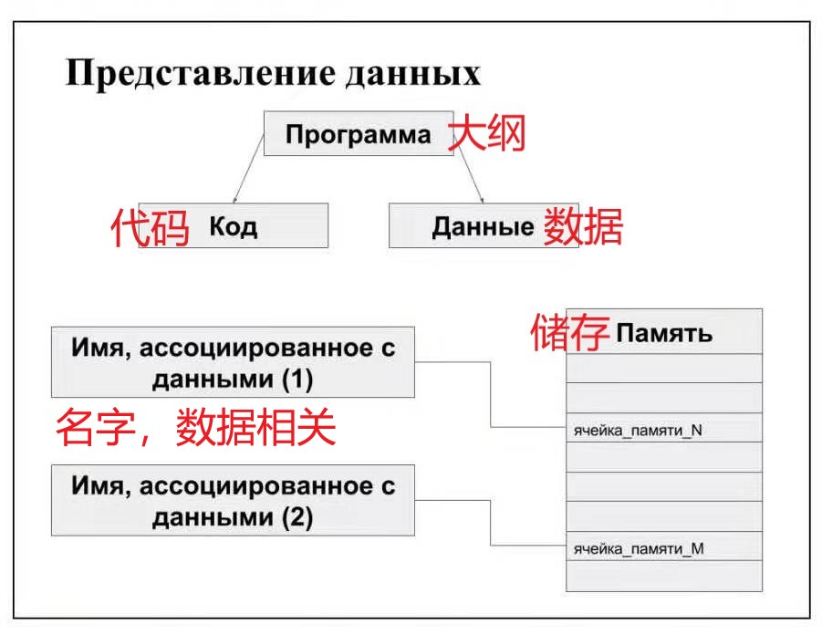
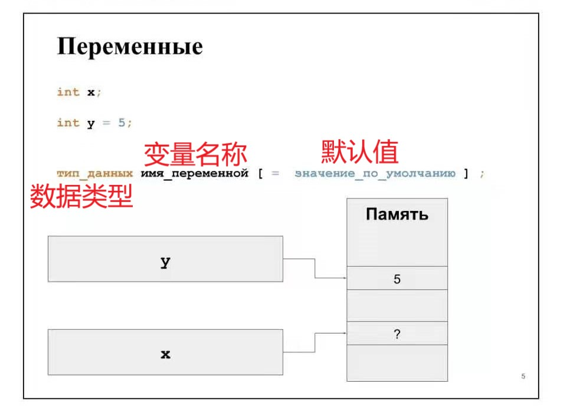
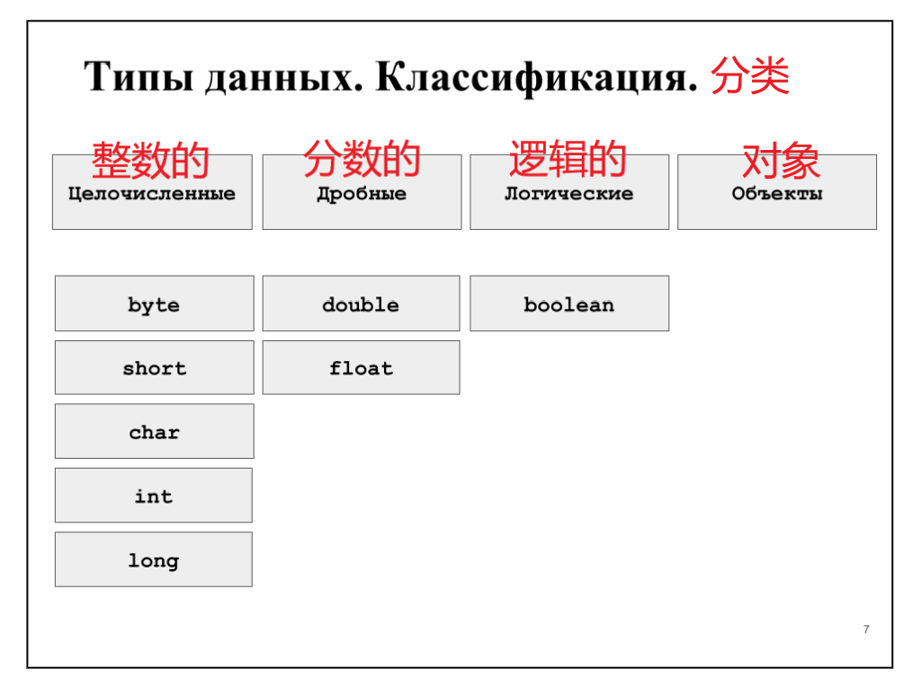
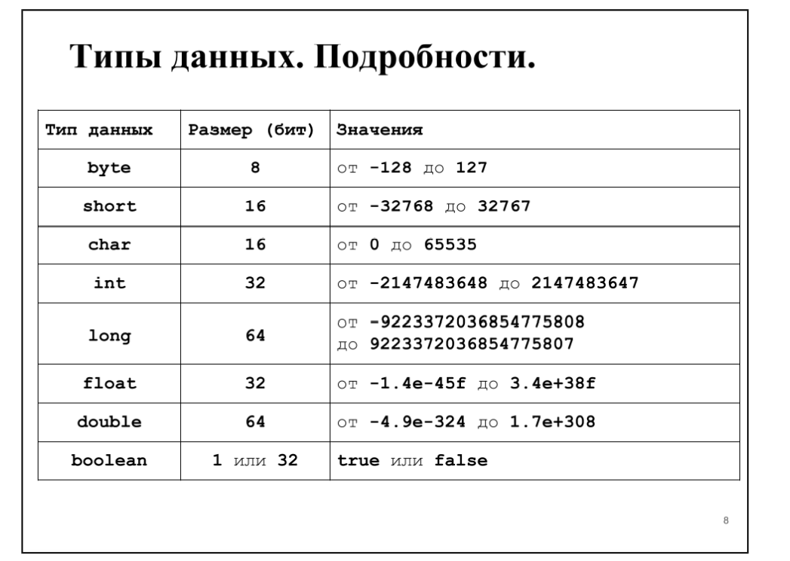
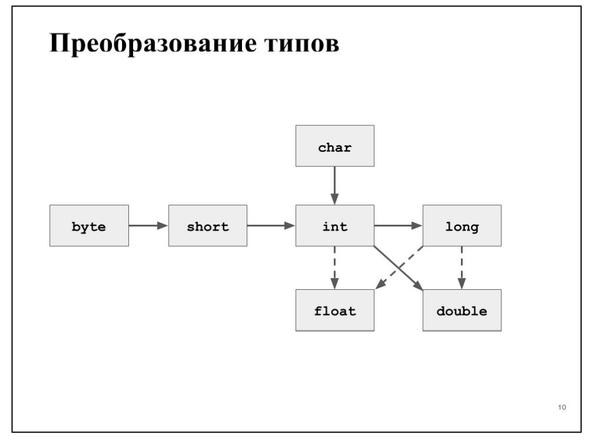
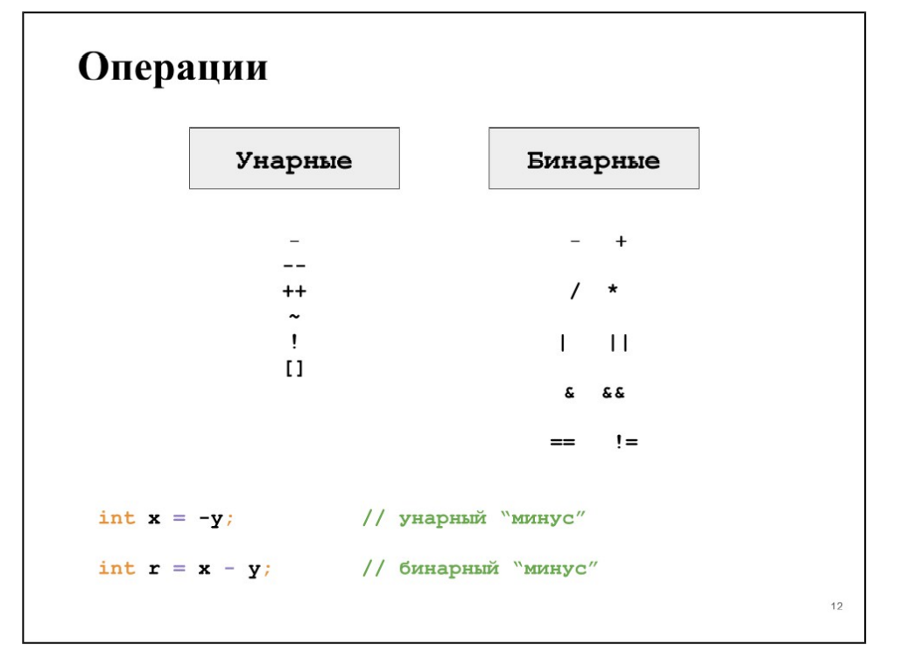
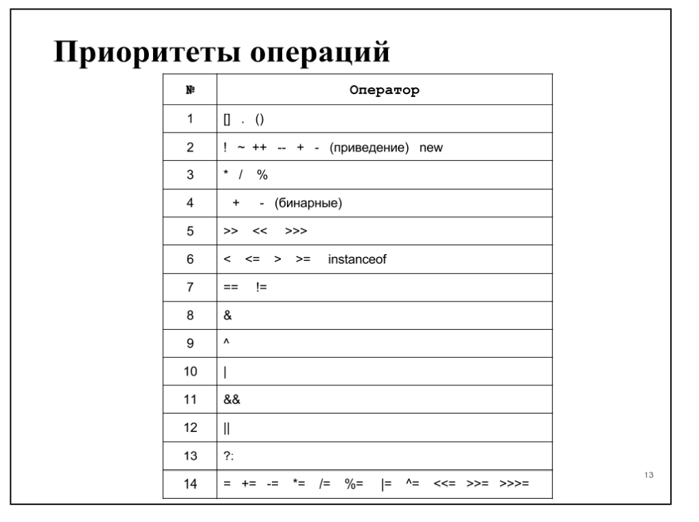
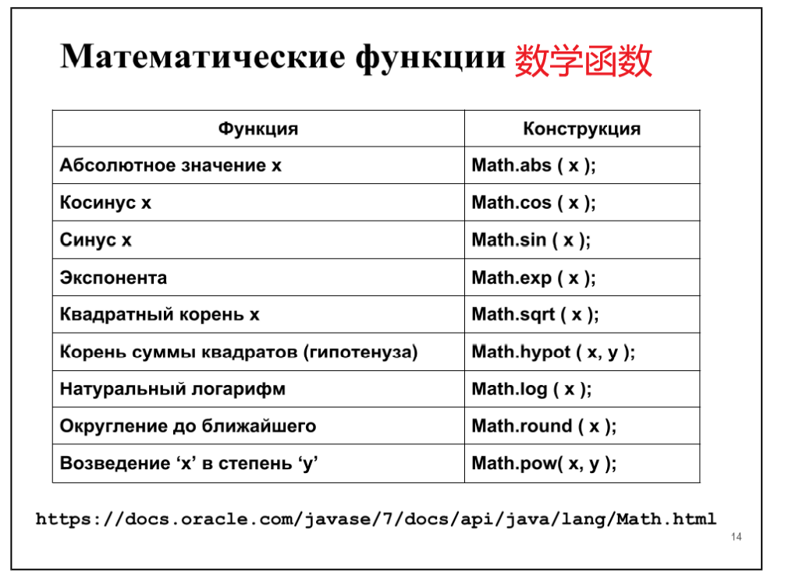
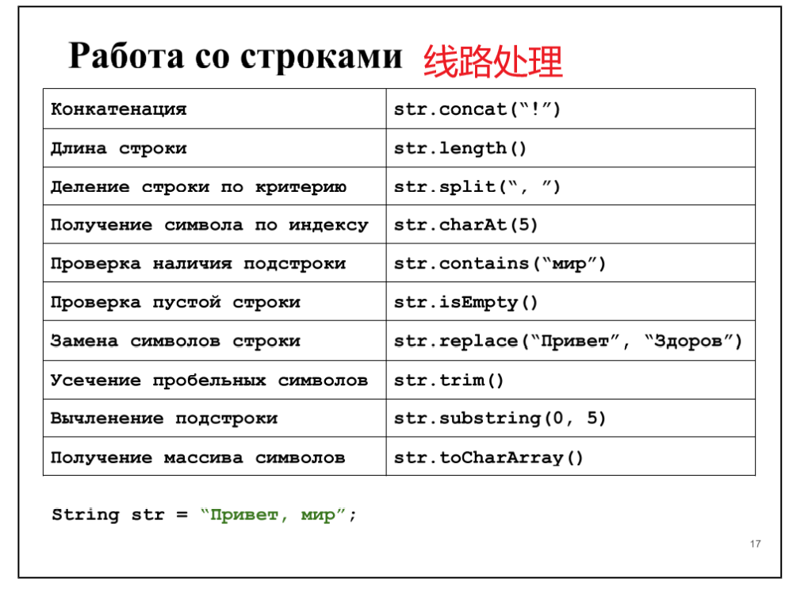
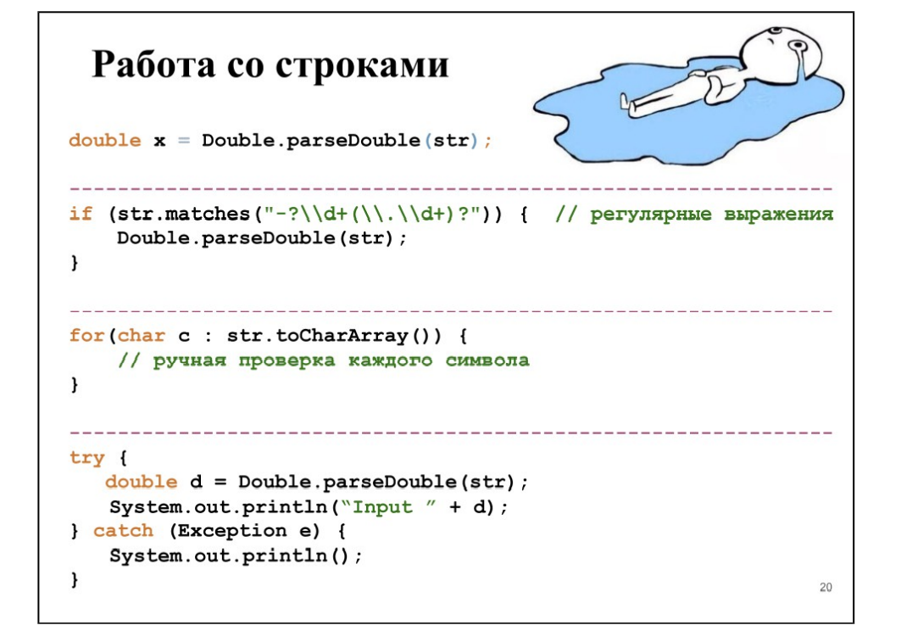

# itmo信息
- ## 第一章：变量与内存
### §1.1 数据表示
    （翻译可能存在偏差）
  - 变量定义：任何程序都可以以数据和处理该数据的代码的形式表示。 通过引用存储必要数据的存储区，可以与程序源代码中的数据进行交互。 此外，对于每个这样的数据，都有一个特定的命名指示字，称为变量名或常量名。（变量是计算机语言中能储存计算结果或能表示值抽象概念,通过变量名访问。）
  - 简单来说：变量让你能够把程序中准备使用的每一段数据都赋给一个简短、易于记忆的名字
  - 内存定义：内存可以以笔记本页的形式表示。 每个方格是一个存储单元。 每个单元格可以存储一些值（数字，符号等）。 对于该值所在的每个单元格，都分配了一个名称，我们可以通过该名称从程序的源代码访问该值。对于每一个包含值的单元格，我们都会分配一个名称，通过这个名称，我们可以从源码中访问该值。这就是代码与数据的交互方式。
### §1.2可变的
     

   -  如前所述，变量是指向包含所需数据值的内存片段的某些指针（变量是一种使用方便的占位符，用于引用计算机内存地址）
   - (Ps:指针：在计算机科学中，指针（Pointer）是编程语言中的一个对象，利用地址，它的值直接指向（points to）存在电脑存储器中另一个地方的值。由于通过地址能找到所需的变量单元，可以说，地址指向该变量单元。因此，将地址形象化的称为“指针”。意思是通过它能找到以它为地址的内存单元。)
   - 幻灯片显示了变量声明的两个示例。 该行显示了用于声明变量的常规语法模式：
   - тип_данных （数据类型）имя_переменной（变量名称 [ = значение_по_умолчанию （默认值）]
   - 现在我们需要讨论变量名称的要求，默认值的作用以及使用变量的规则:
   - 变量名不能以数字开头，但是数字可以用来构成变量名。变量名必须以字母或下划线打头，名字中间只能由字母、数字和下划线“_”组成；最后一个字符可以是类型说明符；在没有为其分配默认值的情况下声明的变量不能使用，直到为其分配了值（在幻灯片上，这是变量x）。变量的值可以在程序执行期间更改.
###  §1.3 常数
   ```java
   final double E = 5.0;
   final double R;
   // ...
   R = 5.0
   
   int total = 8 * 5 * 4 * 12; // wrong
   final int HOURS = 8,DAYS = 5,WEEKS = 4,MONTHS = 12;
   //...
   int total = HOURS * DAYS * WEEKS * MONTHS;  // right
   ```

   -  如果需要使用在程序执行期间，其值不会改变的数据，则在这种情况下可以使用常量。常量就像变量一样，是指向存储在内存中的值的命名指针。 区别在于这些值在一次写入有效的存储区中。在整个程序执行期间，只能将值赋给常量一次。声明常量的语法类似于声明变量唯一的区别——在常量的声明中，在指定数据类型之前指定了final关键字。 幻灯片中显示了声明常量的示例。 将常量命名为使用大写字母，并在常量名称中分隔单词，请使用“ _”符号，这被认为是一种好习惯。
   - 在程序文本中使用未命名的值是不好的做法，因为它大大减少了理解和维护程序源代码的指标。在不使用常数的情况下计算每年的工作时数时，计算中使用的数字的含义是很不明显的。 但是，通过对数字值使用有意义的常量名称，源代码的含义将变得清楚。
   ### §1.4 数据类型——分类
     

   - 1、byte：字节   double：定义为双精度浮点（也就是说：赋给变量的值将以双精度实型格式存储在内存中）  boolean：布尔运算
   - 2、short：短整型    float：单精确浮点
   - 3、char：用于C或C++中定义字符型变量，只占一个字节
   - 4、int：整型
   - 5、long：长整型
   - （ps：short在C语言中是定义一种整型变量家族的一种。C语言中有三种整数类型，分别为 short、int 和 long。）
   - 可以对所有数据类型进行分类。 前两个类别是数字，它们之间的区别仅在于它们所占用的内存量。 可以注意到，所谓的“字符”类型char也属于数据类型的整数类。
   - 布尔类型是数据的变体，其值只能采用两个值：true或false。 当您需要存储某些位标志或功能的数据时，此功能很有用。 具体示例：存储有关是否按下按钮的信息，等等。
### §1.5 数据类型——详细
     
   (该表显示了标准数据类型的特征，即消耗的内存量和有效值的范围。)
   - 特别要注意的是布尔类型。存储该类型值所消耗的内存根据定义该类型变量的上下文而不同。当使用布尔类型的数组时，一个位的数据用来存储一个值。当声明这种类型的独立变量时，存储值会消耗32位内存（实际上是使用int类型）。
   - 该语言的另一个功能是char类型。 顾名思义，以及其他语言的经验，这是一种“字符”数据类型。 这部分是正确的，但是Java指定其整数数据类型，即，作为“无符号短型”，因为short是16位类型，而这正是存储Unicode字符代码所需的量.
### §1.6 运用“大数”
   ```java
   BigInteger bigInt = new 
   BigInteger("99999999999999999999999999999999999");

   BigTnteger one = new BigInteger("1");

   BigInteger result = bigInteger.add(one);
   
   BigDecimal bigFloat = new 
   BigDecimal("99999999999999999.99999999999999999");
   
   BigDecimal one = new BigDecimal("0.0000000000000001");

   BigDecimal result = bigFloat.add(one);
   ``` 
   - 在某些情况下，有必要使用大于long和double的数字。 例如，对于天文学的计算，由于宇宙物体之间的距离达到数十亿光年，因此将这些数字转换为国际单位制（即以米为单位）会导致明显符号的损失。
   - 有两种工具可以解决Java中的此类问题：BigInteger（用于大整数）和BigDecimal（用于大分数）。
### §1.7 类型转换
     
   - 类型转换是将一种类型的内存中的值视为另一种类型的值的能力。
   ```java
        short ${x}_{1}$ = 255, 
        x2 = 18;
        int currentValue = x1;
        // some code
        currentValue = x2;
   ```
   - 在这种情况下，我们声明了short类型的变量，但后来将其值用作int。这种机制称为类型转换。仅当要转换的值的维数适合目标类型（要转换为该值的类型）的位网格时，才可以进行无损转换。因此，int类型包含short类型的所有值，因此可以进行转换而不会造成损失。在图中，用实心箭头显示了无损转换。虚线箭头表示可能造成损失的转换。
   - Java中未提供其他转换（未用箭头指示），但是有一种强制转换机制可以解决此限制。
### §1.8 类型换算
   ```java
   double e = 2.7;

   int notE = (int) e ;  // notE = 2


   int roundE = (int) Math.round(e);  //roundE = 3
   ```
   - 类型转换是标准转换未提供的类型转换机制。 例如，您计算了桌子的高度（92.53厘米），但精度对您并不重要，对于进一步的计算，您打算仅使用数字的整数部分，则可以使用以下结构：
   ```java
    double height = 92,53;
    int totalHeigh；
    t = (int) height;
   ```
   - 要使用舍入，必须使用幻灯片上显示的构造。
### §1.9 操作
     
   - 一元运算符是执行运算的运算符，例如，一元减号会反转数字的符号：
    
   ```java
    x = ¬x;
   ```
   - 将数字减一的操作：
   ```java
   x++; ++x;
   y--；--y；
   ```
   - 二进制运算是涉及两个变量的运算，例如，二进制减号从另一个变数减去一个参数，赋值运算符计算在其右侧的表达式并将其分配在变量的左侧，依此类推：
   ```java
   int result = x ¬ y;
   int square = height * width;
   ```
### §1.10 操作重点
     
   - 运算符按照优先级从高到低的顺序列出。
### §1.11 数学函数
     

   - 作为第一个实验的一部分，您将需要编写一些数学公式。 为此，您必须使用标准的Java数学函数。 编写这些函数以获得特定结果的规则如下：
   ```java
   result = Math. _  (  _ _  ); имя функции аргументы через запяту（逗号分隔的函数名参数）
   ```
   - 在这种情况下，结果可能是不同的类型，具体取决于所使用的功能。
### §1.12 数学常数
   ```java
   Math.PI     //3.14159265358979323846
   Math.E      //2.7182818284590452354


   double real = 3 * Math.PI / 2;

   double res2 = Math.log(5) * Math.E;
   ```
   - 要在数学公式中使用诸如PI和E之类的常量，则无需在源代码中声明这些常量。这些常量在数学中声明
### §1.13 行
   ```java
   String name = "Alis";

   
   String lastName = new String("Parker");


   String a = "Java\u2122";                
   String b = "";                          // 空行
   ```
   http://docs.oracle.com/javase/6/docs/api/java/lang/String.html
   - 字符串是用户与程序进行交互的第二大交互工具，仅次于图像。 借助文本信息，该程序为用户提供了输入数据的提示，并且还提供了其所有工作结果。 Java中的字符串是Unicode字符序列。 （在Java 9中将对此进行更改，但是直到Java 1.8（包括Java 1.8）为止，该字符串仍保持此顺序。）
   - 幻灯片显示了声明字符串变量的示例。字符串不是原始类型，实质上是我们在数据类型分类一节中讨论过的对象。字符串不是可变类型，也就是说，不能更改存储在内存中的字符串。如果要向其中添加一个字符，则必须分配一个新的内存，即字符串的大小加上添加的字符，然后将字符串复制到新的内存中，并将所需的字符添加到末尾。这是连接字符串时发生的过程，我们将进一步讨论。
### §1.14 线路处理
     
   - string——字符串
        - str.concat("!") : 将指定字符串连接到此字符串的结尾
        - str.length ： 
   - 该表仅包含一些用于处理字符串的函数，有关使用字符串的可用可能性的更多信息，请参见String类型的文档。 在此示例中，声明了字符串str。 让我们看一些使用声明的字符串的示例：
   ```java
   String total = str.concat(''!'');  // total =  ,  ! 
   total = str.substring(0, 5);    // total = Приве
   String[] parts = str.split('', ''); // parts = {''Привет'' ''мир''}
   ```
   - 字符串中的字符索引从零开始。 那些。 第一个字母索引= 0，第二个字母= 1，依此类推。
### §1.15 线路处理
     
   ```java
   double x = Double.parseDouble(str);

   if (str.matches())
   ```
   - 在其他功能中，Java具有将字符串解析为给定类型的数字的机制。 如果参数中需要实数，则可以使用以下构造进行这种转换： 
   ```java
   double argument = Double.parseDouble ( str );
   ```
   - 但是，如果传递的参数不包含实数，则程序将终止并显示错误。 幻灯片显示了避免这种错误的三种方法：
        - 解析字符串之前，请对照“数字模式”进行检查；
        - 解析字符串之前，请检查字符串的每个字符是否符合要求；
        - 使用语法try-catch来“捕获”结果错误并实现此错误的处理程序  ；
### §1.16 格式化输出
   ```java
   double x = 5.683;
   double y = Math.pow(x, 2.5);
   System.out.print("%.2f ^ 2.5 = %.3f",x,y)
                                      
                                       5,68^2.5 = 76,890
   ```
   - 因此，我们可以使用数学函数和运算来计算一些值，可以声明并使用字符串。但是，问题仍然存在：如何正确，方便地显示程序工作的结果。我们可以多次使用System.out.print构造来打印一些值，但这不仅对于程序员来说是乏味的，而且也很不方便，对于程序的用户来说可能也不方便。为此，Java能够格式化程序的输出。 System.out.printf构造用于格式化输出。
   - 考虑幻灯片上显示的示例。 有两个变量：函数的自变量及其结果。 我想向该程序的用户显示该程序计算出的整个公式。在幻灯片上，我们可以看到格式化的输出构造采用了三个参数：一个格式字符串和必须以特定形式将其值替换为给定字符串的变量。
   - 让我们仔细看看格式字符串。 字符串中将替换值的关键字符是百分比字符（％）。 其后是指定参数的输出格式的可选值。 在这种情况下，第一个参数的选项具有以下含义：.2f.
   - 这意味着字符串中此点的参数应替换为实数，并在点后两个字符之间进行分隔，即分隔小数部分和整数部分的字符。
### §1.17 知而不做是愚蠢的，做而不知是危险的
   ```java
   public class PracticValibles{

      public static void main(String[] args) {

         byte x = 127;
         
         x++;
         
         System.out.printf(x);        //  -128

         final String eyesColor = "green";

             // eyesColor = "";
         
         int size = 5;
            
            size = (int)Math.exp(size);

            size = (int)Math.exp(Math.E);
      }

   }
   ```
   - 自测问题： 
        - 0.如果删除第13行的注释开头，会发生什么情况？
        - 1.解释为什么第7行的增量操作导致结果-128？
        - 2.将舍入结果转换为int类型的目的是什么？
### §1.18 延续
   ```java
   public class PracticMath {

      public static void main(String[] arge) {

         double x = 5.1, y = 3.57;

         double res = Math.sin(( x + 1)  / 3*Math.PI) * 8*Math.cos(y)

      }

   }
   
   ```
   - 在Java中实现数学公式的示例。
   - __§19.__ 延续
    ```java
    public class PracticString {

      public static void main(String[] arge) {

         String name = "Vladimir";

         String subName = name.substring(0, 4);   // "Vlad"

         String[] parts = name.split("i");       //{"Vlad" "m" "r"} 

         final String eyesColor = "green";

              // eyesColor = "";

         int result = (int) 3 * Math.PI / 2;

         System.out.printf("3 * PI / 2 ~ d",result);

      }

   }
   ```
   - 自测问题：
       - 1.在第17行执行构造后，输出是什么？
       - 2.在第15行找到错误；
       - 3.如果子字符串函数的参数更改为1和5，surName变量将等于什么?
### §1.20 命令行参数
   ```java
   public class Lab0 {

      public ststic void main(String[] args) {

         if(args.lenght > 0) {
            System.out.println ( args[0] );
         }

      }
   }


   1.javac Main.java    //  运行带有参数的java程序
   2.java Main
   3.java Main 3 2 4
   ``` 

   - 根据作业要求，在第一次实验作业中，计算给定函数的参数必须从命令行参数中读取。这些论点是什么？为了理解向运行中的程序传递参数的概念，请考虑幻灯片底部所示的一组命令。
   - 在第一行中，我们运行javac程序，然后指定源代码文件的路径。 在这种情况下，让文件作为参数传递给javac程序。 编译器将以字符串（字符序列）的形式接收此参数，并将尝试使用指定的名称打开文件。
   - 可以有多个参数。 在这种情况下，它们之间用空格隔开。 如果传递的参数（字符串）包含空格字符，则通常用双引号将此类参数引起来（取决于OS）。
### §1.21 命令行参数
   ```java
   public class Lab0 {

      public ststic void main(String[] args) {

         if(args.lenght > 0) {
            System.out.println ( args[0] );
         }

      }
   }


   1.javac Main.java    //  运行带有参数的java程序
   2.java Main          //  运行带有参数的java程序
   3.java Main 3 2 4    //  类名之后的所有参数都将传递给Java程序。
   ``` 
   - 在第二行中，我们启动Java程序（Java虚拟机），并作为参数指定应包含应用程序入口点的类的名称-具有必要修饰符和签名的main方法。 为了将参数传递给我们的程序，我们将它们放在类名之后。 考虑在这种情况下会发生什么。
### §1.22 命令行参数 
   ```java
   public class Lab0 {

      public ststic void main(String[] args) {

         if(args.lenght > 0) {
            System.out.println ( args[0] );
         }

      }
   }
   java Main 3 2 4
   ```  
   - 虚拟机将启动并加载指定的类（Main，其代码在当前目录的Main.class文件中）。 在此类中，它找到一个声明如下的方法： 
       -  public static void main (String[] args )
   - 此方法将字符串数组作为参数。 Java机器通过在Main类的名称之后指定的参数填充该数组来对其进行初始化。 幻灯片中显示了此过程。 行“ 3”，“ 2”和“ 4”将作为参数传递给我们的程序。
   - 如何将参数直接传递给虚拟机？ 所有这些参数都在类名称之前指定。 例如，该参数负责虚拟机可以使用的最大RAM量： 
     - java -Xmx2G Main 1 2 3 // максимум 2 гигабайта
### §1.23 路径类与导入 
   ```java
   > javac Main.java   // 将代码编译成 Main.java
   > java Main 3 2 4   // 启动VM进行主要执行


   > javac itmo/java/labs/0/Main.java // itmo/java/labs/0/Mai.class

   > java Main    //  error!!

   > java -cp timo/java/labs/0/Main
   ``` 
   - 但是，如果我们想从与Main.class所在的目录不同的目录启动虚拟机，该怎么办？ 如果我们的项目由位于不同目录中的几个类组成，该怎么办？ 要解决此问题，有一个相应的虚拟机参数： 
         - java -cp путь_к_классам Main
   - 如果我们要为类使用多个源，则可以指定多个路径，并用冒号分隔。 
### §1.24   路径类与导入
   ```java
   import static java.lang.Math.*;

   /**
   * Безысходники 
   */
   public class PracticMath {

      public static void main(String[] args ){

         double x = 5.1,y = 3.57;
         
         double res = sin(( x + 1 ) / 3*PI) * 8*cos(y);

      }

   }
   ```
   Безысходники (我也不知道是什么)
   - 在程序中使用其他类的另一方面是需要将它们“包括”在程序中。 为此，您的源代码使用一些参数指定import关键字。
   - 作为第一个实验室工作的一部分，邀请您使用在“库”（类）Math中声明的函数实施数学计算。 为此，可以使用幻灯片上显示的导入结构。 它的用法允许您在每次使用前都不指定名称Math，而是直接使用数学函数，如幻灯片所示。
   