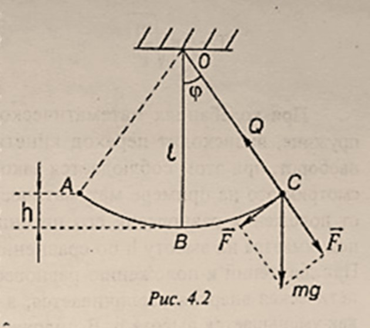
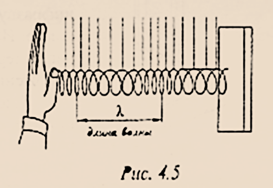
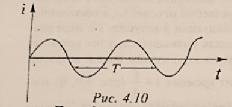

# Колеба́ния и во́лны

# Текст
___

53

# Разде́л 4 Колеба́ние и во́лны

## Глава́ 1. Механи́ческие колеба́ния и во́лны

### §1. Гармони́ческие колеба́ния. Амплиту́да, перио́д, частота́ и фа́за колеба́ний
<!-- а́ о́ у́ э́ и́ ы́ я́ е́ ю́ -->
Механи́ческими колеба́ниями называ́ют движе́ния тел, кото́рые повто­ря́ются во вре́мени (каче́ли, стру́ны гита́ры и т.д). С колеба́ниями мы встреча́­емся не то́лько в меха́нике, но и при изуче́нии са́мых разли́чных явле́ний: переме́нных

___

54

то́ков све́та и т.д. Ра́зные по приро́де ви́ды колеба́ний име́ют о́бщие за­кономе́рности.

Перио́дом колеба́ний называ́ется вре́мя, за кото́рое соверша́ется одно́ по́лное колеба́ние. Он измеря́ется в секу́ндах, $[Т]=с$.

Частото́й колеба́ний $\nu$ называ́ется число́ по́лных колеба́ний за 1(одну) секу́нду.
Едини́ца измере́ния частоты́ колеба́ний — герц, $[\nu]=Гц$.

Лине́йная частота́ и перио́д свя́заны зави́симостью  
$$\nu=\frac{1}{T}\qquad(4.1)$$
(`ню равно единица разделить на тэ`)

Смеще́нием называ́ют расстоя́ние от положе́ния коле́блющегося те́ла в за́­данный моме́нт вре́мени до положе́ния усто́йчивого равнове́сия.

Колеба́ние называ́ется гармони́ческим, е́сли периоди́ческое измене́ние смеще́ния в зави́симости от вре́мени происхо́дит по зако́ну си́нуса или ко́синуса.
Уравне́ние гармони́ческого колеба́ния позволя́ет определи́ть смеще́ние $х$ коле́б­лющегося те́ла в за́данный моме́нт вре́мени $t$ :
$$x=Asin{(\omega t+\varphi_0)}\qquad(4.2)$$
(`икс равно а большое умножить на синус суммы омега тэ плюс фи ноль, это формулы четыре точка два`)

где А - амплиту́да колеба́ний - мо́дуль наи­бо́льшего смеще́ния те́ла от положе́ния ра́внове­сия. Величину́ $\omega t+\varphi_0=\varphi$, стоя́щую под знако́м си́нуса (и́ли ко́синуса), называ́ют фа́зой колеба́них. В нача́льный моме́нт вре́мени $t=0$ фа́за равна́ нача́льной фа́зе $\varphi_0$. Фа́за определя́ет со­ стоя́ние коле́блющегося те́ла в любо́й моме́нт вре́мени. Фа́за измеря́ется в радиа́нах, $[\varphi]=рад$.

За вре́мя одного́ перио́да фа́за изменя́ется на величину́ $2\pi$. Очеви́дно, что ско́рость измене́ния фа́зы $\omega=\frac{2\pi}{T}=2\pi \nu$ (`фазы омега - это два пи разделить на тэ большое, или два пи умножить на ню`). Эта величина́ получи́ла назва́ние угло­во́й частоты́. Она измеря́ется в радиа́нах в секу́нду, $[\omega] = рад/с$ (размерность омега - это радиан на секунду).

На рис. 4.1 пока́зано измене́ние смеще́ния $х$ во вре́мени. Смеще́ние при­нима́ет значе́ния в преде́лах $-А \le х \le +А$ (`от минус А до плюс А`).

___

55

### §2. Математи́ческий ма́ятник. Пружи́нный ма́ятник. Превраще́ние эне́ргии при́ механи́ческих колеба́ниях
<!-- а́ о́ у́ э́ и́ ы́ я́ е́ ю́ -->

Математи́ческим ма́ятником назы­ва́ется те́ло ма́лых разме́ров, кото́рое мо́жно приня́ть за материа́льную то́чку, подве́шенное на ни́ти, ве́сом и растяже́нием, кото́рой мо́жно пренебре́чь. Колеба́ния, соверша́емые математи́ческим ма́ятником в по́ле си́лы тя́жести при откло­не́нии его́ на небольшо́й у́гол $\varphi$ (см. рис. 4.2), явля́ются приме́ром гармони́ческих коле­ба́ний. Си́ла упру́гости ни́ти $Q$ уравнове́­шивается составля́ющей си́лы тя́жести $\vec{F_1}$. По́д де́йствием друго́й составля́ющей си́лы тя́жести $\vec{F}$ ма́ятник начина́ет дви́гаться по дуге́ окру́жности вниз с нарас­та́ющей ско́ростью, достига́ющей максима́льного значе́ния в моме́нт, когда́ ма́­ятник прохо́дит положе́ние равнове́сия. Всле́дствие свое́й ине́ртности ма́ятник дви́жется да́льше, поднима́ясь вверх. В кра́йней то́чке он остана́вливается, и на­чина́ется движе́ние в противополо́жную сто́рону. Мо́жно показа́ть, что перио́д колеба́ний математи́ческого ма́ятника ра́вен:
$$T=2\pi \sqrt{\frac{l}{g}}\qquad(4.3)$$
(`Тэ большое равно два пи умножить на корень кватрадный из эл делить на жэ.`)  
где 
- $l$ - длина́ ни́ти 
- $g$ - ускоре́ние свобо́дного паде́ния.
<!-- а́ о́ у́ э́ и́ ы́ я́ е́ ю́ -->
Перио́д колеба́ний математи́ческого ма́ятника не зави́сит от его́ ма́ссы и угла́ отклоне́ния.

Зави́симость перио́да $Т$ от ускоре́ния свобо́дного паде́ния испо́льзуется для́ то́чных измере́ний ускоре́ния свобо́дного паде́ния в ра́зных то́чках Земли́. По результа́там таки́х измере́ний мо́жно определи́ть райо́ны залега́ния поле́зных ископа́емых.

Други́м приме́ром гармони́ческого колеба́ния явля́­ются колеба́ния гру́за на пружи́не (рис. 4.3).

Если вы́вести гру́з из положе́ния равнове́сия, смести́в его́ вниз на расстоя́ние $х$, то пружи́нный ма́ятник начнёт соверша́ть колеба́ния под де́йствием си́лы упру́гости пру­жи́ны $F_{упр.}=-кх$, где $к$ - коэффицие́нт упру́гости.

___

56

Перио́д колеба́ний пружи́нного ма́ятника с ма́ссой гру́за $m$ определя́ется фо́рмулой:

$$T=2\pi\sqrt{\frac{m}{к}}\qquad(4.4)$$
(`Тэ большое равно два пи умножить на корень кватрадный из эм делить на ка.`)  

<!-- а́ о́ у́ э́ и́ ы́ я́ е́ ю́ -->
При колеба́ниях математи́ческого ма́ятника и́ли гру́за, подве́шенного на пружи́не, происхо́дит перехо́д кинети́ческой эне́ргии тела́ в потенциа́льную и наоборо́т, при э́том соблюда́ется зако́н сохране́ния механи́ческой эне́ргии. Рассмо́трим э́то на приме́ре математи́ческого ма́ятника. При отклоне́нии ма́ятника от положе́ния равнове́сия его́ потенциа́льная эне́ргия увели́чивается, т.к. гру́з поднима́ется на высоту́ $h$ по сравне́нию с положе́нием равнове́сия (см. ри́с. 4.3). При движе́нии к положе́нию равнове́сия ско́рость ма́ятника возраста́ет, его́ кинети́ческая эне́ргия увели́чивается, а потенциа́льная эне́ргия уменьша́ется, так как уменьша́ется высота́ $h$. В положе́нии равнове́сия ско́рость, а сле́довательно, и кинети́ческая эне́ргия достига́ют ма́ксимума, а потенциа́льная эне́ргия минима́льна. По́сле прохожде́ния равнове́сия ско́рость убыва́ет, высота́ подъёма возраста́ет, и происхо́дит превраще́ние кинети́ческой эне́ргии в потенциа́льную. В ве́рхней то́чке подъёма $v=0$, $Е_к=0$, а потенциа́льная эне́ргия максима́льна. По́лная механи́ческая эне́ргия коле́блющегося тела́ при отсу́тствии поте́рь на тре́ние и др., ра́вная су́мме кинети́ческой и потенциа́льной эне́ргий, оста́ется постоя́нной в любо́й то́чке траекто́рии движе́ния ма́ятника.

### §3. Во́лны. Попере́чные и продо́льные во́лны, длина́ во́лны. Свя́зь дли́ны во́лны со ско́ростью и частото́й колеба́ний

Твёрдые, жи́дкие и газообра́зные вещества́ состоя́т из части́ц, взаимоде́й­ствующих между собо́й упру́гими си́лами. Если в како́м-ли́бо ме́сте упру́гой среды́ возбуди́ть колеба́ния её части́ц, то всле́дствие взаимоде́йствия между час­тицами э́то колеба́ние начнёт распространя́ться от части́цы к части́це с неко́то­рой ско́ростью $v$. **Проце́сс распростране́ния колеба́ний в упру́гой среде́ называ́­ется механи́ческой волно́й.** Части́цы среды́ не перено́сятся волно́й, они́ лишь со­верша́ют колеба́ния о́коло свои́х положе́ний равнове́сия. В зави́симости от на­правле́ния колеба́ний части́ц по отноше́нию к направле́нию распростране́ния во́лны различа́ют попере́чные и продо́льные во́лны.

В попере́чной волне́ части́цы среды́ коле́блются в направле́нии, перпенди­куля́рном к направле́нию распростране́ния во́лны. Наприме́р попере́чная волна́ распространя́ется вдо́ль рези́нового шнура́, оди́н коне́ц кото́рого закреплён, а друго́й приведён в колеба́тельное движе́ние (рис 4.4).

___

57

В продо́льной волне́ части́цы коле́блются вдо́ль направле́ния распростране́ния во́лны. Продо́льная волна́ возника́ет, наприме́р, в пружи́не (`рис. 4.5`): е́сли оди́н коне́ц пружи́ны подве́ргнуть периоди́ческому вне́шнему возде́йствию, то в не́й распространи́тся волна́ в ви́де перемеща́ющихся сгуще́ний и разреже́ний её витко́в.

<!-- а́ о́ у́ э́ и́ ы́ я́ е́ ю́ -->
Продо́льные во́лны мо́гут возника́ть в га́зах, жи́дкостях и твёрдых те́лах, а попере́чные то́лько в твёрдых, в кото́рых возника́ют си́лы упру́гости при деформа́ции сдви́га. На `рис. 4.6` предста́влена зависи́мость смеще́ния $x$ части́ц во́лны от расстоя́ния $y$ ме́жду исто́чником колеба́ний и да́нной части́цей среды́ в определённый моме́нт вре́мени. Расстоя́ние ме́жду ближа́йшими дру́г к другу́ части́цами, коле́блющимися в одина́ковых фа́зах, называ́ется длино́й во́лны. За вре́мя, ра́вное одному́ перио́ду колеба́ний, волна́ распространя́ется на расстоя́ние, ра́вное длине́ во́лны $\lambda$, поэ́тому ско́рость её распростране́ния
$$v=\frac{\lambda}{T}\qquad(4.5)$$
(`вэ равно отношению лямбда к тэ большому`)

Так как перио́д колеба́ний $T$ и частота́ $\nu$ связа́ны соотноше́нием $T=\frac{1}{\nu}$(`тэ большое равно единица делить на ню`), то
$$v=\lambda\nu\qquad(4.6)$$
(`вэ равно произведению лямбда умножить на ню`)

т.е. ско́рость распростране́ния во́лны равна́ произведе́нию дли́ны во́лны на частоту́ колеба́ний.

___

58

### §4. Звуковы́е во́лны. Ско́рость зву́ка. Гро́мкость зву́ка и высота́ то́на

Разде́л фи́зики, изуча́ющий звуковы́е явле́ния, называ́ется акусти́ческой.

Звуковы́е во́лны – э́то механи́ческие во́лны с частото́й колеба́ний от $16$(`шестьнадцать`) до $20000$ Гц(`двадцать тысяч`), воспринима́емые у́хом челове́ка. Во́лны с частото́й колеба́ний $\nu<16Гц$(`шестьнадцать`) - инфразвуковы́е, а с частото́й $\nu>20000 Гц$(`двадцать тысяч`) - ультразвуковы́е. Исто́чником зву́ка являе́тся коле́блющееся те́ло, наприме́р, но́жки камерто́на (`рис. 4.7`), вы́веденные из положе́ния равнове́сия уда́ром молото́чка.
<!-- а́ о́ у́ э́ и́ ы́ я́ е́ ю́ -->
Ско́рость зву́ка зави́сит от сво́йств среды́. Наприме́р, ско́рость зву́ка в во́здухе при температу́ре $0℃$ равна́ $332м/с$(`триста тридцать два метр в секунду`), а в воде́ - о́коло $1450м/с$(`тысяча четыреста пятьдесят метр в секунду`). С повыше́нием температу́ры ско́рость зву́ка возраста́ет.

Гро́мкость зву́ка определя́ется переноси́мой волно́й эне́ргией, кото́рая пропорциона́льна квадра́ту амплиту́ды колеба́ния части́ц. Че́м бо́льше амплиту́да. Те́м гро́мче зву́к.

Зву́ки, образу́ющие набо́р часто́т, непреры́вно заполня́ющих некото́рый интерва́л, называ́ются шу́мами.

Зву́к како́й-ли́бо определённой частоты́ характеризу́ется высото́й то́на: че́м бо́льше частота́, тем вы́ше то́н. Обы́чно музыка́льному зву́ку соответству́ет набо́р неско́льких просты́х гармони́ческих колеба́ний. Колеба́ние с наиме́ньшей частото́й явля́ется осно́вным то́ном. Задаю́щим высоту́ музыка́льного зву́ка. Колеба́ння больши́х часто́т, кра́тных частоте́ основно́го то́на, образу́ют так называ́емые оберто́ны. Окра́ска зву́ка, называ́емая те́мбром, зави́сит от коли́чества обертоно́в, их часто́т и амплиту́д. Наприме́р, при одно́й высоте́ то́на зву́ки, издава́емые гита́рой и пиани́но, отлича́ются те́мбром.

## Глава́ 2. Электромагни́тные колеба́ния и во́лны

### §1. Свобо́дные электромагни́тные колеба́ния в ко́нтуре. Со́бственная частота́ колеба́ний. Превраще́ние эне́ргии в колеба́тельном ко́нтуре 

Колеба́тельным ко́нтуром называ́ется за́мкнутая электриче́ская це́пь, состоя́щая из после́довательно соединённых кату́шки индукти́вности $L$, конденса́тора $C$ и электриче́ского сопротивле́ния $R$. В просте́йшем идеализи́рованном слу́чае сопротивле́ние $R\rightarrow0$ (эр стремится к нолю), и им можно пренебре́чь. Тако́й ко́нтур изображён на `рис. 4.8`.

Колеба́тельный ко́нтур – просте́йшая систе́ма, в кото́рой наблюда́ются электромагни́тные колеба́ния.

___

59

В слу́чае свобо́дных электромагни́тных колеба́ний в колеба́тельном ко́нтуре происхо́дит периоди́ческое измене́ние заря́да $q$ и ра́зности потенциа́лов $U$ на обкла́дках конденса́тора,а та́кже,си́лы то́ка $I$ в ко́нтуре без потребле́ния эне́ргии от вне́шних исто́чников. 

Сообщи́м конденса́тору в нача́льный моме́нт вре́мени $t=0$ каким-либо спо́собом электри́ческий заря́д $q_m$. Ме́жду обкла́дками конденса́тора возни́кнет ра́зность потенциа́лов,принима́ющая максима́льное значе́ние $U_m$. При этом конденса́тору сообща́ется эне́ргия,сосредото́ченная в электри́ческом по́ле ме́жду его обкла́дками (рис. 4.9,а) и ра́вная 
$$W_э=\frac{CU_m^2}{2}$$ 
` Дубль-вэ с индексом э равно Цэ У максима́льное в квадрате делить пополам`
где С — электроёмкость конденса́тора.  С тече́нием вре́мени конденса́тор постепе́нно разряжа́ется,и в ко́нтуре возника́ет электри́ческий ток. Он вы́зывает появле́ние магни́тного по́ля вокру́г кату́шки индукти́вности. Си́ла то́ка возраста́ет не мгнове́нно,а постепе́нно,т.к. нараста́нию то́ка препя́тствует ЭДС самоинду́кции в кату́шке. По ме́ре разря́дки конденса́тора напряже́ние на его обкла́дках уменьша́ется,а ток возраста́ет. Это сопровожда́ется уменьше́нием эне́ргии электри́ческого по́ля и возраста́нием эне́ргии магни́тного по́ля то́ка. В моме́нт вре́мени $t=\frac{T}{4}$ (рис. 4.9,б) конденса́тор по́лностью разрядится,а ток в ко́нтуре дости́гнет ма́ксимума. Эне́ргия электри́ческого по́ля ста́нет ра́вной нулю́,а эне́ргия магни́тного по́ля ока́жется максима́льной и ра́вной        
$$W_м=\frac{LI_м^2}{2}$$ 
`Дубль-вэ с индексом эм равно эль большое умножить И максима́льное в квадрате делить пополам`
В тече́ние второ́й четвёрти перио́да си́ла то́ка в ко́нтуре убыва́ет. Мгнове́нному прекраще́нию то́ка препя́тствует ЭДС самоинду́кции,создаю́щая электри́ческий ток того́ же направле́ния. В моме́нт вре́мени $\frac{T}{2}$ ток обрати́тся в ну́ль,к этому времени произойдёт заря́дка обкла́док конденса́тора до первонача́льного значе́ния напряже́ния ме́жду ни́ми,но знак за́ряда бу́дет противополо́жен первонача́льному (рис. 4.9,в). При этом эне́ргия магни́тного по́ля то́ка по́лностью преврати́ться в эне́ргию электри́ческого поля заряженного конденса́тора. Зате́м вновь происхо́дит разря́д конденса́тора че́рез кату́шку,и проце́ссы повторя́ются в обра́тном направле́нии (рис. 4.9,гд ). Если сопротивле́ние ко́нтура равно́ нулю́,то о́бщая величина́,эне́ргии ко́нтура ост́а́ется неизме́нной,и свобо́дные электромагни́тные колеба́ния будут <u>незатуха́ющцми.</u>  

___

60

Перио́д свобо́дных,или со́бственных колеба́ний в ко́нтуре определя́ется фо́рмулой То́мсона: 
$$T=2\pi\sqrt{LC}\qquad(4.7)$$ 
`Тэ большое раино 2 пи умножьное на корень из Эль Цэ  `
т.е. зави́сит от индукти́вности кату́шки $L$ и ёмкости конденса́тора $С$. Со́бственная цикли́ческая частота́ 
$$\omega_0=\frac{2\pi}{T}=\frac{1}{\sqrt{LC}}\qquad(4.8)$$  
Колеба́тельный ко́нтур явля́ется неотъе́млемой ча́стью любо́го ра́диопередатчика и ра́диоприёмника.  

### § 2. Переме́нный электри́ческий то́к. Генера́тор переме́нного то́ка. Трансформа́тор 

Переме́нным называ́ется ток,си́ла и направле́ние кото́рого периоди́чески изменя́ются во вре́мени по гармони́ческому зако́ну (рис. 4.10): 
$$i=I_msin{\omega t}\qquad(4.9)$$ 
`И малое равно И большое максима́льное умножить на синус омега тэ`
где $i$ - мгнове́нное значе́ние то́ка; 
$I_m$ - амплиту́да,т.е. максима́льное значе́ние си́лы то́ка;
$\omega$ - цикли́ческая частота́;
$t$ - время.  
Перио́д переме́нного то́ка – наиме́ньший промежу́ток вре́мени,че́рез кото́рый значе́ния си́лы то́ка повторя́ются.  

Для получе́ния переме́нного то́ка служа́т <u>генера́торы переме́нного то́ка.</u>Что́бы вы́яснить при́нцип де́йствия генера́тора,рассмо́трим враще́ние ви́тка прово́да пло́щадью $S$ в одноро́дном магни́тном по́ле с инду́кцией $\vec{B}$ (рис. 4.11) Ве́ктор инду́кции $\vec{B}$ составля́ет у́гол $\alpha$ с норма́лью $\vec{n}$ к пло́скости ви́тка.  
При враще́нии ви́тка с углово́й ско́ростью $\omega$ у́гол $\alpha$ в любо́й момент вре́мени ра́вен $\omega t$,и магни́тный пото́к че́рез вито́к определи́тся выраже́нием: 
$$\Phi=BScos{\alpha}=BScos{\omega t}\qquad(4.10)$$
  
___

61

Измене́ние магни́тного пото́ка, прони́зывающего вито́к, вызыва́ет в нём ЭДС инду́кции е, ра́вную ско́рости измене́ния магни́тного пото́ка, т.е. произво́д­ной пото́ка магни́тной инду́кции по вре́мени, взя́той со зна́ком "ми́нус": 
$$e=-\Phi'=BS\omega sin{\omega t}=E_m sin{\omega t}\qquad(4.11)$$

где $Е_m=BS\omega$ - амплиту́да, и́ли максима́льное значе́ние ЭДС инду́кции. 

Е́сли с по́мощью конта́ктных коле́ц и скользя́щих по ним щёток соедини́ть концы́ витка́ с электри́ческой це́пью, то под де́йствием ЭДС инду́кции в цепи́ возника́ет переме́нный ток. Си́ла то́ка изменя́ется во вре́мени по гармони́ческо­му зако́ну в соотве́тствии с выраже́нием (4.9) с частото́й $\omega$, совпада́ющей с час­тото́й ЭДС инду́кции и частото́й враще́ния витка́.

В генера́торе переме́нного то́ка магни́тное по́ле создаётся электромагни́­том. Обы́чно электромагни́т явля́ется ро́тором, т.е. враща́ющейся ча́стью маши́­ны, а обмо́тка, состоя́щая из большо́го числа́ витко́в, располага́ется о ста́торе - неподви́жной ча́сти генера́тора. Сумма́рная ЭДС инду́кции равна́ су́мме ЭДС, возника́ющих в ка́ждом витке́. Генера́тор переме́нного то́ка осуществля́ет пре­враще́ние механи́ческой эне́ргии в электри́ческую. Переме́нный ток испо́льзует­ся в освети́тельной свети́, промы́шленном произво́дстве Частота́ промы́шленно­го то́ка в Росси́и и Евро́пе равна́ 50 Гц.

В электроте́хнике для характери́стики переме́нного то́ка вво́дится поня́тие де́йствующего значе́ния си́лы переме́нного то́ка - оно́ равно́ си́ле постоя́нного то́ка, кото́рый в проводнике́ выделя́ет тако́е же коли́чество теплово́й эне́ргии, что и да́нный переме́нный ток за то же вре́мя. Де́йствующее значе́ние свя́зано с амплиту́дой переме́нного то́ка соотноше́нием:
$$I=\frac{I_m}{\sqrt{2}}\qquad(4.12)$$

Де́йствующее значе́ние переме́нного напряже́ния определя́ется аналоги́чно: 
$$U=\frac{U_m}{\sqrt{2}}\qquad(4.13)$$

Амперме́тр и вольтме́тр переме́нного то́ка измеря́ют и́менно де́йствующие зна­чения си́лы то́ка и напряже́ния.

Трансформа́тор явля́ется устройст­вом, предназна́ченным для преобразова́ния напряже́ния и си́лы переме́нного то́ка. Он состои́т из за́мкнутого стально́го сердеч­ни́ка, на́бранного из отде́льных изоли́рованных

___

62

друг от дру́га пла́стан, на кото́рый наде́ты две кату́шки с разли́чным число́м витко́в. Одна́ из них - перви́чная - присоединя́ется к исто́чнику пере­ме́нного то́ка, а друга́я, называ́емая втори́чной, соединя́ется с потреби́телем (рис. 4.12).

В осно́ве ро́боты трансформа́тора лежи́т явле́ние электромагни́тной инду́кции (см. §4. гл 3). При прохожде́нии переме́нного то́ка по перви́чной об­мо́тке возника́ет переме́нное магни́тное по́ле, прони́зывающее о́бе обмо́тки. В результа́те в ка́ждом витке́ перви́чной и втори́чной обмо́ток индуци́руется ЭДС.

Если акти́вное сопротивле́ние R перви́чной кату́шки ничто́жно ма́ло, а втори́чная обмо́тка разо́мкнута (режи́м холосто́го хо́да трансформа́тора), то со­блюда́ется соотноше́ние:
$$\frac{U_1}{U_2}=\frac{n_1}{n_2}=к\qquad(4.14)$$

где
- $U_1$ и $U_2$ - соотве́тственно напряже́ния на перви́чной и втори́чной обмо́тках, а
- $n_1$ и $n_2$ - число́ витко́в содержа́щихся в них.

 Величина́ $к$ называ́ется коэффицие́нтом трансформа́ции. При $к<1$ трансформа́­тор повыша́ет напряже́ние, при $к>1$ - понижа́ет его́. Поско́льку в трансформа́­торе поте́ри мо́щности пренебрежи́мо малы́, то мо́щность в перви́чной цепи́ та­ка́я же. как во втори́чной $Р_1 = Р_2$ и име́ет ме́сто сле́дующее соотноше́ние ме́жду то́ками и напряже́ниями:
$$I_1U_1=I_2U_2,\quad и́ли \quad \frac{U_2}{U_1}=\frac{I_1}{I_2}\qquad(4.15)$$

т.е. увеличе́ние напряже́ния на вы́ходе сопровожда́ется уменьше́нием си́лы то́ка во сто́лько же раз. Изменя́ть напряже́ние и си́лу то́ка с по́мощью трансформа́то­ра осо́бенно необходи́мо при переда́че электри́ческой эне́ргии на больши́е рас­стоя́ния. Поте́ри эне́ргии на джо́улево тепло́ в передаю́щих прово́дах пропорциона́льны квадра́ту си́лы то́ка. Что́бы свести́ их к ми́нимуму, необходи́мо пере­дава́ть ток ма́лой величины́. Поэ́тому на электроста́нциях ста́вят повыша́ющие трансформа́торы, а у потреби́теля - понижа́ющие.

### §3. Электромагни́тное по́ле и его́ материа́льность. Электромагни́тные вол­ны, их сво́йства. Зави́симость свойств электромагни́тных волн от частоты́

Англи́йский фи́зик Ма́ксвелл в 1865 г. созда́л еди́ную тео́рию электри́че­ских и магни́тных явле́ний. Согла́сно Ма́ксвеллу вся́кое измене́ние электри́че­ского по́ля порожда́ет магни́тное по́ле с силовы́ми ли́ниями, охва́тывающими ли́нии ве́ктора напряжённости электри́ческого по́ля $\vec{E}$ , и наоборо́т: вся́кое измене́нне

___

63

магни́тного по́ля порожда́ет электри́ческое по́ле с за́мкнутыми силовы́ми пи́ниями, охва́тывающими ли́нии инду́кции магни́тного по́ля $\vec{B}$.

Таки́м о́бразом, переме́нные электри́ческое и магни́тное по́ля существу́ют всегда́ совме́стно, образу́я еди́ное _электромагни́тное по́ле_. Это осо́бая фо́рма мате́рии. Электромагни́тное по́ле существу́ет реа́льно, т.с. незави́симо от нас, от на́ших зна́ний о нем.

_Проце́сс распростране́ния периоди́чески изменя́ющегося электромагни́т­ного по́ля в простра́нстве называ́ется электромагни́тной волно́й._ В отли́чие от механи́ческих волн, электромагни́тные во́лны мо́гут распространя́ться, не то́ль­ко в веществе́, но и в ва́кууме. Ско́рость их распростране́ния в ва́кууме равна́ $с = 3\cdot10^8 м/с$. Электромагни́тные во́лны явля́ются попере́чными. Ве́кторы $\vec{E}$ и $\vec{B}$ в электромагни́тной волне́ перпендикуля́рны друг к дру́гу и направле́нию распро­стране́ния волны́ (рис. 4,13). Электромагни́тные во́лны поглоща́ются и рассе́иваются Средо́й, в кото́рой они́ распространя́ются; на грани́це разде́ла дву́х сред части́чно отража́ются и части́чно преломля́ются; огиба́ют препя́тствия, соизме­ри́мые с их длино́й волны́.

Совоку́пность все́х электромагни́тных излуче́ний подразделя́ют по ви́дам, образу́ющим <u>шкалу́ электромагни́тных волн.</u>

В зави́симости от частоты́ (длины́ волны́) электромагни́тные во́лны обла­да́ют разли́чными сво́йствами, наприме́р, проника́ющей спосо́бностью, ви́димо­стью. коэффицие́нтом отраже́ния и т.д. Примене́ние ка́ждого диапазо́на элек­тромагни́тных волн свя́зано с хара́ктерными сво́йствами, прису́щими и́менно э́тому диапазо́ну.

<u>Ни́зкочасто́тные электромагни́тные во́лны</u> (ча́стота не бо́лее $30\ кГц$) -
сла́бо поглоща́ются земле́й и водо́й и поэ́тому применя́ются при подзе́мной и подводно́й ра́диосвязи.

Радиово́лны ($3\cdot10^4\div 3\cdot10^{12}\ Гц$) - применя́ются в радиосвя́зи, телеви́дении и т.п.

<u>Инфракра́сное (ИК) излуче́ние</u> ($3\cdot10^{11}\div4\cdot10^{14}\ Гц$) испо́льзуется в ИК-спектроскопи́и, ИК-фотогра́фии, в прибо́рах ночно́го виде́ния и т.п.

<u>Ультрафиоле́товое (УФ) излуче́ние</u> ($8\cdot10^{14}\div3\cdot10^{16}\ Гц$) испо́льзуется в УФ- спектроскопи́и, люминесце́нтных ла́мпах, медици́не, искусствове́дении.

<u>Рентге́новское излуче́ние</u> ($3,7\cdot10^{16}\div3\cdot10^{20}\ Гц$) - ши́роко испо́льзуется в медици́не, рентгенострукту́рном ана́лизе, дефектоскопи́и и др.

<u>Га́мма-излуче́ние</u> (свыше $3\cdot10^{13}\ Гц$) - примене́ние аналоги́чно ре́нгеновскому излуче́нию, сопровожда́ет я́дерныс взры́вы.

# Вопросы
___
## Страница 53
1. Что такие механические колебания?  
    >什么是机械运动？

    Механи́ческими колеба́ниями называ́ют движе́ния тел, кото́рые повторя́ются во вре́мени.  
    >机械振荡是指随着时间的推移而重复的进行的运动。
2. Что такой период колеба́ний?  
    >什么是振动周期？
    
    Перио́дом колеба́ний называ́ется вре́мя, за кото́рое соверша́ется одно́ по́лное колеба́ние.  
    >振动周期是发生一次完整震荡的时间。 
3. Что размерность периода колеба́ний?  
    >振动周期的单位是什么？

    Размерность периода колеба́ний - секунда.  
    >振动周期的单位是秒。
4. Что такая частота колеба́ний?  
    >什么是振动幅度？

    Частото́й колеба́ний $\nu$ называ́ется число́ по́лных колеба́ний за 1(одну) секу́нду.  
    >振动频率 $\nu$ 是每秒完全振动的次数。
5. Что размерность частота колеба́ний?  
    >振动频率的单位是什么？

    Размерность частота колеба́ний - герц.  
    >振动频率的单位是赫兹。
6. Какова связь между частотой колеба́ний и периодом колеба́ний?  
    >振动频率与振动周期的关系是什么？

    Частота колеба́ний обратно пропорциональна периоду колеба́ний.  
    >振动频率与振动周期成反比。
7. 关于公式 $x=A\sin{(\omega t+\varphi_0)}\qquad(4.2)$
    1. Что такая $A$?  
        >$A$ 表示什么？

        $А$ - амплиту́да колеба́ний - мо́дуль наи­бо́льшего смеще́ния те́ла от положе́ния ра́внове­сия.  
        >$A$ 表示振幅，也就是指最大位移量。
    2. Что такая величину́ $\omega t+\varphi_0=\varphi$?  
        >表达式 $\omega t+\varphi_0=\varphi$ 表示了什么？

        Величину́ $\omega t+\varphi_0=\varphi$ называ́ют фа́зой колеба́них.  
        >表达式 $\omega t+\varphi_0=\varphi$ 表示相位。
    3. Что такой $\varphi_0$?  
        >什么是 $\varphi_0$？

        $\varphi_0$ - нача́льная фа́за в нача́льный моме́нт вре́мени $t=0$.  
        >$\varphi_0$ 是一开始时间 $t=0$ 时的初相位。
    4. Что размерность фа́зы?  
        >相位的单位是什么？

        Размерность фа́зы - рад.  
        >相位的单位是拉德。
    5. Что такой $\omega$?  
        >$\omega$ 表示什么？

        $\omega$ - угловая частота.  
        >$\omega$ 表示角频率。
    6. Что размерность угловой частоты?    
        >角频率的单位是什么？

        Размерность угловой частоты - рад/с.  
        >角频率的单位是拉德每秒。
    7. В каком пределе при­нима́ет значе́ния смеще́ния $х$?  
        >位移值 $x$ 处在什么范围内？

        Значе́ния смеще́ния $х$ при­нима́ет в преде́лах $-А \le х \le +А$.  
        >位移值 $x$ 处在 $-А \le х \le +А$ 范围内。

​	
