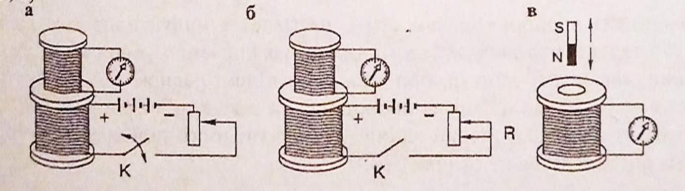

[49 start]
# Магни́тное По́ле Эле́ктромагни́тная Инду́кция 

# Текст

## Глава́ 3. Магни́тное По́ле. Эле́ктромагни́тная Инду́кция 

### §1 Взаимоде́йствие то́ков. Магни́тное по́ле. Магни́тная инду́кция 

Опыт пока́зывает, что́ два паралле́льных проводника́, по кото́рым теку́т то́ки, притя́гиваются дру́г к дру́гу, е́сли то́ки в э́тих проводника́х напра́влены одина́ково, и отта́лкиваются, е́сли то́ки теку́т в противополо́жных направле́ниях, Это взаимоде́йствие мо́жно объясни́ть сле́дующим о́бразом. Вся́кий дви́жущийся электри́ческий заря́д создаёт в окружа́ющем простра́нстве магни́тное по́ле. Это одна́ из фо́рм существова́ния мате́рии. таки́м о́бразом, вокру́г любо́го про­водника́ с то́ком образу́ется магни́тное по́ле. Магни́тное ноле́ ока́зывает де́йст­вие на движу́щиеся заря́ды. Си́ла взаимоде́йствия между паралле́льными то́ками возника́ет потому́, что ка́ждый из э́тих то́ков нахо́дится в магни́тном по́ле друго́­го то́ка. 

В ато́мах любо́го веще́ства происхо́дит движе́ние электро́нов вокру́г ядра́. За счёт э́того движе́ния возника́ют так называ́емые микрото́ки. Они́ явля́ются причи́ной намагни́чивания не́которых веще́ств, наприме́р, желе́за. 

Силово́й характери́стикой магни́тного по́ля явля́ется ве́ктор магни́тной инду́кции В. магни́тная стре́лка, внесённая в магни́тное по́ле, устана́вливается так, что́ её се́верный по́люс ориенти́руется по направле́нию ве́ктора магни́тной инду́кции. Величина́ ве́ктора магни́тной инду́кции определя́ется си́лой, де́йст­вующей со стороны магни́тного по́ля на проводни́к с то́ком 1 А и длино́й 1 м, располо́женный перпендикуля́рно ве́ктору магни́тной инду́кции.

Магни́тная инду́кция измеря́ется в те́слах. [В] = Тл. Те́сла - э́то инду́кция тако́го магни́тного по́ля, в кото́ром на 1 м проводника́ с то́ком 1 А, располо́жен­ного перпендикуля́рно ве́ктору магни́тной инду́кции, де́йствует си́ла в 1 Н. 
<!-- а́ о́ у́ э́ и́ е́ я́ -->
Магни́тное по́ле изобража́ют графи́чески с по́мощью ли́нии магни́тной ин­ду́кции, кото́рые прово́дятся так, что́бы ве́ктор В в любо́й то́чке бы́л напра́влен по каса́тельной к э́тим ли́ниям. В отли́чие от силовы́х ли́ний электростати́ческо­го поля́, ли́нии магни́тной инду́кции всегда́ за́мкнуты. По́ля с за́мкнутыми сило­выми ли́ниями называ́ются вихревы́ми, сле́довательно, и магни́тное по́ле вихре­во́е. Силовы́е ли́нии магни́тного по́ля прямо́го про­водника́ с то́ком представля́ют собо́й окру́жности, лежа́щие в плоскостя́х, перпендикуля́рных провод­нику́ (ри́с. 3.9). Це́нтры окру́жностей лежа́т на о́си проводника́. Направле́ние ли́ний магни́тной инду́к­ции определя́ется пра́вилом бура́вчика, е́сли поступа́­тельное движе́ние бура́вчика совмести́ть с направле́­нием то́ка в проводнике́, то́ направле́ние враще́ния рукоя́тки совпадёт с направле́нием силовы́х ли́ний. 

[49 end]
[50 start]

### §2. Зако́н Ампе́ра. Си́ла Ло́ренца 

Си́ла, де́йствующая на проводни́к с то́ком, помещённый в магни́тное называ́ется си́лой Ампе́ра. Де́йствие э́той си́лы мо́жно обнару́жить, помеща́я подви́жный провод­ни́к с то́ком между полюса́ми магни́та (ри́с. 3.10). По́д де́йствием си́лы Ампе́ра проводни́к втя́гива­ется в промежу́ток ме́жду полюса́ми и́ли выта́лки­вается в зави́симости от направле́ния то́ка в про­воднике́. 

Зако́н Ампе́ра формули́руется сле́дующим о́бразом: 
Си́ла Ампе́ра пропорциона́льна мо́дулю ве́ктора магни́тной нндукций В, си́ле то́ка I, длине́ проводника́ l и́ си́нусу угла́ а между напра́влен ве́ктора магни́тной инду́кции и́ то́ка в проводнике́,
$$F_A=BIl\sin{\alpha}\qquad(3.35)$$  

Си́лу Ампе́ра мо́жно рассма́тривать как су́мму си́л, де́йствующих на сво­бодные заря́ды, дви́жущиеся в проводнике́ с то́ком. 
<!-- а́ о́ у́ э́ и́ е́ я́ -->
Си́ла де́йствующая на заря́д, дви́жущийся в магни́тном по́ле, называ́ется си́лой Ло́ренца, мо́дуль кото́рой ра́вен: 
$$F_a=qvB\sin{\alpha}\qquad(3.36)$$  
где q - заря́д;  
V - Ско́рость движе́ния заря́да;  
В - мо́дуль ве́ктора магни́тной инду́кции;  
$\alpha$ - у́гол ме́жду ве́кторами ско́рости и́ магни́тной инду́кции.  

Направле́ние си́л Ампе́ра и Ло́ренца определя́ется пра́вилом ле́вой руки́, е́сли ле́вую ру́ку расположи́ть так, что́бы ли́нии ин­ду́кции входи́ли в ладо́нь, а четы́ре па́льца бы́ли напра́влены по движе́нию положи́тель­ных заря́дов (и́ли про́тив движе́ния отрица­ те́льных), то ото́гнутый на 90° большо́й па­лец пока́жет направле́ние де́йствующей си́лы (ри́с. 3.11). 

[50 end]
[51 start]

### §3. Магни́тный пото́к 

Магни́тным пото́ком Ф (пото́ком инду́кции магни́тного по́ля) сквозь пове́рхность пло́щади S в слу́чае одноро́дного магни́тного поля́ называ́ется скаля́рная величина́, ра́вная произведе́нию мо́дуля ве́ктора магни́тной инду́кции на пло́щадь пове́рхно­сти и на ко́синус угла́ между направле́ниями ве́ктора магни́тной инду́кции В и норма́ли n к пове́рхности S (ри́с. 3.12)  
$$\Phi=BS\cos{\alpha}\qquad(3.37)$$  

Магни́тный пото́к мо́жно истолкова́ть как величину́, пропорциона́льную числу́ ли́ний магни́тной инду́кции, прони́зывающих пове́рхность.  
Едини́цей магни́тного пото́ка явля́ется ве́бер, [Ф] = Вб. Ве́бер - э́то маг­ни́тный пото́к, создава́емый магни́тным по́лем с инду́кцией 1(одна) Тл че́рез поверх­ность пло́щадью 1(один) м, располо́женную перпендикуля́рно ли́ниям магни́тной ин­ду́кции.

### §4.  Явле́ние эле́ктромагни́тной инду́кции. Зако́н эле́ктромагни́тной инду́кции. Пра́вило Ле́нца 

В 1831 г. Фараде́й обнару́жил с по́мощью се́рии о́пытов, что в проводя́щем за́мкнутом ко́нтуре, находя́щемся в переме́нном магни́тном по́ле, возника́ет электри́ческий ток, кото́рый называ́ют индукцио́нным, а создаю́щую его эле́ктродви́жущую си́лу называ́ют ЭДС инду́кции. Это явле́ние было на́звано явле́нием эле́ктромагни́тной инду́кции.  
<!-- а́ о́ у́ э́ и́ е́ я́ -->
Первонача́льно инду́кция была́ откры́та в неподви́жных друг относи́тельно дру́га кату́шках при замыка́нии и размыка́нии це́пи одно́й из них (рис. 3.13 а). В соотве́тствии с рисунком. 3.13 б при измене́нии си́лы то́ка в одно́й из кату́шек, магни́тное по́ле которо́й прони́зывает втору́ю кату́шку, в после́дней возника́ет индукцио́нный ток. Появле́ния индукцио́нного то́ка мо́жно доби́ться при вдвиже́нии постоя́нного магни́та вну́трь кату́шки и выдвиже́нии магни́та из неё (рис. 3.13 в).  

  

[51 end]
[52 start]

ЭДС инду́кции не зави́сит от причи́н измене́ния магни́тного пото́ка，а определя́ется ско́ростью его измене́ния. Зако́ну эле́ктромагни́тной инду́кции (зако́ну Фараде́я)：  
ЭДС инду́кции в за́мкнутом ко́нтуре пря́мо пропорциона́льна измене́н магни́тного пото́ка за едини́цу вре́мени:  
$$\varepsilon_u=-\frac{\Delta\Phi}{\Delta t}\qquad(3.38)$$  
где  ΔΦ- измене́ние магни́тного пото́ка за вре́мя Δt.  
Знак " -(минус) " математически выра́жает пра́вило Ле́нца:  

Индукцио́нный ток всегда́ напра́влен так, что свои́м магни́тным по́лем он противоде́йствует измене́нию магни́тного пото́ка, вызыва́ющему этот ток.  

Наприме́р, если магни́тный пото́к, прони́зывающий ко́нтур, убыва́ет, то возникаю́щий при этом индукцио́нный ток создаёт магни́тное по́ле, напра́вленное одина́ково с убыва́ющим магни́тным по́лем, стремя́сь скомпенси́ровать его у́быль. Если же магни́тный пото́к, прони́зывающий ко́нтур возраста́ет то магни́тное по́ле индукцио́нного то́ка, препя́тствуя возраста́нию магни́тного пото́ка, будет напра́влено в противополо́жную сто́рону.

Явле́ние эле́ктромагни́тной инду́кции лежи́т в осно́ве устро́йства генера́торов, превраща́ющих механи́ческую эне́ргию в электри́ческую́ трансформа́торов и други́х устро́йств  

### §5.  Индукти́вность. Явле́ние самоинду́кции. Эне́ргия магни́тного по́ля
<!-- а́ о́ у́ э́ и́ е́ я́ -->
Электри́ческий ток, проходя́щий по проводнику́，создает вокру́г него маг­ни́тное поле. Магнитный поток Ф скво́зь пло́щадь, ограни́ченную ко́нтуром с то́ком, пропорциона́лен си́ле то́ка в ко́нтуре:  
$\Phi \sim I$, или $\Phi=LI\qquad(3.39)$  
(Фи пропорциально I большое, или Фи равно Эл большое умножить на И большое)  

Коэффицие́нт пропорциона́льности L называ́ется индукти́вностью конту́ра, Из (3.39) сле́дует, что индукти́вность ко́нтура чи́сленно равна́ магни́тному пото́ку, прони́зывающему ко́нтур при си́ле то́ка в нём ра́вном 1 А. Индукти́вность зависи́т от разме́ров и фо́рмы проводника́， а также от магни́тных сво́йств среды́， в котором он нахо́дится. За едини́цу индукти́вности принима́ется ге́нри, [L] = Гн. Она определя́ется на осно́ве (3.39):  
$$L=\frac{\Phi}{I}$$  

[52 end]
[53 start]

При́няв Ф = 1 Вб, I = 1 А, получи́м: 1 Гн = $\frac{1Вб}{1А}$  т.е. ге́нри - индукти́вность 1А ко́нтура, кото́рый при си́ле то́ка 1 А прони́зывается магни́тным пото́ком 1 Вб.   

При измене́нии си́лы то́ка в ко́нтуре или кату́шке происхо́дит измене́ние магни́тного по́ля, создава́емого этим то́ком. Измене́ние магни́тного пото́ка, прони́зывающего кату́шку, вызыва́ет появле́ние ЭДС инду́кции в кату́шке. 

**Явле́ние возникнове́ния ЭДС инду́кции в электри́ческой цени́ в ре­ зультате измене́ния си́лы то́ка в э́той це́пи называ́ется самоинду́кцией.**  

Самоинду́кция - э́то ча́стный слу́чай явле́ния электромагни́тной инду́кции. Ток самоинду́кции мо́жет быть напра́влен и́ли одина́ково с основны́м, и́зме­няющимся то́ком в це́пи, и́ли в противополо́жную сто́рону. В соотве́тствии с пра́вилом Ле́нца ЭДС самоинду́кции препя́тствует нараста́нию то́ка при за́мы­кании электри́ческой це́пи и убыва́нию то́ка при её размыка́нии. Величина́ ЭДС самоинду́кции согла́сно зако́ну Фараде́я и в соотве́тствии с выраже́нием (3.39) равна́:  
$$\varepsilon_c=-\frac{\Delta\Phi}{\Delta t}=-L\frac{\Delta I}{\Delta t}\qquad(3.40)$$  
где $\Delta I$ - измене́ние си́лы то́ка за промежу́ток вре́мени $\Delta t$.  

<u>ЭДС самоинду́кции пропорциона́льна индукти́вности кату́шки и ско́рости измене́ния си́лы то́ка в ней.</u>  
Эне́ргия исто́чника то́ка, затра́ченная на преодоле́ние ЭДС самоинду́кции и созда́ние то́ка 1 в кату́шке с индукти́вностью Ь, нака́пливается в магни́тном поле́, создава́емом то́ком.  
<u>Эне́ргия магни́тного по́ля</u> то́ка равна́ полови́не произведе́ния индукти́вно­сти кату́шки на квадра́т си́лы то́ка в ней:
$$W=\frac{LI^2}{2}\qquad(3.41)$$

[53 end]

# Вопросы

## 49

### Вопросы в записи

1. <Вопрос>
2. <Вопрос>
3. ......

### Вопрос может быть

1. <Вопрос>
2. <Вопрос>
3. ......

## 49

### Вопросы в записи
1. .
2. Могнитное поле на неподвижной заряд действует или нет?（Действует ли могнитное поле на неподвижной заряд？）Почему？
    > 磁场是否对静电荷起作用？为什么？
    - 答：Нет.Потому что сила Лоренциа $F_{a}=qvB\sin{\alpha}$,если $v=0$,то $F=0$
        > 答：否，因为洛伦兹力 $F_{a}=qvB\sin{\alpha}$，若 $v=0$，则 $F=0$
3. Вот величина заряда.Как зависит действующая сила,если заряд увеличим два раза？Сколько раз вырастет сила？
    > 这里是电荷量的大小，如果电荷量增加 2 倍，有效力如何？ 将增加多少倍？
    - 答：Вырастет 2 раза.Потому что сила Лоренциа $F_{a}=qvB\sin{\alpha}$,если заряд $q$ увеличим два раза,то сила вырастет вырастет 2 раза
        > 答：增加两倍。因为洛伦兹力 $F_{a}=qvB\sin{\alpha}$，若电荷量 $q$ 增大两倍，则力也增大两倍
4. Если увеличим ещё раз величину заряда, увеличим 2 раза, что произойдёт здесь включить на него силой?
    > 如果我们再增加电荷的大小，增加2倍，这里会发生什么？
    - 答：
5. От направления движения зарядов,дейстующая на него сила зависит или нет？
    > 作用在电荷上的力取决于电荷移动的方向吗？
    - 答：Да,зависит.Сила Лоренциа $F_{a}=qvB\sin{\alpha}$,если угол $\alpha$ изменяется,то $\cos{\alpha}$ изменяется,поэтому сила Лоренциа тоже изменяется.
        > 答：是的，取决于。洛伦兹力 $F_{a}=qvB\sin{\alpha}$，若角 $\alpha$ 改变，则 $\cos{\alpha}$，因此洛伦兹力也改变
6. силовые линии магнитного поля замкнутые или они начинаются на плюс зарядах оканчивается на минус. В чём разница между линиями электрического и магнитного поля. линие силовой электрического поля на каких зарядах начинается? на положительных. А кончивается на отрицательных. А линии магнитного поля какие они?  
   磁场力线是闭合的，或者是以正电荷为起点，以负电荷为终点。电场线和磁场线有什么区别.电场线的力线是从什么电荷上开始的呢，是在正电荷上。它以负电荷结束。而磁场线，是什么？

    В отли́чие от силовы́х ли́ний электростати́ческого поля́, ли́нии магни́тной инду́кции всегда́ за́мкнуты. По́ля с за́мкнутыми силовыми ли́ниями называ́ются вихревы́ми, сле́довательно, и магни́тное по́ле вихрево́е. Силовы́е ли́нии магни́тного по́ля прямо́го проводника́ с то́ком представля́ют собо́й окру́жности, лежа́щие в плоскостя́х, перпендикуля́рных проводнику́ (ри́с. 3.9). Це́нтры окру́жностей лежа́т на о́си проводника́.   
    与静电场相反，磁感应总是短路的。场线闭合的场称为涡流场，因此磁场也是涡流场。载流导体的直接磁场的力线是垂直于导体的圆（图3.9）。周长位于导体轴线上。

7. Как называется Поля с замкнутыми силовыми линиями?  
   闭合力线的字段的名称是什么？

   вихрение
   涡旋

8. но вихревая обучения может быть в разные стороны слева направо и справа налево Как узнать. Куда направлена линия каким правилам направление линии определяется как она называется?  
   但是从左到右以及从右到左，涡旋学习可以在不同的方向上。如何找到答案。 线指向什么规则，线的方向由线的调用方式决定？
   
   Направле́ние ли́ний магни́тной инду́к­ции определя́ется пра́вилом бура́вчика, е́сли поступа́­тельное движе́ние бура́вчика совмести́ть с направле́­нием то́ка в проводнике́, то́ направле́ние враще́ния рукоя́тки совпадёт с направле́нием силовы́х ли́ний.  
   如果磁感线的方向是由磁芯规则决定的，那么磁芯规则的旋转方向与导体中的电流方向是一致的。

### Вопрос может быть

1. Как двигают два паралле́льных проводника́, по кото́рым теку́т то́ки, е́сли то́ки в э́тих проводника́х напра́влены одина́ково. А в противополо́жных направле́ниях?
    > 若两个平行载流导体中的电流方向相同，它们如何运动？若电流相反呢？
    - 答：Если то́ки в э́тих проводника́х напра́влены одина́ково —— притя́гиваются дру́г к дру́гу；в противополо́жных направле́ниях —— отта́лкиваются
        > 答：若电流方向一致 —— 相互吸引；电流方向相反 —— 相互排斥
        
## 50

### Вопросы в записи

1. Как называется сила действующая на проводник с током в магнитном поле？  
    在磁场中，电流对导体的作用力是什么？

    Силой Амперa  
    安培力

2. Cила ампера действующая на проводник силы тока в проводнике зависит?  
    安培力取决于导体的电流强度吗？

    да.

3. Если силу тока увеличить в 5 раз сила ампера во сколько раз увеличится?  
    安培力取决于导体中电流的强度。如果电流增加5倍，安培力将增加多少倍？

    5 раз  
    5倍

4.  Если изменить направление провода доставка в пространстве сила, действующая на него изменится или нет?  
    如果你改变了空间中导线输送的方向，作用在它上的力就会改变还是不变？

    изменится  
    改变($\alpha$改变)

5. Что называется силой ампера?  
    什么叫安培力？

    Сила, действующая на проводник с током, помещённый в магнитное называется силой Ампера.  
    放在磁场中的电流作用在导体上的力称为安培力。

6. Cилой ампера величина индукции магнитного поля зависит или нет?  
    安培力的大小是否取决于磁场的大小？

    Зависит  
    安培力的大小取决于磁场的大小

7. Если индукция магнитного поля увеличится в 3 раза сила ампера, что?  
    如果磁场的感应力增加3倍，则安培力的大小如何改变？ 

    увеличится в 3 раза  
    增加3倍

8.  Как называется сила, действующая на заряд в магнитном поле?  
    在磁场中作用在电荷上的力叫什么？

    Силой Лоренца  
    洛伦兹力

### Вопрос может быть

1. Что называется cилой Лоренца？
什么叫洛伦兹力？
Си́ла де́йствующая на заря́д, дви́жущийся в магни́тном по́ле, называ́ется си́лой Ло́ренца.
作用在磁场中运动的电荷上的力叫洛伦兹力
2. 对于公式中与安培力及洛伦兹力成正比的电荷量电流等增加或减少n倍时安培力及洛伦兹力的变化进行考察
$F_A=BIl\sin{\alpha}\qquad$  $F_a=qvB\sin{\alpha}\qquad$
$I$ - сила тока
$l$ - длина проводника
$q$ - заря́д;  
$V$ - Ско́рость движе́ния заря́да;  
$В$ - мо́дуль ве́ктора магни́тной инду́кции;  
$\alpha$ - у́гол ме́жду ве́кторами ско́рости и́ магни́тной инду́кции.

## 51

### Вопросы в записи 

1. Что такое явление электромагнитной индукции？
什么是电磁感应现象？
В 1831 г. Фарадей обнаружил с помощью серии опытов, что в проводящем замкнутом контуре, находящемся в переменном магнитном поле, возникает электрический ток, который называют индукционным, а создающую его электродвижущую силу называют ЭДС индукции. Это явление было названо явлением электромагни́тной индукции.
1831年，法拉第通过一系列实验发现，在位于交变磁场中的导电闭合电路中，存在着电流，这种电流叫感应电流，产生它的电动势力叫感应电磁场。这种现象被称为电磁感应现象。

### Вопрос может быть

1. Магнитным потоком $Phi$ (потоком индукции магнитного поля) сквозь поверхность площади S в случае однородного магнитного поля называется скалярная величина или векторная величина？ 
在磁场均匀的情况下，通过表面积S的磁通量$Phi$（磁感应通量）为标量还是矢量？
Cкалярная величина.
标量。
2. 对公式$\Phi=BS\cos\alpha$进行考察
$В$ - модуль вектора магнитной индукции; 
$S$ - пло́щадь поверхно сти;
$\alpha$ - косинус угла между направлениями вектора магнитной индукции $B$ и нормали $n$ к поверхности $S$
3. Kак магнитный поток можно истолковать？
磁通量可以解释成什么？
Магнитный поток можно истолковать как величину, пропорциональную числу линий магнитной индукции, пронизывающих поверхность. 
磁通量可以解释为与穿透磁极的磁感应线数量成正比的大小。
4. Что такое единицы магнитного потока？
磁通量的单位是什么？
Ве́бер .
韦伯。
5. Oбъясните единицы магнитного потока——вебер.
解释磁通量单位——韦伯。
Вебер - это магнитный поток, создаваемый магнитным полем с индукцией 1 Тл через поверх ность площадью 1 м, расположенную перпендикулярно линиям магнитной индукции.
这是在垂直于磁感应线的1米表面上感应1特斯拉的磁场所产生的磁通量。