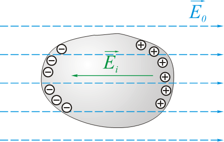
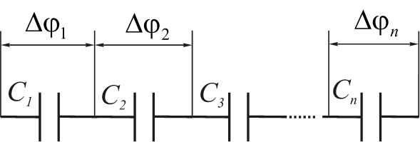

Content

- [Expression](#Expression)

# 电与磁

## 第三课 静电场中的导体

### 3.1 导体中的电荷分布
- 存在大量自由电荷的物质叫做导体
    - 金属 —— 自由电子
    - 电解质 —— 正负离子
    - 气体（离子化） —— 电子和正离子
- 在静电场的作用下，导体中电荷的重新分布称为[静电感应](https://baike.baidu.com/item/%E9%9D%99%E7%94%B5%E6%84%9F%E5%BA%94/5484462?fr=aladdin)：
    - $\overrightarrow{F} = q\overrightarrow{E}_{0}$
        - 
    - $\overrightarrow{E} = \overrightarrow{E}_{0}+\overrightarrow{E_{i}}$
        > $\overrightarrow{E} = 0$
        - 
    - 1.导体内部的电场为0，表面上的电场沿法线方向
        > $E = E_{n} \quad\quad\quad\quad\quad\quad E_{τ} = 0$
        - 
    - 2.导体范围内电势相等
        > $\frac{d\phi}{dl} = -E_{l} = 0$
    - 3.导体的表面是等势的
        > $\frac{d\phi}{dl} = -E_{τ} = 0$
    - 4.未补偿的（未抵消的）感应电荷分布于导体表面
        - 
            > - $q = \underset{(s)}{\oint}\varepsilon_{0}\overrightarrow{E}d\overrightarrow{S} = 0$
            > - $\underset{(s)}{\oint}\overrightarrow{D}d\overrightarrow{S} = q^{своб}_{охв}$
            > - $\underset{∆h \rightarrow 0}{\lim}\underset{(s)}{\oint}\overrightarrow{D}d\overrightarrow{S} = D_{n}dS$
            > - $q^{своб}_{охв} = \sigma dS$
            > - $D_{n} = \sigma       E_{n} = \frac{\sigma}{\varepsilon \varepsilon_{0}} (3.1)$

### 3.2 孤导体的电容量
- 孤导体（绝缘导体，隐蔽导体）（уединенный проводник）是指距离其他物体很远，可以忽略其电场影响的导体
    - $\sigma = k \cdot q$
    - $k = k（x，y，z）$
    - $\phi = \frac{1}{4 \pi \varepsilon \varepsilon_{0}} \underset{(S_{пров})}{\int} \frac{\sigma dS}{r} = \frac{q}{4\pi \varepsilon \varepsilon_{0}}\underset{(S_{пров})}{\int}\frac{kdS}{r}$
- 孤导体的电荷 $q$ 与电位 $\phi$ 的比值 $C$,称为该导体的电容.
    - $C = \frac{q}{\phi}          (3.2)$
        > 国际单位：容量 - $1F$(Фарад 法拉)
        - $1F$ 是这种孤立导体的容量，当向其传递 $1C$ 电荷时，它获得 $1V$ 的电势。
- 例题：
    - 让我们来求一个位于介电常数为 $ε$ 的均质的，各向同性介质中的孤立导电球的电容。
        - $r \geq R$
        - $E_{r} = \frac{q}{4\pi εε_{0}r^{2}}$
        - $\phi = -\int\limits_{R}^{\infty}E'{R}dr = \frac{q}{4\pi εε_{0}R}$
    - $C = 4\pi εε_{0}R          (3.3)$
    > 地球的电容：$C = 4\pi\cdot 8.85\cdot 10^{-12}F/m\cdot6.4\cdot10^{6}m=7\cdot10^{-4}F=700\quad mkF$

### 3.3 电容器
- 
    > - $E'_{r} < E_{r} = \frac{q}{4\pi εε_{0}r^{2}}$
- 
    > - $\phi ' = \frac{q}{C'} = \int\limits_{R}^{\infty}E'_{r}dr < \int\limits_{R}^{\infty} \frac{qdr}{4\pi εε_{0}r^{2}} = \frac{q}{4\pi εε_{0}R} = \frac{q}{C} = \phi$
    > - $C' > C$
- 未连接的导体的电容量始终大于单独使用时同一导体的电容量
- 电容器是由两个导体（称为极板）组成的系统，由电介质层隔开
    - 
- 一个极板的电荷与极板之间的电势差的比值称为电容器的电容
    - $C = \frac{q}{\phi_{1} - \phi_{2}}          (3.4)$
- 例子：
    - 1.扁平电容器
        - $0 \le x \le d$
        - 
            > - $E_{x} = \frac{\sigma}{2 \varepsilon \varepsilon_{0}} + \frac{\sigma}{2 \varepsilon \varepsilon_{0}} = \frac{\sigma}{\varepsilon \varepsilon_{0}}$
            > - $\sigma = \frac{q}{S}$
            > - $\phi_{1} - \phi_{2} = \int\limits_{0}^{d}E_{x}dx = \frac{\sigma}{\varepsilon\varepsilon_{0}}\int\limits_{0}^{d}dx = \frac{qd}{\varepsilon\varepsilon_{0}S}$
        - $C = \frac{\varepsilon \varepsilon_{0} S}{d}$          (3.5)
    - 2.球形电容器
        - 
            - $E_{r} = \frac{q}{4 \pi\varepsilon\varepsilon_{0}r^{2}}$
            - $\phi_{1} - \phi_{2} = \int\limits_{R_{1}}^{R_{2}}E_{r}dr = \frac{q}{4\pi εε_{0}}\int\limits_{R_{1}}^{R_{2}}\frac{dr}{r^{2}} = \frac{q}{4\pi εε_{0}}(\frac{1}{R_{1}} - \frac{1}{R_{2}})$
        - $C = \frac{4\pi\varepsilon\varepsilon_{0}R_{1}R_{2}}{R_{2} - R_{1}}$          (3.6)
    - 3.圆柱形电容器
        - 
            - $τ = q/l$
            - $E_{r} = \frac{τ}{2\pi\varepsilon \varepsilon_{0}r} = \frac{q}{2\pi\varepsilon\varepsilon_{0}lr}$
            - $\phi_{1} - \phi_{2} = \int\limits_{R_{1}}^{R_{2}}E_{r}dr = \frac{q}{2\pi εε_{0}l}\int\limits_{R_{1}}^{R_{2}}\frac{dr}{r} = \frac{q}{2\pi εε_{0}l}\ln{\frac{R_{2}}{R_{1}}}$
        - $C = \frac{2\pi\varepsilon\varepsilon_{0}l}{\ln{(R_{2}/R_{1})}}$          (3.7)
- 击穿电压(击穿电压)是指电容器的电极之间的最小电位差，在这个电位差上，通过电容器中的介电层发生放电。

### 电容器的连接
- 并联(Параллельное соединение)
    - 
        > - $q_{i} = C_{i}\cdot ∆\phi$
        > - $q = C\cdot ∆\phi$
        > - $q = \sum_{i=1}^{n}C_{i}\cdot\phi = ∆\phi\cdot\sum_{i=1}^{n}C_{i}$
    - $C = \sum_{i=1}^{n}C_{i}          (3.8)$
- 串联(Последовательное соединение)
    - 
        > - $∆\phi_{i} = \frac{q}{C_{i}}$
        > - $∆\phi = \sum_{i=1}^{n}∆\phi_{i} = \sum_{i=1}^{n}\frac{q}{C_{i}} = q\cdot\sum_{i=1}^{n}\frac{1}{C_{i}}$
        > - $∆\phi = \frac{q}{C}$
    - $\frac{1}{C} = \sum_{i=1}^{n}\frac{1}{C_{1}}          (3.9)$
    - 
        > - $∆\phi_{посл} = n\cdot ∆\phi_{пар}$