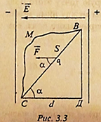
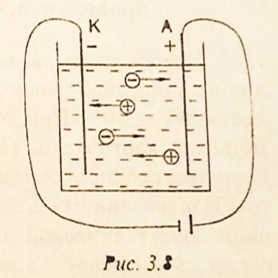

# 预科物理教材

# 第一部分：分子物理学

## 第一章：分子动力学理论的基本原理
    
### §1.1. 分子动力学理论的基本规定及其实验依据
- 分子动理论
    - 定义：分子和动力学理论是通过构成物体的原子和分子的运动和相互作用来解释物体的结构和性质的学说。
    - 内容
        - 1，所有物质都是由大量的分子组成的，
        - 2，所有分子都在做永不停息的无规则运动
        - 3，分子之间存在相互作用力
        > 注意：物理学概念上的分子是指构成某一物质的具有其基本的化学性质的最小粒子（包括原子，离子甚至电子）
- 布朗运动
    - 定义：布朗运动是悬浮在液体中的 `颗粒` 的无规则运动。无规则运动的液体分子从四面八方作用于 `颗粒` ，与 `颗粒` 发生碰撞，从而改变了 `颗粒` 速度的大小和方向。
- 扩散运动
    - 定义：扩散运动是指一种物质的分子渗透到另一种物质分子之间的空隙中的过程，存在于气体，液体和固体之间
- 分子间作用力的证明
    - 分子间引力的证明：将两块铅各切出一个切口，将这两块铅沿新切口接合起来，可以承受相当大的拉力而不分开，可以证明出分子之间存在吸引力
    - 分子间斥力的证明：液体与固体很难被压缩，证明分子间存在斥力
- 物质的量
    - 物质的量是由构成该物质的分子数决定的，以摩尔为单位
    - 一摩尔等于 0.012 千克碳 C12 中含有多少个原子，就含有多少个分子的物质
    - 任何物质的一摩尔都含有相同数量的分子，称为阿伏加德罗常数：NA = 6.02·1023 个
- 摩尔质量
    - 物质的量为一摩尔的某物质的质量即为摩尔质量，以克每摩尔为单位
    - 摩尔质量在数值上等于该物质的相对分子质量
    - 物质的一个分子的质量可以用该物质的摩尔质量除以阿伏伽德罗常数来计算，即：$m_{0} = \frac{\mu}{N_{A}}$
    - 研究发现分子之间的距离约为 10-10m
    > 分子动力学理论的创始人是伟大的科学家M.V.罗蒙诺索夫。他根据分子动力学的概念，讲解了气体的性质、热的性质、固体的溶解等。

### §1.2. 温度及其物理意义
- 温度的概念：    
    - 温度是描述物体冷热程度的物理量。从微观角度来说是物体分子进行热运动的剧烈程度。从分子运动论的观点来说是分子运动平均动能的标志
- 热量的转递：
    - 如果让两个温度不同的物体（或者同一物体温度不同的两个部分）接触，组成物体的分子会相互碰撞，使热量自发地从温度较高的物体（或部分）传到温度较低的物体（或部分）上，直到两物体（或部分）的温度变得相等。在这种情况下，可以说这两个物体（或这两个部分）处于热平衡状态。
- 分子热运动的平均动能：
    - 随温度的升高，分子热运动的平均动能增大。气体分子热运动的平均动能 $\overline{\varepsilon}$ 与其温度 $T$ 之间有直接的比例关系，由表达式定义为： 
        - $\overline{\varepsilon} = \frac{3}{2}KT$    (2.1)    
其中：К为玻尔兹曼常数，即理想气体常数与除以阿伏伽德罗常数的值，$K = 1.380649 \times 10^{-23} J/K$
- 温度的度量：
    - 绝对温度：若温度 $T \rightarrow 0$，则根据（2.1）$\overline{\varepsilon} \rightarrow 0$。我们规定分子热运动停止的温度称为绝对零度(абсолютным нулем)。这样定义的温度只能是正值。它被称为绝对温度(абсолютная температура)，以开尔文刻度来衡量。绝对温度的单位是开尔文($K$)，$[T] = K$
    - 摄氏温度：仅仅与开尔文刻度在零点位置上不同：$0K = -273.15℃$。若 $t$ 为摄氏刻度温度，$T$ 为绝对温度，则$T = t + 273.15$

### §1.3. 理想气体与门捷列夫方程
- 理想气体：为了简化气体的研究，我们引入了理想气体的概念：
    - a)与容器的体积相比，气体分子的大小可以忽略不计
    - b)分子之间没有相互作用，则可以认为是理想的气体。    
        > 气体所服从的规律是复杂的。真正的气体按其性质来说，在足够小的压力和不太低的温度下，是接近理想气体的。
- 理想气体状态方程：
    - 气体的状态由一组参数表示。包括：质量$m$、温度$T$、体积$V$、压强$P$。将表征给定质量气体 $m$ 状态的参数$P$、$V$、$T$联系起来的方程，称为理想气体的状态方程。即 $PV = \frac{m}{\mu}RT$
    - 理想气体常数 $R$：对于一摩尔的任意理想气体，将该气体的压强 $P$ 与其摩尔体积 $V_{\mu}$ 的乘积除以气体的绝对温度 $T$，都会得到一个恒定的数，用字母 $R$ 表示，称之为理想气体常数，即：
        - $PV_{\mu} = RT ⇨ \frac{PV_{\mu}}{T} = R$, ( R=8.31 J/(mol·K) )    (2.2)
        > 理想气体常数 $R$，玻尔兹曼常数 $K$ 与阿伏伽德罗常数的关系为：$R = K \cdot N_{A}$
    - 物体的质量 $m$ 除以其摩尔质量 $μ$ 即为物体的物质的量 $ν$，即 $ν = \frac{m}{\mu}。将 (2.2) 乘以摩尔数 \frac{m}{\mu}$，得到：
        - $PV_{\mu}\frac{m}{\mu} = \frac{m}{\mu}RT$
    - 由于数值 $V_{\mu}\frac{m}{\mu} = V$ 为整个气体的体积，故而：
        - $PV = \frac{m}{\mu}RT$    (2.3)
        > 表达式（2.3）即为理想气体的状态方程。它是由克拉佩伦和门捷列夫建立的，称为门捷列夫-克拉佩伦方程。

## 第二章：热力学要素

### §2.1. 内能与热力学第一定律
- 热力学：
    - 概念：热力学是研究热功转换过程所遵循的规律的科学，不考虑物体的原子和分子内部结构
    - 基本内容：热力学的四个经验定律
        - 1，热力学第零定律：若两个热力学系统均与第三个系统处于热平衡状态（即温度相同），此两个系统也必互相处于热平衡。
        - 2，热力学第一定律：一个热力学系统的内能增量等于外界向它传递的热量与外界对它所做的功的和。（如果一个系统与环境孤立，那么它的内能将不会发生变化）
        - 3，热力学第二定律：
            - 克劳修斯表述：热量可以自发地从温度高的物体传递到较冷的物体，但不可能自发地从温度低的物体传递到温度高的物体；
            - 开尔文-普朗克表述：不可能从单一热源吸取热量，并将这热量完全变为功，而不产生其他影响。
            - 熵表述：随时间进行，一个孤立体系中的熵不会减小。
        - 4，热力学第三定律：绝对零度时，所有纯物质的完美晶体的熵值为零。 或者绝对零度（$T = 0K$ 即 $-273.15℃$）不可达到。
- 内能：
    - 定义：
        - 物质分子热运动的动能和它们相互作用的势能之和称为机体的内能，即：
            - $U = E_{k}+E_{p}$
        - 而对于理想气体，分子间相互作用的势能等于零，内能等于其所有分子混沌运动的动能之和，即：
            - $U = E_{k}$
    - 规律：理想气体的内能与其温度成正比，随着温度的升高，分子的热运动平均速度加快，因而其平均动能也随之增加。如果温度不改变，内能保持不变。
    - 内能变化的两种情况：    
        - 1，做功：外界对物体（或由物体组成的体系）做正机械功时，物体（或体系）内能增加，反之，物体（或体系）内能减少    
        - 2，热传递：内能从温度高的物体传到温度地的物体，或从同一物体的高温部分传到低温部分
            - 发生条件：存在温度差
            - 传递方向：从高温处传到低温处
        > 注意:
            - 1，内能 $U$ 与热量 $Q$ 的区别：内能是一个状态量，一个物体在不同的状态下有不同的内能。而热量是一个过程量，表示由于热传递而引起的变化过程中转移的能量，即内能的该变量。没有热传递就没有热量可言。    
            - 2，热量 $Q$ 和功 $A$ 的概念是相似的：它们是衡量从一个物体（或部分）转移到另一个物体（或部分）的能量。热量的计量单位是 $J$。
- 热力学第一定律：热力学第一定律是能量的守恒和转化定律，延伸到热现象：传递给系统的热量用于改变系统的内能和供系统对外部机构做功：
    - $Q = ΔU+A$    (2.5)
    > 例如，当一定量的热量传递给活塞下的容器中的气体时，它被用于气体的加热，即增加其内能，以及气体膨胀时活塞的提升工作。

### §2.2. 热力学第一定律的应用
- 概念梳理：
    - 过程：在一定的环境条件下，系统的状态发生了变化，从一个状态变化到另一个状态，我们称系统发生了一个热力学过程，简称过程
    - 等过程：是指系统状态参数：温度 $T$，体积 $V$ 或压强 $P$ 中的任意一值保持不变进行的过程
    - 途径：系统变化所经历的具体路径称为途径
- 气体状态的变化过程的研究，
    - 1，等温变化过程
        - 概念：指温度恒定（即 $T = const$）的情况下发生的过程，该过程服从波义耳-马略特定律
        - 对于给定质量的气体，气体压强与体积的乘积不变，即：
            - $PV = const$    (2.6)
                > 由门捷列夫-克拉佩龙方程（见2.3）得出
        - 对于气体变化前后的两种状态：
            - $P_{1}V_{1} = P_{2}V_{2}$ 或 $\frac{P_{1}}{P_{2}} = \frac{V_{1}}{V_{2}}$    (2.7)    
                
            - 在恒温条件下，理想气体的压强与体积成反比。等温过程图像中的图线即为等温线（见图2.1）
            - 在等温过程中，由于温度不变，内能没有变化，$ΔU = 0$。根据热力学第一定律：$Q = ΔU+A$，应用于等温过程中，其形式为：$Q = A$，即传递给气体的热量仅与气体做工有关
    - 2，等容变化过程
        - 概念：指体积恒定（即 V=const）的情况下发生的过程，该过程服从查尔斯定律
        - 对于给定质量的气体，气体压强与温度的商不变，即：
            - $\frac{P}{T} = const$
                > 由门捷列夫-克拉佩龙方程（见2.3）得出
        - 对于气体变化前后的两种状态：
            - $P_{1}V = \frac{m}{\mu}RT_{1}$    ①
            - $P_{2}V = \frac{m}{\mu}RT_{2}$    ②    
            将①式除以②式，得到：
    >`此处缺一页`

### §2.3. 比热容
- 物体的热容在数值上等于必须传递给物体以将其加热 1°C 或 1K 的热量
    - $C = \frac{Q}{∆T}$ (2.10)
        - $∆T$ - 热量 $Q$ 被传递给物体时的温度变化
- 物质的比热容是一个物理量，在数值上等于每加热 1°C（或 1K）一千克物质所需的热量
    - $c = \frac{Q}{m∆T}$ (2.11)
        - $m$ - 物体的质量
    - 比热容计量单位是 $[s] = J/(kg·K)$
        > 由公式 <a href="#a">(2.11)</a> 得出
        - 铜的比热容是 380 J / (kg·K)
            > 即给 1kg 铜加热使其温度升高 1℃（或 1K）所需的热量是 380J，冷却同样释放相同的热量
    - 用于计算将质量 $m$ 加热 $∆T$ 度所需的热量的公式
-    $Q = c \cdot m \cdot ∆T$
            > 由公式 <a href="#a">(2.11)</a> 得出
    - 热容不仅取决于物质的性质，还取决于物体体温变化的条件
        - 在等容过程中，传递给物体的热量仅用于增加内能
        - 在等压过程中，还用于做机械功。
            > 因此在恒压过程下的热容 $C_{p}$ 始终大于恒容过程下的热容    $C_{v}$
        - 在绝热过程中，当 $Q = O$ 时，热容为零
        - 在等温过程中，温度恒定，热容的概念没有意义

### §2.4. 热力发动机的工作原理
- 能将内能转换为机械功的设备叫做热力发动机
 - 通常在热力外燃机中，机械工作是由气体（蒸汽）来完成的，气体被称为工作体。气体接受来自温度高于气体的加热装置的热量 $Q_{1}$，气体膨胀时，会带动机器的运动部件（例如气缸的活塞）。工作体每次做完功后，必须恢复到初始状态，使气体压缩时消耗的功小于膨胀时获得的功。为此气体在压缩前被冷却，使其与冷却装置（即温度低于气体温度的物体）接触。在这种情况下，气体传递给冷冻装置的热量 $Q_{2} < Q_{1}$，然后重复整个过程。一个周期的有用功 $A = Q_{1} - Q_{2}$
- 热机的效率 $\eta$ 是指一个周期内所做的有用功 $A$ 与从加热器接收的热量 Q1 之比。效率（КПД - Коэффициент полезного действия）表示发动机的有用功有多少是来自燃料完全燃烧所释放的全部能量。根据定义得：
 - $\eta = \frac{A}{Q} = \frac{Q_{1}-Q_{2}}{Q_{1}} = 1- \frac{Q_{2}}{Q_{1}}$
     > 由表达式可知，热机的效率总是小于 1
     - 理想热机的效率最大值可以通过……温度 $T_{1}$ 和……温度 $T_{2}$ 计算：
         - $\eta_{max} = \frac{T_{1} - T_{2}}{T_{1}}$
 - 加热装置的温度 $T_{1}$ 越高，冷却装置的温度 $T_{2}$ 越低，效率越高。大气环境也可以作为冷却装置。热机的实际效率 $\eta < \eta_{max}$，因为能量会因摩擦以及其他原因损失
- 热机有很大的实际用途。 蒸汽轮机用于热电厂和核电厂，大型船舶等。内燃机用于各种现代运输工具，包括公路，铁路，水以及农业机械。 在航空和太空火箭中-喷气发动机和涡轮喷气发动机。
    
## 第三章：物态变化

### §3.1. 物态的分子动力学解释
- 物态(агрегатное состояние)：即物质的聚集状态
- 根据温度和压力的不同，同一种物质可以处于某种集合状态：固体、液体、气体。还有其他的集合状态，如等离子体，我们就不考虑了。所有状态的共同点是构成物质的粒子的无规则运动
    > 根据条件的不同，物质可以从一种集合状态转变为另一种集合状态
    - 在气体中，分子之间的距离比其大小大很多倍，分子在气体所占的空间中自由移动。这就解释了气体能够被压缩并占据给它的整个体积。气体分子之间的引力很小，不能使它们相互靠近
    - 在液体中，粒子的位置几乎相互接近，并在自己的平衡位置附近进行振荡运动。在做了大约一百万次振荡之后，一个分子就会跳到另一个位置。每个分子每秒会发生 105 - 106次这样的变化。这就决定了液体的流动性和低压缩性等特性
    - 在固体中，粒子围绕其平衡位置振动。在晶体中，这些位置是晶格（кристаллическая решетка）的节点。固体之所以有形状和体积，是因为分子之间的吸引力大

### §3.2. 熔化和结晶
- 熔化是指物质从固体到液体的转变。结晶体要想开始熔化，必须将其加热到一定的温度，称为熔点。直到物体完全熔化，其温度仍保持不变，因为熔化所提供的热量都用在打破固体的晶格上。[熔解比热(удельная теплота плавления) “λ” ](https://w.qianyix.com/index.php?q=%D1%83%D0%B4%D0%B5%D0%BB%D1%8C%D0%BD%D0%B0%D1%8F+%D1%82%D0%B5%D0%BF%D0%BB%D0%BE%D1%82%D0%B0+%D0%BF%D0%BB%D0%B0%D0%B2%D0%BB%D0%B5%D0%BD%D0%B8%D1%8F) （国内叫[熔化热](https://baike.baidu.com/item/%E7%86%94%E5%8C%96%E7%83%AD/2732316?fr=aladdin)） 是指将 1kg 的晶体固体在其熔点上变成液体所需的热量。熔化一个质量为 m 的物体，需要提供的热量为
    - $Q = \lambda \cdot m$ (2.15)
        >在结晶过程中（物质从液态向固态转变），会释放出一定的热量，可以用同样的公式计算。
        - 熔解比热的计量单位为 $[λ] = J/kg$

### §3.3. 汽化和凝结
> 汽化是指液体转化为蒸汽的过程。凝结是物质从气态转变为液态的过程
- 汽化（парообразование）：有两种类型 —— 蒸发（испарение）和沸腾（кипение）
    > 研究问题：蒸汽 —— 饱和与不饱和蒸汽；沸腾 —— 沸点与压力的关系
    - 蒸发
        - 蒸发是从液体的自由表面发生的。最快的分子可以从液体中飞出，进入周围的空间，克服作用在液体表层的吸引力。这时，液体分子的平均动能降低，其温度也会降低。蒸发速度取决于液体的种类、温度、表面积、表面上方的空气运动
        - 蒸发过程伴随着分子返回到液体中的反向流动，因此，在物质的蒸发和冷凝过程之间建立了动态​​平衡。与液体处于动态平衡状态的蒸汽称为`饱和蒸汽`。这种状态的特点是：在同一时间内，离开液体表面的分子数等于返回液体的蒸汽分子数。
            - 蒸汽的名称 —— 饱和，这个名字强调的是在给定的温度下，给定的体积中不能有更多的蒸汽。可在恒温的密闭容器中获得。
            - 对于饱和蒸汽有以下特性
                - 在恒温下，饱和蒸汽的压强不取决于所占的体积
                - 体积恒定的饱和蒸气压随温度的升高而升高
        - 如果蒸汽还没有达到与液体的动态平衡状态，则称为`不饱和蒸汽`。在这种情况下，离开液体表面的分子数大于从蒸汽返回液体的分子数。不饱和蒸汽的压力取决于它的体积：
            - 体积增大时，压强减小
            - 体积减小时，压强增大
                > 直至蒸汽达到饱和
        - 蒸汽在恒温下进一步压缩，导致其转变为液体。其条件是温度必须低于临界温度，临界温度是指蒸汽和气体不能通过压缩而转变为液体状态的温度
    - 沸腾
        - 沸腾是指液体向蒸汽转变的过程，它不仅发生在表面，而且发生在液体内部。在沸腾过程中，液体的温度不会发生变化，因为提供给液体的所有热量都用于汽化。每种液体在固定的温度下沸腾，称为沸点。沸腾时，在整个液体体积中会形成蒸气气泡，一旦气泡内部的饱和蒸气压力等于或超过外部压力，气泡就会浮到表面。随着外界压力的降低，液体的沸腾温度降低，反之亦然。
    - 在恒定温度下，将1千克液体转化为蒸汽所需的热量称为[汽化比热 - 比蒸发热 - 比汽化热 (удельная теплота парообразования)](https://w.qianyix.com/index.php?q=%D1%83%D0%B4%D0%B5%D0%BB%D1%8C%D0%BD%D0%B0%D1%8F+%D1%82%D0%B5%D0%BF%D0%BB%D0%BE%D1%82%D0%B0+%D0%BF%D0%B0%D1%80%D0%BE%D0%BE%D0%B1%D1%80%D0%B0%D0%B7%D0%BE%D0%B2%D0%B0%D0%BD%D0%B8%D1%8F)（或许国内叫[蒸发热](https://baike.baidu.com/item/%E8%92%B8%E5%8F%91%E7%83%AD/9984575?fromtitle=%E6%B1%BD%E5%8C%96%E7%83%AD&fromid=4892269&fr=aladdin)？但又有些不同），其计量单位为 $[r] = J/kg$。将质量为 $m$ 的液体转化为蒸汽所需的热量根据如下公式计算：
        - $Q = r \cdot m\qquad(2.16)$

# 第二部分：电动力学

## 第一章：静电学

### §1.1. 带电物体，电荷及其性质，库仑定律
- 电动力学：研究带电体或粒子之间相互作用的物理学分支
- 静电学：电动力学的一个分支，研究静止体和拥有电荷的粒子的特性和相互作用
- 电荷
    - 定义：电荷是表征带电粒子与物体之间相互作用强度的物理量，用字母 $q$ 表示
    - 单位：库仑，$[q]=Кл$，库仑是指在1安培的电流强度下，1秒钟内通过导体截面的电荷。
    - 分类：自然界中只存在两种电荷
        - 正电荷：玻璃与皮肤摩擦时，玻璃上会产生正电荷
        - 负电荷：用羊毛擦过的琥珀上，会产生负电荷
    - 点电荷：物理学上把本身的线度比相互之间的距离小得多的带电体叫做点电荷，在进行研究时，我们忽略点电荷的尺寸
    - 物体带电的方式
        - 摩擦起电：
            - 实质：电子在不同物体间的转移
            - 原因：不同物体对电子的吸引和束缚能力不同
            - 带电特点：两物体带上等量异种电荷
            > 摩擦后的物体具有吸引轻小物体的现象
        - 感应起电
            - 实质：物体上电荷的再分布
            - 原因：物体在静电场的作用下，发生了的电荷上再分布，导体两端出现等量正负感应电荷
            - 带点特点：孤立的带电体和处于电场中的感应导体，处于静电平衡时，其特征：
                1. 导体内部场强处处为零，没有电场线(叠加后的);
                2. 整个导体是等势体，导体表面是等势面；
                3. 导体外部的电场线与导体表面垂直，表面场强不一定为零;
                4. 对孤立导体，静电荷分布在外表面，且表面曲率(1/R)越大，电荷密度越大，电场越强.
                >注意: 
                >1. 静电荷是指导体内正、负电荷中和后所剩下的多余电荷；
                >2. 感应电荷是指由于静电感应而使导体两端出现的等量异种电荷.
        - 接触起电
    - 电荷量：
        - 任何电荷，不论其符号如何，其电荷量总是最小电荷e的倍数，这个最小的电荷称为基本电荷(又称元电荷)，其电荷量为 $e\approx1.6\cdot10^{-19} Кл$ 基本电荷的载体是带负电的电子、带正电的质子和其他一些基本粒子
        - 表达式：
            $$q=ne$$
            其中：n为正整数，基本电荷值 $e=1.6\cdot10^{-19} Кл$
    - 电荷守恒定律：对于一个孤立系统，不论发生什么变化，其中所有电荷的代数和永远保持不变。
    - 电荷间的相互作用：同类电荷相互远离，相反电荷相互吸引
    
- 库仑定律
    - 库仑力：真空中两个点状静止电荷的相互作用力与电荷模块的乘积成正比，与它们之间距离的平方成反比，这种相互作用力叫库仑力
    - 库仑力的计算：如果场是由一个点电荷$q1$产生的，在这个场的某一点上又引入了另一个点电荷$q2$，根据库仑定律可以计算出它们之间的相互作用力
        - 真空介质中的库仑力：
            - $$F_0=k\frac{\lvert q_1\rvert\lvert q_2\rvert}{r^2}\qquad(3.1)$$
                >其中，库伦常数（静电力常量）$k=9\cdot10^9\frac{Н\cdot м^2}{Кл^2}$，它通常表示为：$k=\frac{1}{4\pi\varepsilon_0}$，$\varepsilon_0$（真空中的介电常数）$\approx8.85\cdot10^{-12}\frac{Кл^2}{Н\cdot м^2}$
        - 非真空均匀介质中的库仑力：
            - 如果相互作用的电荷是在均匀的电介质中，而不是在真空中，库仑力就会减少$\varepsilon$（电介质的介电常数）倍：
            - $$F=\frac{F_0}{\varepsilon},\quadили\quad F=k\frac{\lvert q_1\rvert\lvert q_2\rvert}{\varepsilon r^2}\qquad(3.2)$$
                >其中相对介电常数 $\varepsilon$（相对电容率）是一个没有单位的物理量，其值等于以该均匀材料为介质与以真空为介质制成的同尺寸电容器电容量之比，可以表征介质材料的介电性质，极化性质以及贮电能力，对于所有 $\varepsilon>1$ 的物质。同种或异种电荷的相互作用力方向如 `图3.1` 所示
            - 

### §1.2.电场
- 电场
    - 电场定义：电场是电荷及变化磁场周围空间里存在的一种特殊物质。这种物质与通常的实物不同，它虽然不是由分子原子所组成的，但它却是客观存在的特殊物质，具有通常物质所具有的力和能量等客观属性
    - 静电场：静止电荷所产生的场称为静电场
    - 电场力
        - 定义：电荷通过在周围空间产生电场来改变周围空间的性质。电场对于电场中的电荷的作用力与这个电荷的电荷量成正比：$\vec{F}$ 正比于 $q$
        - 表达式：$\vec{F}=\vec{E}q$
    - 电场强度
        - 定义：电场强度是用来表示电场的强弱的物理矢量，其方向与作用在正电荷上的电场力的方向一致，其值为作用在电荷上的力与该电荷量的比值，电场强度的大小取决与电场本身，或者说取决于激发电场的电荷，与电场中的受力电荷无关。
        - 单位：根据 (3.3) ，电场强度的单位是牛顿每库仑，$[E]=N/Кл$
        - 表达式：
            - 对于单个电荷构成的电场：
                - $$\vec{E}=\frac{\vec{F}}{q}=\frac{kq_0q}{\varepsilon r^2q}=k\frac{q_0}{\varepsilon r^2}\qquad(3.4)$$
                    >- 根据(3.4)，在这种情况下，场强与电荷上升、产生场的大小成正比，与电荷到场中给定点的距离g的平方成反比  
                    >- 其中 $r$ 为电荷 $q0$ 到场中给定点的距离  
                    >- 因为 $\vec{F}$ 正比于 $q$ ，所以 $\vec{E}$ 正比于 $q$
            - 对于由多个电荷构成的复合电场，根据电场的叠加原理，电场中某一点的电场强度等于每个电荷产生的电场强度的几何和：
                - $$\vec{E}=\vec{E_1}+\vec{E_2}+...+\vec{E_n}$$
        - 电场的图形描绘
            - 电场线：为了用图形描绘电场，我们采用带有方向箭头的曲线，称为电场线。电场线上每一点的切线方向和该点电场强度的方向一致；曲线密集的地方场强强，稀疏的地方场强弱。*电场线不是客观存在的一种物质，是人为地画出的形象描述电场分布的辅助工具*
            - 电场线的画法：电场线起于正电荷（或正无穷大），止于负电荷（或负无穷大）。在 `图3.2` 中显示了单个正负电荷的场，以及正负电荷系统的场。
            - 
        - 匀强电场：电场中各点的电场强度相同，即 $\vec{E}=const$ 的电场
            - 典例：两个携带异种电荷的平行板电容器内的电场

### §1.3. 电荷在静电场中的做功
- 在匀强电场中的做功
    - 
    - 如 `图3.3` ，在匀强电场中，一个点电荷 $q$ 在沿着电场强度方向的电场力 $F=Eq$ 的作用下，从 $B$ 点移动到 $C$ 点的过程中，求电场力 $F$ 做功
    - 如果电荷径直从 $B$ 点移动到 $C$ 点：
        - $$A_{ВС}=FS\cos\alpha=Eqd\qquad(3.6)$$
            >即电场力做功 $А$ 等于电荷量 $q$ 、场强 $E$ 和沿场线所取距离 $d$ 的乘积
    - 如果电荷沿路线 ВДС 从 В 点沿直线移动到 Д 点再沿直线移动到 С 点，电场力的做功为
        - $$A_{ВСД}=А_{ВД}А_{ДС}=FS\cos90\degree+FS\cos0\degree\qquad(3.7)$$
        >其结果与 (3.6) 相同
    - 当沿着B点和C点之间的任何曲线路径移动电荷时，将得到同样的结果（例如，ВМС）。这意味着在均匀的电场中，电场力的做功不取决于运动轨迹的形状和路径的长度，而只由起点和终点的位置决定。类似于重力场，力的做功不取决于运动轨迹形状和长度，我们将这种场称为势场 (потенциальное поле)。引力场和电场都是势场。
    - 电势能：引入电场的电荷与电场相互作用，从而拥有电势能。将电荷从位置1移到位置2的做功可以表示为势能的改变量：
        - $$А=\Delta W=-(W_2-W_1)=W_1-W_2\qquad(3.8)$$

### §1.4. 电势，电势差，电场强度与电位的关系，点电荷的电势场
- 电势（又称电位）
    - 定义：处于电场中某个位置的单位电荷所具有的电势能与它所带的电荷量之比，等于静电场中每单位电荷具有的电势能，它是电场的一种能量特性。
    - 特点：电势只有大小，没有方向，是一个标量，其数值不具有绝对意义，只具有相对意义
    - 表达式：
        - $$\varphi=\frac{W}{q}\qquad(3.9)$$
    - 单位：
        - 电势和电势差的测量单位是伏特，$[\varphi]=[\Delta\varphi]=В=Дж/Кл$。
- 电势差
    - 定义：电场中两个点之间电势的差值
    - 表达式：
        - $$\Delta\varphi=\varphi_1-\varphi_2$$
    - 单位：同电势单位，如果 1 Кл 电荷从一点转移到另一点时做了 1 Дж 的工作，则两点之间的电位差等于 1 В
    - 使用电势差来计算电场力做功
        - 由表达式 (3.9) 可知$W=q\varphi$，根据 (3.8)，电荷在静电场中移动的功等于：
        - $$A=q\varphi_1-q\varphi_2=q(\varphi_1-\varphi_2)=q\Delta\varphi\qquad(3.10)$$
            电荷轨迹的初始点和最终点的电位差被括在括号中:
            - $$\Delta\varphi=(\varphi_1-\varphi_2)=\frac{A}{q}\qquad(3.11)$$
            - __即两点之间的电势差等于将相当于一个库仑的点电荷从一点移动到另一点的功__
    - 电场强度与电势差之间有一定的依赖性。如（图3.4），假设电荷 q 在均匀的静电场中沿电场线从 点1 移动到 点2 时，所做的功为：
        - $$A=qEd\qquad(3.11)$$
        - 该做功可以用 点1 和 点2 的电势差来表示：
        - $$A=q(\varphi_1-\varphi_2)=q\Delta\varPhi=qU\qquad(3.12)$$
    - 联立等式 (3.11) 和 (3.12)，我们可以找到场强矢量的模数：
        - $$E=\frac{U}{d}\qquad(3.13)$$
        - 根据 (3.13)，均匀静电场的强度在数值上等于每单位长度的电位差。由此可见，静电场强度的单位是 1 В/м，1 В/м=1 Н/Кл
        - 如果一个点电荷q0产生了静电场，那么在距离电荷r的任何一点上，电势是相等的:
            - $$\varphi=k\frac{q_0}{\varepsilon r}\qquad(3.14)$$

### §1.5. 电容，电容器与电能
- 电容
    - 概念：经验表明，如果将不同量的电荷$q_1, q_2, ...$先后通过一个单独的导体，导体的电势将分别为$\varphi_1, \varphi_2, ...$，电荷与相应电势的比值$\frac{q_1}{\varphi_1}=\frac{q_2}{\varphi_2}=...$保持不变，这个比值表征了导体的某种特性，它既不依赖于电荷，也不依赖于电势，称为导体的电容量：
    - 表达式：
        - $$C=\frac{q}{\varphi}\qquad(3.15)$$
        - 单独导体的电容量$C$是一个物理量，数值上等于每单位电势变化量下，电荷量的变化值。它取决于导体的材料，形状和大小以及周围的环境（例如平行板电容器的平行板之间的距离就会影响其电容量）
    - 单位：
        - 国际单位：法拉，$[C]=\Phi$
            >根据(3.15)，一法拉等于`通过 1 库伦的电荷时能发生 1 伏特电势的改变的导体的电容量`
        - 其他单位：
            - 微法拉($мк\Phi$)和皮法拉($п\Phi$)：
            - $мк\Phi=10^{-6}\Phi$
            - $п\Phi=10^{-6}мк\Phi=10^{-12}\Phi$
- 电容器
    - 定义：电容器是一个由两个导体（外壳）组成的系统，中间有一个介电层隔开。当电容器的两个极板之间加上电压时，电容器就会储存电荷
    - 特性：电容器有一个显著的特性，就是体积小却有很大的电容量，可以存储大量电荷
    - 平行板电容器：
        - 构造：通常使用由两个金属板组成，中间由电介质隔开
        - 特点：带电平行板电容器绝大部分的电场都集中在其内部
        - 电容量计算：
            - $$C=\frac{\varepsilon_0\varepsilon S}{d}\qquad(3.16)$$
            - >其中：
                - $\varepsilon$ - 是金属板间电介质的相对介电率。
                - $S$ - 两金属板正对面积
                - $d$ - 两金属板间距离
    - 电容器的充电：当电容器与电压源连接时，电容器充电，其两个导体之间产生电场。电源的做功用来积累电场的能量，而电场的能量由电容器的电容量和其导体间的电压决定的：
        - $$W=\frac{CU^2}{2}\qquad(3.17)$$
    - 电容器的放电：当电容器与电源断联时，电容器放电，集中在带电电容器的场内的能量会转化为其他类型的能量：例如热能、光能等。
    - 放电特性：当电容器通过低阻电路放电时，它几乎是在瞬间释放出能量，这种放电特性用在摄影用的闪光灯上。
    - 应用：电容器在无线电工程中应用广泛，特别是在无线电接收机的主要部分--振荡电路中，在自动装置中等都有使用。

## 第二章：直流电定律

### §2.1. 电流、电流强度、部分电路的欧姆定律、导体的电阻、[电阻率](https://baike.baidu.com/item/%E7%94%B5%E9%98%BB%E7%8E%87/786893?fromtitle=%E6%AF%94%E7%94%B5%E9%98%BB&fromid=10626206&fr=aladdin)（又叫比电阻）
- 电荷的定向运动叫做电流。取正电荷的运动方向为电流方向。物质中电流的出现和存在，必须要有自由电荷载体和电场，在电场的影响下，带电粒子才会有序地运动。
- 电流强度是在一定时间间隔内通过导体横截面的电荷 $∆q$ 与该时间间隔 $∆t$ 之比:
    - $I=\frac{∆q}{∆t}\qquad(3.18)$
- 如果电流强度不随时间而变化，则称为恒定电流。电流强度的单位是安培，$[I]=A$,这个单位是根据电流的“磁相互作用”建立起来的。安培是指直流电的强度，当它流过两根长度为无穷大的平行直线导体（在真空中距离为1米）时，在这两根导体之间将产生 $2\times10^{7}N/m$ 的磁相互作用力。测量电流的设备称为电流表。它与待测电流的电路部分串联，并用符号  $A$ 表示。
- 一段电路上的电势差称为电压。
- 用电压表测量某段电路的电压。它与待测部分并联，用符号 $V$ 表示。
- 1826年，德国物理学家欧姆发现，作为电路一部分的金属导体两端的电压与电路中的电流强度之比是一个定值：
    - $\frac{U}{I}=R=const\qquad(3.19)$
- $R$ 的值被称为导体的电阻。电阻的单位是 - 欧姆：$[I]=\Omega\quad(Ом)$。对于 $1\Omega$ 电阻的导体，$1V$ 的电压产生 $1A$ 的电流。由公式 `(3.19)` 得：
    - $I=\frac{U}{R}\qquad(3.20)$
- 这个比表示了部分电路的欧姆定律:
     - 电流强度与该部分电路的电压成正比，与该部分的电阻成反比。
- 导体的电阻取决于它的几何尺寸和制造它的物质。对于长度为 $l$、横截面积为 $s$ 的导体来说：
    - $R=\rho\frac{l}{s}\qquad(3.21)$
- 比例系数 $\rho$ 称为电阻率，它取决于物质的类型。 电阻率在数值上等于单位长度和单位截面积的导体的电阻。 电阻率单位是 - $[\rho]=\Omega·m\quad(Ом·м)$

### §2.2. 导体的并联和串联
- 直流电路中的导体可以串联和并联在一起。
- 在串联电路中，第一根导体的端部与第二根导体的端部相连，以此类推。在这种情况下，所有导体中的电流相同，整个电路两端的电压 $U$ 等于串联的所有导体的电压之和。利用欧姆定律写出一个电路的部分:
    - $U=U_{1}+U_{2}+U_{3}+……+U_{n}\quad$或$\quad IR=I_{1}R_{1}+I_{2}R_{2}+I_{3}R_{3}+……+I_{n}R_{n}\qquad(3.22)$
    - 即 $\quad R=R_{1}+R_{2}+R_{3}+……+R_{n}\qquad(3.23$)
- 当导体串联时，它们的总电阻等于所有导体的电阻之和。
- 当导体处于并联状态时，其始端和末端与电流源有共同的连接点。所有导体上的电压 $U$ 相同，无支路中的电流 $I$ 等于所有并联导体中的电流之和。将欧姆定律应用到电路中，我们发现：
    - $I=I_{1}+I_{2}+I_{3}+……+I_{n}\quad$ 或 $\quad\frac{U}{R}=\frac{U_{1}}{R_{1}}+\frac{U_{2}}{R_{2}}+\frac{U_{3}}{R_{3}}+……+\frac{U_{n}}{R_{n}}\qquad(3.24)$
    - 即 $\quad\frac{1}{R}=\frac{1}{R_{1}}+\frac{1}{R_{2}}+\frac{1}{R_{3}}+……+\frac{1}{R_{n}}\qquad(3.25)$
- 在并联时，导体总电阻的倒数等于所有并联导体的电阻倒数之和。

### §2.3. 电动势、闭合电路的欧姆定律
- 一个最简单的电路由电流源（内电路部分）和电能消费者（外电路部分）组成。电流源在外电路两端保持恒定的电位差。在电路的外侧，电荷在库仑力的作用下运动，而在内侧，电荷在电场力的作用下运动。
- 作用在电流源内部，并使电荷向与电场方向相反的方向运动的非电性力称为外力。
- 外力的工作是以牺牲电流源（化学、热、机械、原子）的能量为代价的。电流源的电动势（ЭДС:Электродвижущая сила）是指外力使单位电荷在闭合电路中移动所做的功：
    - $\varepsilon=A_{стро.}{q}\qquad(3.26)$
- 电动势的测量单位与电压相同，即以伏特（вольт）为单位，$[\varepsilon]=B$。
- 图 $3.7$ 为闭合电路,外电阻 $R$ 和内电阻 $r$ 之和就是电路的总电阻 $R+r$，闭合电路的欧姆定律为:
    - $I=\frac{\varepsilon}{R+r}\qquad(3.27)$
    - 
- 闭合电路中的电流与作用在电路中的电动势成正比，与它的总电阻成反比。
    - $I_{к.з.}=\frac{\varepsilon}{r}\qquad(3.28)$
- 当 $R=0$ 时的电流流动方式称为短路电流。
- 公式 `(3.27)` 还可表示为以下形式：
    - $\varepsilon=IR+Ir=U_{внеш}+U_{виутр}$
        - $U_{внеш}=IR$ - 外部电压  
          $U_{виутр}=Ir$ - 内部电压
- 若 $R\gg r$，则 $U_{внеш}\gg U_{виутр}$，且 $\varepsilon\approx U_{внеш}$。若外电路断路（此时，我们可以认为 $R\longrightarrow\infty$），则源端电压等于电动势的值。

### §2.4. 电流的功和功率
- 产生电流的电场强度的功被称为电流的功，电场强度的功用公式 `(3.12)` 来定义：
    - $A=q(\varphi_{1}-\varphi_{2})=qU$
        - $q=It\quad$ - 在时间 $t$ 内流经导体横截面的电荷量的数值
    - 因此，时间 $t$ 电流做d的功等于：
        - $A=UIt=I^{2}Rt=\frac{U^{2}}{R}t\qquad(3.29)$
            - $I$- 该处电流强度  
              $U$- 电压  
              $R$- 该段电路电阻
    - 和在力学中一样，功的单位是焦耳：$1J=1V·1A·1s$。焦耳是指在电压为 $1V$ 的区域内，$1A$ 的直流电 $1s$ 内所做的功。
- 电流的功率等于单位时间内电流所做的功：
    - $P=\frac{A}{t}=U·I=I^{2}R=\frac{U^{2}}{R}\qquad(3.30)$
    - 电流功率的单位是瓦特（ватт,式中写作Вт），$1W=1J/s$。电流功率的倍数单位是千瓦：$1kW=1000W$。
    - 电流的工作单位焦耳也称为瓦特秒（ватт секунда）：$1J=1W·1s$。体系外的（非单位制的）电流的功的单位是千瓦时（киловатт-час）：$1kW·h=3.6\times10^{6}W·s$。

### §2.5. 电流的热效应、焦耳-楞次（Ленца）定律
- 如果在电场的作用下，电路部分不做机械功，物质不发生化学转化，电流做的功只导致导体的加热。因此，在时间 $t$ 内，该电路部分放出的热量等于电流的功。
    - $Q=A\qquad(3.31)$
    - 或根据`(3.29)`：
        - $Q=I^{2}Rt\qquad(3.32)$
        > 该表达式被称为焦耳-楞次定律  
        - 通电导体释放的热量与电流的平方、导体的电阻和电流通过导体的时间成正比。
- 电流的热效应用于白炽灯、电热设备等。

### §2.6. 金属中的电流、金属导体的电阻及与温度的关系
- 由于金属中存在自由的带电粒子 - 电子，所有金属都是电流的导体，$1cm$ 中电子数量可达 $10^{22}$。在没有电场的情况下，电子在金属中无规则运动。在电场的影响下，电子除了做无规则运动外，还获得定向运动，并产生了电流。电子的定向运动因其与晶格离子、缺陷和杂质的碰撞而受到阻碍——因此会产生电阻。在每次碰撞中，电子在电场的作用下在自由路径中获得的动能的一部分也转移到离子上。当电流流过导体时，会导致导体发热。金属的电阻率在加热时大约呈线性增加：
    - $\rho=\rho_{0}(1+\alpha t)\qquad(3.33)$
        - $\rho_{0}$- $0℃$ 时的电阻率
        - $\rho$- 温度 $t$ 时的电阻率（以摄氏度为标准）
        - $\alpha$- 电阻温度系数
        > 在纯金属中 $\alpha\approx\frac{1}{273}\frac{1}{град}$
- 1911年，人们发现，当汞的温度降到 $4.1K$ 时，其电阻率突然降为零。这种现象称为超导性，在一些金属和合金中都能观察到。电流流经超导体不会发生能量损失，因此在超导环中激发的电流可以无限期存在而不发生变化。超导性通常在非常低的温度下观察到——低于 $20K$。
- 1986年，人们创造出在更高的温度 $~100K$ 时保留超导性的材料。这为超导体在低损耗输电线路、强力电磁铁等方面的实施创造了广泛的应用前景。

### §2.7. 电解液中的电流、电解定律
- 其溶液能传导电流的物质叫电解质。其中包括酸，碱和盐以及熔融盐的溶液。这些物质的分子溶于水后，由于它们在水中的相互作用力减小（81倍 -  $\varepsilon_{воды}\approx81$），分子分解成阳离子和阴离子。这个过程被称为解离。当电流流过电解液时，阳离子流向阴极 $K$（负电极），阴离子流向阳极 $A$（正电极）。如图：  

电流通过电解液时，会在电极上释放出构成电解质的物质。在阳极，阴离子丢失多余的电子；在阴极，阳离子得到缺少的电子。因此，会有纯净的化学物质在电极上沉积。例如：当电流通过 $CuCl$ 水溶液时，氯气在阳极释放，铜在阴极沉积。当电流通过电解液时，电极上物质释放的过程称为电解。释放物质的质量取决于法拉第建立的**电解定律**：
    - 电流流过的过程中，电极上释放的物质质量与通过电解液的电荷 $e$ 成正比：  
        $\qquad m=kq\quad$ 或 $\quad m=kIt\qquad(3.34)$
        - $I$- 电流强度  
          $t$- 电流通过电解液的时间  
          $k$- 比例系数——物质的电化学当量，它在数值上等于 $1C$ 的电荷通过电解质时的释放物质的质量，单位为 $kg/C$。
- 电解被广泛应用于从金属中去除杂质（精炼）；用于在金属产品上涂覆另一种金属的薄层（电镀）；从浮雕图像等中获取金属副本（电铸）。电池中应用了电解现象。

## 第三章：磁场与电磁感应

### §3.1 电流的相互作用，磁场与磁感应
- 电流间的相互作用
    - 现象：经验表明，两个平行导体中流过的电流，如果这些导体中的电流方向相同，就会相互吸引，如果电流流向相反，就会相互排斥
    - 原因：任何移动的电荷都会在周围的空间内产生磁场。因此，任何有电流的导体周围都会形成磁场。并且磁场对运动的电荷会产生一种作用力。由于这些电流中的每一个电荷都处于另一个电流产生的磁场作用下。因此，平行电流之间就会产生这种相互作用力，
- 磁场
    - 产生：
        - 一个静止的电子具有一定质量和单位负电荷，因此对外产生引力和单位负电场力。当外力对这个静止电子作用并使之运动时，该外力不但要为电子的整体运动提供动能，还要为运动电荷所产生的磁场提供磁能。由此可见，磁场是电子由于外力作用于运动电子并通过能量转换的方式产生的。
        - 带负电的点电荷运动形成的电流产生的磁场是大量运动的电子产生磁场的宏观表现。
        - 同样道理，带正电的点电荷运动形成的磁场，是其中过剩的质子产生磁场的宏观体现。
    - 磁感应强度：与电场相仿，磁场是在一定空间区域内连续分布的向量场，描述磁场的基本物理量是磁感应强度矢量$\vec{B}$，
        - 单位：磁感应强度的单位是特斯拉，$[B]=Тл$。将带有1A恒定电流的直长导线垂直放在均匀磁场中，若导线每米长度上受到1Н的力，则该均匀磁场的磁感应强度定义为 $1Тл$
    - 磁场的图形描述：
        - 磁感线：磁场可以通过磁感应线以图形的方式来描述
            - 特点：
                - 曲线上每一点的切线方向都和这点的磁场方向一致
                - 磁感应强度的方向与该点的磁力线切线方向相同，其大小与磁力线的密度成正比
                - 磁力线是人为的假设的曲线。磁力线有无数条，磁力线是立体的，所有的磁力线都不交叉，磁力线总是从 N 极出发，进入与其最邻近的 S 极并形成
                - 磁力线都是闭合的，具有闭合场线的场称为涡流场，因此磁场是涡流
                - 同电流类似，磁力线总是走磁阻最小（磁导率最大）的路径，因此磁力线通常呈直线或曲线，不存在呈直角拐弯的磁力线。任意二条同向磁力线之间相互排斥，因此不存在相交的磁力线
    - 安培定则（右手螺旋定则）：
        - 安培定则一：用右手握住通电直导线，让大拇指指向直导线中电流方向，那么四指指向就是通电导线周围磁场的方向
        - 安培定则二：用右手握住通电螺线管，让四指指向电流的方向，那么大拇指所指的那一端是通电螺线管的N极
        - 安培定则在直线型导体中的运用：
            - >例：如 `图3.9`，有电流的直形导体磁场的场线是垂直于导体的平面上的圆圈，圆的中心位于导体的轴线上。磁感应线的方向如图所示，当右手四指螺旋的的方向与导体中的磁场方向一致，那么右手大拇指指向的方向将与电流的方向一致
            - 

### §3.2 安培力与洛伦兹力
- 安培力：
    - 将通有电流的导体置于磁场中，作用在该导体上的力称为安培力。通过在磁铁的两极之间放置一个带电流的移动导体，我们可以观测到这个力的作用，如 `图3.10`"：在安培力的作用下，根据导体中电流的方向，将导体向内拉入两极间的空隙或向外推出
    - 
    - 表达式：安培力与磁感应矢量的模数 $B$、电流强度 $I$、导体的长度 $l$ 和磁感应矢量方向与导体中电流的角度 $\alpha$ 的正弦值成正比。
        - $$F_A=BIlsin\alpha\qquad(3.35)$$
        - >安培力可以认为是磁场作用在带电流的导体中所有运动电荷上的力（即洛伦兹力）的总和。
- 洛伦兹力
    - 磁场作用在运动的电荷上的力叫洛伦兹力
    - 表达式：
        - $$F_a=qvsin\alpha\qquad(3.36)$$
        - 其中：
            - q - 电荷
            - v - 感应磁场场强
            - $\alpha$ - 速度与磁感应矢量的夹角
    - 左手定则：
        - 判断安培力：伸开左手，使拇指与其他四指垂直且在一个平面内，让磁感线从手心流入，四指指向电流方向，大拇指指向的就是安培力方向（即导体受力方向）
        - 判断洛伦兹力：将左手掌摊平，让磁感线穿过手掌心，四指表示正电荷的运动方向，则与四指垂直的大拇指所指方向即为洛伦兹力的方向
            - >需要注意的是：当四指指向的运动电荷是正的，大拇指的指向即为洛伦兹力的方向。反之，如果四指指向的运动电荷是负的，仍用四指表示电荷运动方向，那么大拇指的指向的反方向为洛伦兹力方向

### §3.3 磁通量
- 磁通量
    - 定义：设再磁感应强度为 $B$ 的匀强磁场中，有一个面积为 $S$ 且与磁场方向垂直的平面，磁感应强度 $B$ 与这个面积 $S$ 的乘积，叫做这个平面的磁通量 ，简称磁通(Магнитный поток, или поток индукции магнитного поля)(图3.12)
    - 表达式：
        - $$\Phi=BScos\alpha\qquad(3.37)$$
    - 磁通量可以解释为与垂直透过这个表面的磁感应线数量与这个表面面积的比值。
    - 单位：磁通量的单位是韦伯 (Вебер) ，[F]=Вб。韦伯是指磁场强度为 1 特斯拉的匀强磁场通过垂直于磁感应线的 1 平方米表面积所产生的磁通量。

### §3.4 电磁感应现象，电磁感应定律与楞次定律
- 电磁感应现象
    - 1831年，法拉第通过一系列实验发现，在交变磁场中的闭合电路中，出现了电流，这种电流叫感应电流，产生这种电流的电动势力叫感应电磁场。这种现象被称为电磁感应现象。
    - 电磁感应的三种实例
        - 通过关闭和打开其中含有一个线圈的电路，由于通过这个线圈的电流发生了变化，这个线圈产生的磁场于是也发生变化，因此在这个静止的线圈中产生了感应电流（图3.13，a）
        - 根据图3.13、b，当其中一个线圈中的电流发生变化，那么这个线圈产生的穿透第二个线圈的磁场强度也会发生变化，于是在第二个线圈中就会产生感应电流
        - 将永磁体推入线圈内，或者将磁体拉出线圈，也可以使通过线圈的磁场强度发生变化，因此可以产生感应电流（图3.13，c）
    - 电磁感应定律（即法拉第定律）
        - 电磁感应产生感应电流，对应也会产生感应电动势，这个感应电动势并不取决于磁通量的变化量，而是取决于磁通量的变化速度。
        - 闭合电路中的感应电动势与单位时间内磁通量的变化成正比：
            - $$\varepsilon_u\sim\frac{\Delta\Phi}{\Delta t},\quad или\quad\varepsilon_u=-\frac{\Delta\Phi}{\Delta t}\qquad(3.38)$$
            - 其中：
                - $\Delta\Phi$ - 在时间段 $\Delta t$ 内磁通量的变化量
                - 符号"-" - 在数学上表现了楞次定律的特点
    - 楞次定律
        - 感应电流总是以这样一种方式被引导，即该电流的磁场会有抵消引起该电流的磁通量变化的趋势。
        - 例如，如果穿过电路的磁通量减小，其产生的感应电流产生的磁场以试图补偿减小的磁场；如果穿过电路的磁通量增加，则产生的感应电流的磁场，会趋向于阻止磁通量增加，将向恢复原来状态的方向发展。
        - 应用：将机械能转化为电能的发电机、变压器等设备就是用了电磁感应现象的原理。

### §3.5 电感，自感现象与磁场能量
- 电感
    - 定义：电感是闭合回路的一种属性，是一个物理量。当电流通过线圈后，在线圈中形成磁场感应，感应磁场又会产生感应电流来抵制通过线圈中的电流。这种电流与线圈的相互作用关系称为电的感抗，也就是电感
    - 表达式：流过导体的电流会在其周围产生磁场。通过有电流的电路所限定的区域的磁通量 $\Phi$ 与电路中的电流强度 $I$ 成正比:
        - $$\Phi\sim I,\quadили\quad\Phi=LI\qquad(3.39)$$
        - 由 `(3.39)` 可知，回路的电感在数值上等于电流强度等于1 A时通过回路的磁通量。电感的数值是根据 `(3.39)` 确定的：
        - $$L=\frac{\Phi}{I}$$
    - 决定因素：电感的大小取决于导体的大小和形状，以及它所处的介质的磁特性等
    - 单位：电感的单位取为亨利 $[L]=$Гн
        - 假设 $\Phi=1 Вб$ , $I=1 A$，我们得到：$1 Гн=\frac{1 Вб}{1 A}$，即 Гн 在电流强度为 1 A ，并且电路中通过着1 Вб 的磁通量时的电感。

- 自感现象
    - 定义：当电路或线圈中的电流强度发生变化时，该电流所产生的磁场就会发生变化。通过线圈的磁通量发生变化，会使线圈中产生感应电磁场。这种在电路中由于该电路中的电流变化而产生的感应电磁场现象称为自感。
    - 自感现象是电磁感应现象的一种特殊情况。自感电流既可以与电路中的直流、交流电方向相同，也可以方向相反。根据楞次定律，自感现象产生的感应电动势（即感生电动势）防止电路闭合时电流增大，开路时电流减小。根据法拉第定律和表达式 `(3.39)` ，自感现象产生的感应电动势的值等于：
        - $$\varepsilon_c=-\frac{\Delta\Phi}{\Delta t}=-L\frac{\Delta I}{\Delta t}\qquad (3.40)$$
        - 其中：
            - $\Delta I$是指在时间间隔 $\Delta t$ 内电流的变化量
    - <u>自感电磁场与线圈的电感量和其中的电流变化率成正比</u>
    - 电流源克服自感电磁场，在电感为L的线圈中产生电流 $I$ 所耗费的能量储存在电流产生的磁场中
    - 电流的磁场能量等于线圈电感大小与线圈中电流强度平方的乘积的一半: 
        - $$W=\frac{LI^2}{2}\qquad(3.41)$$

# 第三部分：振动与波

## 第一章：机械振动与机械波

### §1.1 振动

- 机械振动（Механи́ческие колеба́ние）
    - 定义：机械振荡是指随着时间的推移而重复的进行的运动（例如秋千、吉他弦等）
    - 应用：我们不仅在力学中研究振动，还将其用于研究各种现象，如交变光电流（переме́нный то́к све́та）。对于不同类型的振动都适用共同的经验法则
    - 振动周期（перио́д колеба́ний）
        - 定义：振动周期是指一次完整的振动发生的时间，用符号 $T$ 表示
        - 单位：
            - 秒（с）- $[T]=с$
    - 振动频率（частота колеба́ний）
        - 定义：振动频率是指每一秒内发生的的完整振动次数，用符号 $\nu$ 表示
        - 单位
            - 赫兹（Герц）- $[\nu]=Гц$
    - 频率与周期的关系式：
        - $$\nu=\frac{1}{T}\qquad(4.1)$$
        由 $(4.1)$ 可见，振动周期与振动频率成反比
    - 位移（смеще́ние）
        - 定义：位移是指在给定时刻 $t_0$ 下，振动物体的位置到稳定平衡位置的距离
    - 简谐振动（Гармони́ческое колеба́ние）
        - 定义：周期性振动的位移随时间的变化符合正弦函数或余弦函数的机械振动，称为简谐振动
        - 振动幅度（амплиту́да колеба́ний）
            - 定义：物体在进行简谐振动时产生位移的最大值，表示振动的强度
        - 相位（фа́за колеба́ний）
            - 定义：进行周期振动的物体在特定时刻下处在循环中的位置叫做相位，是一种表示振动物体在波峰还是波谷或者是在他们之间的标度，当 $t=0$ 时，相位等于初始相位 $\varphi_0$
            - 单位：弧度（рад） - $[\varphi]=рад$
        - 角频率（угло­ва́я частотыа́）
            - 定义：进行简谐振动的物体单位时间内相位的变化量叫做角频率，又称圆频率
            - 计算式
                - $$\omega=\frac{2\pi}{T}$$
            - 单位：弧度每秒 - $[\omega]=рад/с$
        - 简谐振动方程
            简谐振动的位移与时间的关系满足如下公式： 
            - $$x=A\sin{(\omega t+\varphi_0)}\qquad(4.2)$$
            其中：
            - $A$ - 振动幅度
            - $\omega t+\varphi_0$ - 相位
            - $\varphi_0$ - 初相位
            - $\omega$ - 角频率
        - 
            `图4.1` 展示了简谐振动位移 $x$ 随时间的变化，其中
            - 位移 $x$ 的取值范围为：$-А \le х \le +А−А≤х≤+А$

### §1.2 几种经典简谐振动及其能量转换

- 数学摆振动（Математи́ческий ма́ятник）
    - 数学摆：又称单摆，是一种能够产生往复摆动的小型装置，由一条不可伸长的轻质细线（或一根轻质细杆）与一个可被视作质点的重物作为摆锤组成。细线（或细杆）的一端连接着摆锤，另一端悬挂在重力场中，这样就形成了一个数学摆，如 `图4.2`
    - 
    - 振动过程
        - 将一个数学摆放置于重力场中，拨动物体使其与重力方向偏转 $\varphi$ 度，并撤去外力，这个物体将进行简谐振动
        - 如图，刚撤去外力时，细线（或细杆）对物体的拉力与重力 $m\vec{g}$ 的分力 $\vec{F_1}$ 平衡，在重力的另一个分力 $\vec{F}$ 作用下，摆锤开始加速沿圆弧向下摆动，
        - 当摆锤运动至最低点到达平衡位置，此时摆锤的运动速度达到最大值，加速度减小到0
        - 由于惯性原因，摆锤将进一步沿圆弧向上运动，达到与起点对称的最高点后停下，开始相反方向做相同的运动，如此往返，不难看出，摆的振动周期相同
    - 振动周期：数学摆的振动周期不取决于它的质量和偏转角。
        - $$T=2\pi\sqrt{\frac{l}{g}}\qquad(4.3)$$
        其中：
        - $l$ - 细绳（或细杆）的长度
        - $g$ - 重力加速度
    - 应用：摆动周期对自由落体加速度的依赖性，用于精确测量地球不同点的自由落体加速度，这些测量结果可用于确定矿产资源的位置
- 物体在弹簧上的振动
    - 将弹簧的一端连接一个重物，另一端竖直固定，如`图4.3`：
    - 
    - 振动过程
        - 将重物向上或向下挤压弹簧或拉伸弹簧，使其形变量为 $x$，重物就会在弹力$F_{упр.=кx}$下发生简谐振动，其中：$к$ 为弹性系数
    - 振动周期
        - $$T=1\pi\sqrt{\frac{m}{к}}\qquad(4.4)$$

- 振动过程中的能量转换
    - 当数学摆或悬挂在弹簧上的重物振动时，机体的动能与势能会相互转化，通过观察，我们可以总结出简谐振动中能量转换的规律
    - 以数学摆为例：
        - 当摆锤从平衡位置升高时，由于重物被提升到比平衡位置高出 $h$ 的高度，所以摆杆的重力势能增加（见图4.3）
        - 之后随着重物的高度 $h$ 减小，其重力势能减小，摆的速度增大，其动能增大
        - 在平衡位置上，速度以及由此产生的动能最大，势能最小
        - 过了平衡点后，速度减小，上升高度增加，动能再次转化为势能
        - 上升达到最高点时 $v=0$，$E_k=0$，势能最大
        - 在没有摩擦损失等情况下，摆动物体的机械能，等于动能和势能之和，在摆的运动过程中保持恒定

### §1.3 波与其性质及其各性质之间的关系

- 波（Волна́）
    - 定义：波是指振动的传播，我们将某一物理量的扰动或振动在空间逐点传递时形成的运动称为波。不同形式的波虽然在产生机制、传播方式和与物质的相互作用等方面存在很大差别，但在传播时却表现出多方面的共性，可用相同的数学方法描述和处理
    - 特点：波浪不会带动环境中的粒子，它们只会在其平衡位置附近振动
    - 分类：根据粒子的振动方向相对于波的传播方向，存在横波和纵波
        - 横波（попере́чная）：在横波中，介质的粒子在与波的传播方向垂直的方向上振荡。如图`4.4`，横波沿橡皮绳传播，橡皮绳的一端是固定的，而另一端是振荡运动的。
        - 
        - 纵波（продо́льная волна́）：质点的振动方向与波的传播方向在同一直线上的波。如图`4.5`，弹簧的一端受到周期性外力的作用，波就将以其收缩和变形的形式进行传播。
        - 
        - 纵波的传播是由于介质中各体元发生压缩和拉伸的变形，并产生使质点恢复原状的纵向弹性力而实现的。一般的固体、液体、气体都具有拉伸和压缩弹性，所以它们都能传递纵波。而横波只能在固体中传播，因为液体和气体没有切变弹性，因此只能传播纵波。
    - 机械波（механи́ческая волна́）
        - 由来：固体，液体和气体物质都由粒子组成，粒子与例子之间存在相互作用的弹力。如果在弹性介质的某个位置激发了其粒子的振动，则由于粒子之间弹性的的相互作用，该振动将开始以一定的速度 $v$ 在粒子之间传播。这种振动在弹性介质中传播的过程称为机械波。
    - 横波的图像，如图`4.6`
        - 坐标轴：横轴表示各质点的平衡位置，纵轴表示该时刻各质点的位移。
        - 意义：表示在波的传播方向上，某时刻各质点离开平衡位置的位移。
        - 
    - 定量分析
        - 波长 $\lambda$ （длина волны）：在波动中，振动相位总是相同的两个相邻质点间的距离。
        - 波速 $v$ （скорость волны）：波在介质中的传播速度，由介质本身的性质决定。
        - 频率 $\nu$ （частота）：等于振动周期的倒数 $\nu=\frac{1}{T}$ 由波源决定，等于波源的振动频率。
        - 它们的关系：
            - $$v=\frac{\lambda}{T}=\lambda\nu$$
  
### §1.4 声波，声音的音调、速度和音量

- 声波：
    - 定义：声波是声音的传播形式，发出声音的物体称为声源。声波是一种机械波，由声源振动产生，声波传播的空间就称为声场。
    - 分类： 人耳可以听到的声波的频率一般在16 $Гц$ 到20000 $Гц$ 之间。根据声波频率的不同，可以分为以下几类：  
        1. 频率低于 $16\ Гц$ 的声波称为次声波或超低声；
        2. 频率 $16\ Гц\sim20000\ Гц$ 的声波称为可闻声；
        3. 频率 $20000\ Гц\sim10^9\ Гц$ 的声波称为超声波；
        4. 频率大于 $10^9\ Гц$ 的声波称为特超声或微波超声。
    - 常见属性
        - 声速（скорость звука）：声波在不同的介质中传播速度显著不同。现在已经测得空气中常温常压下声波速度是 $344\ м/с$，淡水中为 $1430\ м/с$，海水中 $1500\ м/с$，钢铁中 $5800\ м/с$，铝中 $6400\ м/с$，石英玻璃中 $5370\ м/с$，而在橡胶中仅为 $30-50\ м/с$。  
        介质的温度、压力变化，声速也随着改变。通常所指的常温是指 $20\ ℃$ 时的气温，当气温降到零度，声波在空气中传播的速度则将为 $331.5\ м/с$，而气温每升高 $1\ ℃$，声速就增加 $0.607\ м/с$。
        - 音量（громкость звука）：声音的大小与声源振动的强弱有关。声波的连续振动，使空气分子不断交替的压缩和松弛，使大气压迅速产生起伏，这种气压的起伏部分，就称为声压。声压大，声音就强；声压小，声音则弱。音量的大小除了与声压有关，还与声强和声功率有关。声强是在声波传播的方向上，单位时间内通过单位面积的声能量；声功率是声源在单位时间内辐射出来的总能量。音量与声强和声功率均成正比关系。（目前我们可以简单认为振幅越大，音量越大。）
        - 音调（высота тона）：在声波的频率范围内，发声的频率决定着音调的高低：频率高，音调也高，声音纤细；反之，频率低，音调也低，声音雄浑。

## 第二章：电磁振荡与电磁波

### §2.1 电路中的自由震荡。震荡的固有频率。振荡电路中的能量转换。

- 振荡电路
    - 定义：振荡电流是一种大小和方向都周期性发生变化的电流，能产生振荡电流的电路就叫做振荡电路。
    - 振荡电路的物理模型（即理想振荡电路）如图 `4.8`
        - 是由串联的电感线圈 $L$ 、电容 $C$ 和电阻 $R$ 组成的闭合电路。
        - 整个电路的电阻 $R$ =0（包括线圈、导线），从能量角度看没有其它形式的能向内能转化，即热损耗为零。
        - 电感线圈 $L$ 集中了全部电路的电感，电容器 $C$ 集中了全部电路的电容，无潜布电容存在。
        - 
        - 振荡电路是观察电磁振荡最简单的系统。

- 在自由振荡的情况下，电容器外壳上的电荷 $q$ 和电势差 $U$ 以及电路中的电流强度 $I$ 的周期性变化是在没有外部能量消耗的情况下发生的。
    - 首先给电容器充电，使电容器两极板间的电势差达到最大值 $U_m$ 此时电路中的能量集中在两极板之间的电场中。
        - 充电完毕（放电开始）：此时回路中感应电流 $I$ = 0，电路中磁场能为零，电场能达到最大，如图 `4.9.а`，等于：
        - $$W_э=\frac{CU_m^2}{2}$$ 
        - 
        
    - 随着时间的推移，电容器逐渐放电，电路中产生电流。这将在电感线圈周围产生一个磁场。这使能量由电场能向磁场能转化。
        - 电流不是瞬间增加的，而是逐渐增加，最终放电结束时达到最大。这是因为自感线圈的原因：自感作用总是阻碍电流的变化，所以电路里的电流不能立刻达到最大值，而是由零逐渐增大。
        - 放电完毕（充电开始）：此时回路中感应电流达到最大，电场能为零，磁场能达到最大，如图 `4.9.б`，等于：
        - $$W_м=\frac{LI_м^2}{2}$$ 
    - 随后，电容器继续充电，最后与初始电压相等,但两极板所带电荷与初始相反。然后磁场能转化为电场能，然后电容器再次通过线圈放电，这些过程以相反的方向重复。如图 `4.9.в` `4.9.г`。
    - 此后，如图 `4.9.д`，上述的全部过程反复地循环下去，在电路中就出现了振荡电流。这种电场和磁场的周期性变化叫做电磁振荡。在电磁振荡的过程中，电场能和磁场能同时发生周期性的转化。周期 $T$ 的表达式为：
        - $$T=2\pi\sqrt{LC}$$
        - 所以电磁振荡的频率 $\omega$ 等于：
        - $$\omega_0=\frac{2\pi}{T}=\frac{1}{\sqrt{LC}}$$

### §2.2 交变电流。交流发电机。变压器

- 交变电流：大小和方向都随时间做周期性变化的电流。如图 `4.10`
    - 
    - $$i=I_msin{\omega t}$$
        - $i$ 是对应时间的瞬时电流，$I_m$ 是振幅，即最大电流，$\omega$ 是变化频率，$t$ 是时间。
- 交变电流的产生（交流发电机）：
    - 一个线圈在匀强磁场中匀速转动。在时间 $t$ 时刻，线圈与磁感线成 $\alpha$ 角，此时通过线圈的磁通量为：
        - $$\Phi=BScos{\alpha}=BScos{\omega t}$$
- 感应电动势的产生：
    - 穿过线圈的磁通量的变化会在其中产生感应电动势，该感应电动势等于磁通量的变化率，即磁感应通量相对于时间的导数，取负号表示：  
    - $$e=-\Phi'=BS\omega sin{\omega t}=E_m sin{\omega t}\qquad(4.11)$$
        - 其中：$Е_m=BS\omega$ - 振幅或感应电动势的最大值
- 如果线圈的两端通过接触环和沿其滑动的电刷与电路相连，则在感应电动势的作用下，电路中会出现交流电。根据谐波规律，电流强度在时间上的变化符合表达式`(4.9)`，其频率 $\omega$ 与感应电动势的频率和环路的旋转频率一致。
- 交流发电机：
    - 在交流发电机中，磁场是由电磁铁产生的。通常情况下，电磁铁是转子，即机器的旋转部分，而由大量线圈组成的绕组位于定子（发电机的固定部分）上。总的感应电动势等于每个线圈中产生的电动势的总和。交流发电机将机械能转换为电能。交流电用于照明和工业生产，俄罗斯和欧洲的工业电流频率为 $50Hz$。
- 交流电的有效值：
    - 在电气工程中，引入了交流电有效值的概念来描述交流电的特征 —— 它等于在导体中发出与给定交流电相同时间的热能的直流电的强度。有效值与交变电流的振幅之间的关系是：  
    $$I=\frac{I_m}{\sqrt{2}}\qquad(4.12)$$
    - 交流电压的有效值以同样方式确定：
    $$U=\frac{U_m}{\sqrt{2}}\qquad(4.13)$$
    - 交流电的电流表和电压表测量的是电流和电压的有效值。
- 变压器：
    - 定义：变压器是一种旨在转换交流电的电压和功率的设备。- 组成：它由一个封闭的钢芯组成，该钢芯由彼此分开的绝缘板组装而成，在该钢芯上放置了两个匝数不同的线圈。其中一个-初级的-加入交流电源，另一个称为次级，连接到用电设备`（图4.12）`。
    - 
    - 运行方式：  
        - 变压器的运行基于电磁感应现象（见第三章第4节）。初级绕组中的电流在两个绕组中产生一个交流磁场。因此，在初级和次级绕组的每个绕组中都会感应到一个电动势。
    - 如果初级线圈的有功电阻 $R$ 可以忽略不计，而且次级绕组是开路的（变压器空载运行），则以下情况适用：
      - $$\frac{U_1}{U_2}=\frac{n_1}{n_2}=k\qquad(4.14)$$
        - $U_1$ 和 $U_2$ - 分别是初级和次级绕组上的电压
        - $n_1$ 和 $n_2$ - 其中包含的匝数
        - $k$ 的值被称为转化率。在 $k<1$ 时，变压器增加电压；在 $k>1$ 时，变压器降低电压。由于变压器的功率损耗小得可以忽略不计，所以一次回路的功率与二次回路的功率相同，$P_{1}=P_{2}$，电流和电压之间的关系如下所示:
        - $$I_1U_1=I_2U_2,\quad\frac{U_2}{U_1}=\frac{I_1}{I_2}\qquad(4.15)$$
            - 即输出电压的增加伴随着相同系数的电流强度的减少。特别是在长距离输电的情况下，有必要使用变压器来改变电压和电流强度。传输线中每焦耳热量的能量损失与电流强度的平方成正比。为了尽量减少这些损失，必须保持尽可能低的电流承载能力。这就是为什么升压变压器用于发电站，而降压变压器用于用户现场的原因。

### §2.3 电磁场和它的物质性、电磁波及其特性、电磁波特性对频率的依赖性
- 英国物理学家麦克斯韦于$1865$年创立了电和磁现象的统一理论。根据麦克斯韦的说法，电场的每一次变化都会产生一个磁场，其力线包含着电场强度矢量 $\vec{E}$ 的线，反之亦然：磁场的每一次变化都会产生一个电场，其封闭力线包含着磁场 $\vec{B}$ 的感应线。
- 因此，交变电场和磁场始终同时存在，形成一个电磁场。 这是物质的一种特殊的形式。电磁是真实存在的，即不取决于我们，我们对它的了解。
- 电磁波：
    - 定义：空间中周期性变化的电磁场的传播过程称为电磁波。 
    - 区别：与机械波不同，电磁波不仅可以在物质中传播，而且可以在真空中传播。 它们在真空中的传播速度等于 $с=3\cdot10^8м/с$。
    - 特征：电磁波是横向的。电磁波中的向量 $\vec{E}$ 和 $\vec{B}$ 彼此垂直，并且与波的传播方向垂直`(图4.13)`。电磁波在其传播的环境中被吸收和散射。在两种介质的界面上被部分反射和部分折射，绕过与其波长相对应的障碍。
    - 
    - 电磁波的分类：
        - 根据形成电磁波标度的类型，可以细分所有电磁辐射。
        - 根据频率（波长）的不同，电磁波有不同的特性，如穿透力、可见度、反射系数等。每一波段的电磁波的应用都与该特定波段的特征属性有关：
            - 低频电磁波（频率不超过 $30kHz$）很难被土壤和水吸收，因此被用于地下和水下无线电通信。
            - 无线电波 $(3\cdot10^4\ ,\ 3\cdot10^{12}\ Hz)$ - 被用于无线电通信、电视等。
            - 红外 $(IR)$ 辐射 $(3\cdot10^{11}\ ,\ 4\cdot10^{14}\ Hz)$ - 用于红外光谱，IR 摄影，夜视设备等。
            - 紫外线 $(UV)$ 辐射 $(8\cdot10^{14}\ ,\ 3\cdot10^{16}\ Hz)$ - 用于紫外光谱学、发光管、医学、艺术科学。
            - $X$射线辐射 $(3,7\cdot10^{16}\ ,\ 3\cdot10^{20}\ Hz)$ - 广泛用于医学、$X$射线结构分析、探伤等领域。
            - 伽马辐射（高于 $3\cdot10^{13}\ Hz$）- 用途类似于$X$射线辐射，伴随核爆炸。

## 参考文献：

- 预科物理教材——《МОЛЕКУЛЯРНО-КИНЕТИЧЕСКАЯ ТЕОРИЯ》
