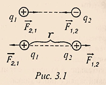

# 预科物理教材

# 第一部分：分子物理学

## 第一章：分子动力学理论的基本原理
    
### §1.1. 分子动力学理论的基本规定及其实验依据
- 分子动理论
    - 定义：分子和动力学理论是通过构成物体的原子和分子的运动和相互作用来解释物体的结构和性质的学说。
    - 内容
        - 1，所有物质都是由大量的分子组成的，
        - 2，所有分子都在做永不停息的无规则运动
        - 3，分子之间存在相互作用力
        > 注意：物理学概念上的分子是指构成某一物质的具有其基本的化学性质的最小粒子（包括原子，离子甚至电子）
- 布朗运动
    - 定义：布朗运动是悬浮在液体中的 `颗粒` 的无规则运动。无规则运动的液体分子从四面八方作用于 `颗粒` ，与 `颗粒` 发生碰撞，从而改变了 `颗粒` 速度的大小和方向。
- 扩散运动
    - 定义：扩散运动是指一种物质的分子渗透到另一种物质分子之间的空隙中的过程，存在于气体，液体和固体之间
- 分子间作用力的证明
    - 分子间引力的证明：将两块铅各切出一个切口，将这两块铅沿新切口接合起来，可以承受相当大的拉力而不分开，可以证明出分子之间存在吸引力
    - 分子间斥力的证明：液体与固体很难被压缩，证明分子间存在斥力
- 物质的量
    - 物质的量是由构成该物质的分子数决定的，以摩尔为单位
    - 一摩尔等于 0.012 千克碳 C12 中含有多少个原子，就含有多少个分子的物质
    - 任何物质的一摩尔都含有相同数量的分子，称为阿伏加德罗常数：NA = 6.02·1023 个
- 摩尔质量
    - 物质的量为一摩尔的某物质的质量即为摩尔质量，以克每摩尔为单位
    - 摩尔质量在数值上等于该物质的相对分子质量
    - 物质的一个分子的质量可以用该物质的摩尔质量除以阿伏伽德罗常数来计算，即：$m_{0} = \frac{\mu}{N_{A}}$
    - 研究发现分子之间的距离约为 10-10m
    > 分子动力学理论的创始人是伟大的科学家M.V.罗蒙诺索夫。他根据分子动力学的概念，讲解了气体的性质、热的性质、固体的溶解等。

### §1.2. 温度及其物理意义
- 温度的概念：    
    - 温度是描述物体冷热程度的物理量。从微观角度来说是物体分子进行热运动的剧烈程度。从分子运动论的观点来说是分子运动平均动能的标志
- 热量的转递：
    - 如果让两个温度不同的物体（或者同一物体温度不同的两个部分）接触，组成物体的分子会相互碰撞，使热量自发地从温度较高的物体（或部分）传到温度较低的物体（或部分）上，直到两物体（或部分）的温度变得相等。在这种情况下，可以说这两个物体（或这两个部分）处于热平衡状态。
- 分子热运动的平均动能：
    - 随温度的升高，分子热运动的平均动能增大。气体分子热运动的平均动能 $\overline{\varepsilon}$ 与其温度 $T$ 之间有直接的比例关系，由表达式定义为： 
        - $\overline{\varepsilon} = \frac{3}{2}KT$    (2.1)    
其中：К为玻尔兹曼常数，即理想气体常数与除以阿伏伽德罗常数的值，$K = 1.380649 \times 10^{-23} J/K$
- 温度的度量：
    - 绝对温度：若温度 $T \rightarrow 0$，则根据（2.1）$\overline{\varepsilon} \rightarrow 0$。我们规定分子热运动停止的温度称为绝对零度(абсолютным нулем)。这样定义的温度只能是正值。它被称为绝对温度(абсолютная температура)，以开尔文刻度来衡量。绝对温度的单位是开尔文($K$)，$[T] = K$
    - 摄氏温度：仅仅与开尔文刻度在零点位置上不同：$0K = -273.15℃$。若 $t$ 为摄氏刻度温度，$T$ 为绝对温度，则$T = t + 273.15$

### §1.3. 理想气体与门捷列夫方程
- 理想气体：为了简化气体的研究，我们引入了理想气体的概念：
    - a)与容器的体积相比，气体分子的大小可以忽略不计
    - b)分子之间没有相互作用，则可以认为是理想的气体。    
        > 气体所服从的规律是复杂的。真正的气体按其性质来说，在足够小的压力和不太低的温度下，是接近理想气体的。
- 理想气体状态方程：
    - 气体的状态由一组参数表示。包括：质量$m$、温度$T$、体积$V$、压强$P$。将表征给定质量气体 $m$ 状态的参数$P$、$V$、$T$联系起来的方程，称为理想气体的状态方程。即 $PV = \frac{m}{\mu}RT$
    - 理想气体常数 $R$：对于一摩尔的任意理想气体，将该气体的压强 $P$ 与其摩尔体积 $V_{\mu}$ 的乘积除以气体的绝对温度 $T$，都会得到一个恒定的数，用字母 $R$ 表示，称之为理想气体常数，即：
        - $PV_{\mu} = RT ⇨ \frac{PV_{\mu}}{T} = R$, ( R=8.31 J/(mol·K) )    (2.2)
        > 理想气体常数 $R$，玻尔兹曼常数 $K$ 与阿伏伽德罗常数的关系为：$R = K \cdot N_{A}$
    - 物体的质量 $m$ 除以其摩尔质量 $μ$ 即为物体的物质的量 $ν$，即 $ν = \frac{m}{\mu}。将 (2.2) 乘以摩尔数 \frac{m}{\mu}$，得到：
        - $PV_{\mu}\frac{m}{\mu} = \frac{m}{\mu}RT$
    - 由于数值 $V_{\mu}\frac{m}{\mu} = V$ 为整个气体的体积，故而：
        - $PV = \frac{m}{\mu}RT$    (2.3)
        > 表达式（2.3）即为理想气体的状态方程。它是由克拉佩伦和门捷列夫建立的，称为门捷列夫-克拉佩伦方程。

## 第二章：热力学要素

### §2.1. 内能与热力学第一定律
- 热力学：
    - 概念：热力学是研究热功转换过程所遵循的规律的科学，不考虑物体的原子和分子内部结构
    - 基本内容：热力学的四个经验定律
        - 1，热力学第零定律：若两个热力学系统均与第三个系统处于热平衡状态（即温度相同），此两个系统也必互相处于热平衡。
        - 2，热力学第一定律：一个热力学系统的内能增量等于外界向它传递的热量与外界对它所做的功的和。（如果一个系统与环境孤立，那么它的内能将不会发生变化）
        - 3，热力学第二定律：
            - 克劳修斯表述：热量可以自发地从温度高的物体传递到较冷的物体，但不可能自发地从温度低的物体传递到温度高的物体；
            - 开尔文-普朗克表述：不可能从单一热源吸取热量，并将这热量完全变为功，而不产生其他影响。
            - 熵表述：随时间进行，一个孤立体系中的熵不会减小。
        - 4，热力学第三定律：绝对零度时，所有纯物质的完美晶体的熵值为零。 或者绝对零度（$T = 0K$ 即 $-273.15℃$）不可达到。
- 内能：
    - 定义：
        - 物质分子热运动的动能和它们相互作用的势能之和称为机体的内能，即：
            - $U = E_{k}+E_{p}$
        - 而对于理想气体，分子间相互作用的势能等于零，内能等于其所有分子混沌运动的动能之和，即：
            - $U = E_{k}$
    - 规律：理想气体的内能与其温度成正比，随着温度的升高，分子的热运动平均速度加快，因而其平均动能也随之增加。如果温度不改变，内能保持不变。
    - 内能变化的两种情况：    
        - 1，做功：外界对物体（或由物体组成的体系）做正机械功时，物体（或体系）内能增加，反之，物体（或体系）内能减少    
        - 2，热传递：内能从温度高的物体传到温度地的物体，或从同一物体的高温部分传到低温部分
            - 发生条件：存在温度差
            - 传递方向：从高温处传到低温处
        > 注意:
            - 1，内能 $U$ 与热量 $Q$ 的区别：内能是一个状态量，一个物体在不同的状态下有不同的内能。而热量是一个过程量，表示由于热传递而引起的变化过程中转移的能量，即内能的该变量。没有热传递就没有热量可言。    
            - 2，热量 $Q$ 和功 $A$ 的概念是相似的：它们是衡量从一个物体（或部分）转移到另一个物体（或部分）的能量。热量的计量单位是 $J$。
- 热力学第一定律：热力学第一定律是能量的守恒和转化定律，延伸到热现象：传递给系统的热量用于改变系统的内能和供系统对外部机构做功：
    - $Q = ΔU+A$    (2.5)
    > 例如，当一定量的热量传递给活塞下的容器中的气体时，它被用于气体的加热，即增加其内能，以及气体膨胀时活塞的提升工作。

### §2.2. 热力学第一定律的应用
- 概念梳理：
    - 过程：在一定的环境条件下，系统的状态发生了变化，从一个状态变化到另一个状态，我们称系统发生了一个热力学过程，简称过程
    - 等过程：是指系统状态参数：温度 $T$，体积 $V$ 或压强 $P$ 中的任意一值保持不变进行的过程
    - 途径：系统变化所经历的具体路径称为途径
- 气体状态的变化过程的研究，
    - 1，等温变化过程
        - 概念：指温度恒定（即 $T = const$）的情况下发生的过程，该过程服从波义耳-马略特定律
        - 对于给定质量的气体，气体压强与体积的乘积不变，即：
            - $PV = const$    (2.6)
                > 由门捷列夫-克拉佩龙方程（见2.3）得出
        - 对于气体变化前后的两种状态：
            - $P_{1}V_{1} = P_{2}V_{2}$ 或 $\frac{P_{1}}{P_{2}} = \frac{V_{1}}{V_{2}}$    (2.7)    
                
            - 在恒温条件下，理想气体的压强与体积成反比。等温过程图像中的图线即为等温线（见图2.1）
            - 在等温过程中，由于温度不变，内能没有变化，$ΔU = 0$。根据热力学第一定律：$Q = ΔU+A$，应用于等温过程中，其形式为：$Q = A$，即传递给气体的热量仅与气体做工有关
    - 2，等容变化过程
        - 概念：指体积恒定（即 V=const）的情况下发生的过程，该过程服从查尔斯定律
        - 对于给定质量的气体，气体压强与温度的商不变，即：
            - $\frac{P}{T} = const$
                > 由门捷列夫-克拉佩龙方程（见2.3）得出
        - 对于气体变化前后的两种状态：
            - $P_{1}V = \frac{m}{\mu}RT_{1}$    ①
            - $P_{2}V = \frac{m}{\mu}RT_{2}$    ②    
            将①式除以②式，得到：
    >`此处缺一页`

### §2.3. 比热容
- 物体的热容在数值上等于必须传递给物体以将其加热 1°C 或 1K 的热量
    - $C = \frac{Q}{∆T}$ (2.10)
        - $∆T$ - 热量 $Q$ 被传递给物体时的温度变化
- 物质的比热容是一个物理量，在数值上等于每加热 1°C（或 1K）一千克物质所需的热量
    - $c = \frac{Q}{m∆T}$ (2.11)
        - $m$ - 物体的质量
    - 比热容计量单位是 $[s] = J/(kg·K)$
        > 由公式 <a href="#a">(2.11)</a> 得出
        - 铜的比热容是 380 J / (kg·K)
            > 即给 1kg 铜加热使其温度升高 1℃（或 1K）所需的热量是 380J，冷却同样释放相同的热量
    - 用于计算将质量 $m$ 加热 $∆T$ 度所需的热量的公式
-    $Q = c \cdot m \cdot ∆T$
            > 由公式 <a href="#a">(2.11)</a> 得出
    - 热容不仅取决于物质的性质，还取决于物体体温变化的条件
        - 在等容过程中，传递给物体的热量仅用于增加内能
        - 在等压过程中，还用于做机械功。
            > 因此在恒压过程下的热容 $C_{p}$ 始终大于恒容过程下的热容    $C_{v}$
        - 在绝热过程中，当 $Q = O$ 时，热容为零
        - 在等温过程中，温度恒定，热容的概念没有意义

### §2.4. 热力发动机的工作原理
- 能将内能转换为机械功的设备叫做热力发动机
 - 通常在热力外燃机中，机械工作是由气体（蒸汽）来完成的，气体被称为工作体。气体接受来自温度高于气体的加热装置的热量 $Q_{1}$，气体膨胀时，会带动机器的运动部件（例如气缸的活塞）。工作体每次做完功后，必须恢复到初始状态，使气体压缩时消耗的功小于膨胀时获得的功。为此气体在压缩前被冷却，使其与冷却装置（即温度低于气体温度的物体）接触。在这种情况下，气体传递给冷冻装置的热量 $Q_{2} < Q_{1}$，然后重复整个过程。一个周期的有用功 $A = Q_{1} - Q_{2}$
- 热机的效率 $\eta$ 是指一个周期内所做的有用功 $A$ 与从加热器接收的热量 Q1 之比。效率（КПД - Коэффициент полезного действия）表示发动机的有用功有多少是来自燃料完全燃烧所释放的全部能量。根据定义得：
 - $\eta = \frac{A}{Q} = \frac{Q_{1}-Q_{2}}{Q_{1}} = 1- \frac{Q_{2}}{Q_{1}}$
     > 由表达式可知，热机的效率总是小于 1
     - 理想热机的效率最大值可以通过……温度 $T_{1}$ 和……温度 $T_{2}$ 计算：
         - $\eta_{max} = \frac{T_{1} - T_{2}}{T_{1}}$
 - 加热装置的温度 $T_{1}$ 越高，冷却装置的温度 $T_{2}$ 越低，效率越高。大气环境也可以作为冷却装置。热机的实际效率 $\eta < \eta_{max}$，因为能量会因摩擦以及其他原因损失
- 热机有很大的实际用途。 蒸汽轮机用于热电厂和核电厂，大型船舶等。内燃机用于各种现代运输工具，包括公路，铁路，水以及农业机械。 在航空和太空火箭中-喷气发动机和涡轮喷气发动机。
    
## 第三章：物态变化

### §3.1. 物态的分子动力学解释
- 物态(агрегатное состояние)：即物质的聚集状态
- 根据温度和压力的不同，同一种物质可以处于某种集合状态：固体、液体、气体。还有其他的集合状态，如等离子体，我们就不考虑了。所有状态的共同点是构成物质的粒子的无规则运动
    > 根据条件的不同，物质可以从一种集合状态转变为另一种集合状态
    - 在气体中，分子之间的距离比其大小大很多倍，分子在气体所占的空间中自由移动。这就解释了气体能够被压缩并占据给它的整个体积。气体分子之间的引力很小，不能使它们相互靠近
    - 在液体中，粒子的位置几乎相互接近，并在自己的平衡位置附近进行振荡运动。在做了大约一百万次振荡之后，一个分子就会跳到另一个位置。每个分子每秒会发生 105 - 106次这样的变化。这就决定了液体的流动性和低压缩性等特性
    - 在固体中，粒子围绕其平衡位置振动。在晶体中，这些位置是晶格（кристаллическая решетка）的节点。固体之所以有形状和体积，是因为分子之间的吸引力大

### §3.2. 熔化和结晶
- 熔化是指物质从固体到液体的转变。结晶体要想开始熔化，必须将其加热到一定的温度，称为熔点。直到物体完全熔化，其温度仍保持不变，因为熔化所提供的热量都用在打破固体的晶格上。[熔解比热(удельная теплота плавления) “λ” ](https://w.qianyix.com/index.php?q=%D1%83%D0%B4%D0%B5%D0%BB%D1%8C%D0%BD%D0%B0%D1%8F+%D1%82%D0%B5%D0%BF%D0%BB%D0%BE%D1%82%D0%B0+%D0%BF%D0%BB%D0%B0%D0%B2%D0%BB%D0%B5%D0%BD%D0%B8%D1%8F) （国内叫[熔化热](https://baike.baidu.com/item/%E7%86%94%E5%8C%96%E7%83%AD/2732316?fr=aladdin)） 是指将 1kg 的晶体固体在其熔点上变成液体所需的热量。熔化一个质量为 m 的物体，需要提供的热量为
    - $Q = \lambda \cdot m$ (2.15)
        >在结晶过程中（物质从液态向固态转变），会释放出一定的热量，可以用同样的公式计算。
        - 熔解比热的计量单位为 $[λ] = J/kg$

### §3.3. 汽化和凝结
> 汽化是指液体转化为蒸汽的过程。凝结是物质从气态转变为液态的过程
- 汽化（парообразование）：有两种类型 —— 蒸发（испарение）和沸腾（кипение）
    > 研究问题：蒸汽 —— 饱和与不饱和蒸汽；沸腾 —— 沸点与压力的关系
    - 蒸发
        - 蒸发是从液体的自由表面发生的。最快的分子可以从液体中飞出，进入周围的空间，克服作用在液体表层的吸引力。这时，液体分子的平均动能降低，其温度也会降低。蒸发速度取决于液体的种类、温度、表面积、表面上方的空气运动
        - 蒸发过程伴随着分子返回到液体中的反向流动，因此，在物质的蒸发和冷凝过程之间建立了动态​​平衡。与液体处于动态平衡状态的蒸汽称为`饱和蒸汽`。这种状态的特点是：在同一时间内，离开液体表面的分子数等于返回液体的蒸汽分子数。
            - 蒸汽的名称 —— 饱和，这个名字强调的是在给定的温度下，给定的体积中不能有更多的蒸汽。可在恒温的密闭容器中获得。
            - 对于饱和蒸汽有以下特性
                - 在恒温下，饱和蒸汽的压强不取决于所占的体积
                - 体积恒定的饱和蒸气压随温度的升高而升高
        - 如果蒸汽还没有达到与液体的动态平衡状态，则称为`不饱和蒸汽`。在这种情况下，离开液体表面的分子数大于从蒸汽返回液体的分子数。不饱和蒸汽的压力取决于它的体积：
            - 体积增大时，压强减小
            - 体积减小时，压强增大
                > 直至蒸汽达到饱和
        - 蒸汽在恒温下进一步压缩，导致其转变为液体。其条件是温度必须低于临界温度，临界温度是指蒸汽和气体不能通过压缩而转变为液体状态的温度
    - 沸腾
        - 沸腾是指液体向蒸汽转变的过程，它不仅发生在表面，而且发生在液体内部。在沸腾过程中，液体的温度不会发生变化，因为提供给液体的所有热量都用于汽化。每种液体在固定的温度下沸腾，称为沸点。沸腾时，在整个液体体积中会形成蒸气气泡，一旦气泡内部的饱和蒸气压力等于或超过外部压力，气泡就会浮到表面。随着外界压力的降低，液体的沸腾温度降低，反之亦然。
    - 在恒定温度下，将1千克液体转化为蒸汽所需的热量称为[汽化比热 - 比蒸发热 - 比汽化热 (удельная теплота парообразования)](https://w.qianyix.com/index.php?q=%D1%83%D0%B4%D0%B5%D0%BB%D1%8C%D0%BD%D0%B0%D1%8F+%D1%82%D0%B5%D0%BF%D0%BB%D0%BE%D1%82%D0%B0+%D0%BF%D0%B0%D1%80%D0%BE%D0%BE%D0%B1%D1%80%D0%B0%D0%B7%D0%BE%D0%B2%D0%B0%D0%BD%D0%B8%D1%8F)（或许国内叫[蒸发热](https://baike.baidu.com/item/%E8%92%B8%E5%8F%91%E7%83%AD/9984575?fromtitle=%E6%B1%BD%E5%8C%96%E7%83%AD&fromid=4892269&fr=aladdin)？但又有些不同），其计量单位为 $[r] = J/kg$。将质量为 $m$ 的液体转化为蒸汽所需的热量根据如下公式计算：
        - $Q = r \cdot m\qquad(2.16)$

# 第二部分：电动力学

## 第一章：静电学

### §1.1. 带电物体，电荷及其性质，库仑定律
- 电动力学：研究带电体或粒子之间相互作用的物理学分支
- 静电学：电动力学的一个分支，研究静止体和拥有电荷的粒子的特性和相互作用
- 电荷
    - 定义：电荷是表征带电粒子与物体之间相互作用强度的物理量，用字母 $q$ 表示
    - 单位：库仑，$[q]=Кл$，库仑是指在1安培的电流强度下，1秒钟内通过导体截面的电荷。
    - 分类：自然界中只存在两种电荷
        - 正电荷：玻璃与皮肤摩擦时，玻璃上会产生正电荷
        - 负电荷：用羊毛擦过的琥珀上，会产生负电荷
    - 点电荷：物理学上把本身的线度比相互之间的距离小得多的带电体叫做点电荷，在进行研究时，我们忽略点电荷的尺寸
    - 物体带电的方式
        - 摩擦起电：
            - 实质：电子在不同物体间的转移
            - 原因：不同物体对电子的吸引和束缚能力不同
            - 带电特点：两物体带上等量异种电荷
            > 摩擦后的物体具有吸引轻小物体的现象
        - 感应起电
            - 实质：物体上电荷的再分布
            - 原因：物体在静电场的作用下，发生了的电荷上再分布，导体两端出现等量正负感应电荷
            - 带点特点：孤立的带电体和处于电场中的感应导体，处于静电平衡时，其特征：
                1. 导体内部场强处处为零，没有电场线(叠加后的);
                2. 整个导体是等势体，导体表面是等势面；
                3. 导体外部的电场线与导体表面垂直，表面场强不一定为零;
                4. 对孤立导体，静电荷分布在外表面，且表面曲率(1/R)越大，电荷密度越大，电场越强.
                >注意: 
                >1. 静电荷是指导体内正、负电荷中和后所剩下的多余电荷；
                >2. 感应电荷是指由于静电感应而使导体两端出现的等量异种电荷.
        - 接触起电
    - 电荷量：
        - 任何电荷，不论其符号如何，其电荷量总是最小电荷e的倍数，这个最小的电荷称为基本电荷(又称元电荷)，其电荷量为 $e\approx1.6\cdot10^{-19} Кл$ 基本电荷的载体是带负电的电子、带正电的质子和其他一些基本粒子
        - 表达式：
            $$q=ne$$
            其中：n为正整数，基本电荷值 $e=1.6\cdot10^{-19} Кл$
    - 电荷守恒定律：对于一个孤立系统，不论发生什么变化，其中所有电荷的代数和永远保持不变。
    - 电荷间的相互作用：同类电荷相互远离，相反电荷相互吸引
    
- 库仑定律
    - 库仑力：真空中两个点状静止电荷的相互作用力与电荷模块的乘积成正比，与它们之间距离的平方成反比，这种相互作用力叫库仑力
    - 库仑力的计算：如果场是由一个点电荷$q1$产生的，在这个场的某一点上又引入了另一个点电荷$q2$，根据库仑定律可以计算出它们之间的相互作用力
        - 真空介质中的库仑力：
            - $$F_0=k\frac{\lvert q_1\rvert\lvert q_2\rvert}{r^2}\qquad(3.1)$$
                >其中，库伦常数（静电力常量）$k=9\cdot10^9\frac{Н\cdot м^2}{Кл^2}$，它通常表示为：$k=\frac{1}{4\pi\varepsilon_0}$，$\varepsilon_0$（真空中的介电常数）$\approx8.85\cdot10^{-12}\frac{Кл^2}{Н\cdot м^2}$
        - 非真空均匀介质中的库仑力：
            - 如果相互作用的电荷是在均匀的电介质中，而不是在真空中，库仑力就会减少$\varepsilon$（电介质的介电常数）倍：
            - $$F=\frac{F_0}{\varepsilon},\quadили\quad F=k\frac{\lvert q_1\rvert\lvert q_2\rvert}{\varepsilon r^2}\qquad(3.2)$$
                >其中相对介电常数 $\varepsilon$（相对电容率）是一个没有单位的物理量，其值等于以该均匀材料为介质与以真空为介质制成的同尺寸电容器电容量之比，可以表征介质材料的介电性质，极化性质以及贮电能力，对于所有 $\varepsilon>1$ 的物质。同种或异种电荷的相互作用力方向如 `图3.1` 所示
            - 

### §1.2.电场
- 电场
    - 电场定义：电场是电荷及变化磁场周围空间里存在的一种特殊物质。这种物质与通常的实物不同，它虽然不是由分子原子所组成的，但它却是客观存在的特殊物质，具有通常物质所具有的力和能量等客观属性
    - 静电场：静止电荷所产生的场称为静电场
    - 电场力
        - 定义：电荷通过在周围空间产生电场来改变周围空间的性质。电场对于电场中的电荷的作用力与这个电荷的电荷量成正比：$\vec{F}$ 正比于 $q$
        - 表达式：$\vec{F}=\vec{E}q$
    - 电场强度
        - 定义：电场强度是用来表示电场的强弱的物理矢量，其方向与作用在正电荷上的电场力的方向一致，其值为作用在电荷上的力与该电荷量的比值，电场强度的大小取决与电场本身，或者说取决于激发电场的电荷，与电场中的受力电荷无关。
        - 单位：根据 (3.3) ，电场强度的单位是牛顿每库仑，$[E]=N/Кл$
        - 表达式：
            - 对于单个电荷构成的电场：
                - $$\vec{E}=\frac{\vec{F}}{q}=\frac{kq_0q}{\varepsilon r^2q}=k\frac{q_0}{\varepsilon r^2}\qquad(3.4)$$
                    >- 根据(3.4)，在这种情况下，场强与电荷上升、产生场的大小成正比，与电荷到场中给定点的距离g的平方成反比  
                    >- 其中 $r$ 为电荷 $q0$ 到场中给定点的距离  
                    >- 因为 $\vec{F}$ 正比于 $q$ ，所以 $\vec{E}$ 正比于 $q$
            - 对于由多个电荷构成的复合电场，根据电场的叠加原理，电场中某一点的电场强度等于每个电荷产生的电场强度的几何和：
                - $$\vec{E}=\vec{E_1}+\vec{E_2}+...+\vec{E_n}$$
        - 电场的图形描绘
            - 电场线：为了用图形描绘电场，我们采用带有方向箭头的曲线，称为电场线。电场线上每一点的切线方向和该点电场强度的方向一致；曲线密集的地方场强强，稀疏的地方场强弱。*电场线不是客观存在的一种物质，是人为地画出的形象描述电场分布的辅助工具*
            - 电场线的画法：电场线起于正电荷（或正无穷大），止于负电荷（或负无穷大）。在 `图3.2` 中显示了单个正负电荷的场，以及正负电荷系统的场。
            - 
        - 匀强电场：电场中各点的电场强度相同，即 $\vec{E}=const$ 的电场
            - 典例：两个携带异种电荷的平行板电容器内的电场

### §1.3. 电荷在静电场中的做功
- 在匀强电场中的做功
    - 
    - 如 `图3.3` ，在匀强电场中，一个点电荷 $q$ 在沿着电场强度方向的电场力 $F=Eq$ 的作用下，从 $B$ 点移动到 $C$ 点的过程中，求电场力 $F$ 做功
    - 如果电荷径直从 $B$ 点移动到 $C$ 点：
        - $$A_{ВС}=FS\cos\alpha=Eqd\qquad(3.6)$$
            >即电场力做功 $А$ 等于电荷量 $q$ 、场强 $E$ 和沿场线所取距离 $d$ 的乘积
    - 如果电荷沿路线 ВДС 从 В 点沿直线移动到 Д 点再沿直线移动到 С 点，电场力的做功为
        - $$A_{ВСД}=А_{ВД}А_{ДС}=FS\cos90\degree+FS\cos0\degree\qquad(3.7)$$
        >其结果与 (3.6) 相同
    - 当沿着B点和C点之间的任何曲线路径移动电荷时，将得到同样的结果（例如，ВМС）。这意味着在均匀的电场中，电场力的做功不取决于运动轨迹的形状和路径的长度，而只由起点和终点的位置决定。类似于重力场，力的做功不取决于运动轨迹形状和长度，我们将这种场称为势场 (потенциальное поле)。引力场和电场都是势场。
    - 电势能：引入电场的电荷与电场相互作用，从而拥有电势能。将电荷从位置1移到位置2的做功可以表示为势能的改变量：
        - $$А=\Delta W=-(W_2-W_1)=W_1-W_2\qquad(3.8)$$

### §1.4. 电势，电势差，电场强度与电位的关系，点电荷的电势场
- 电势（又称电位）
    - 定义：处于电场中某个位置的单位电荷所具有的电势能与它所带的电荷量之比，等于静电场中每单位电荷具有的电势能，它是电场的一种能量特性。
    - 特点：电势只有大小，没有方向，是一个标量，其数值不具有绝对意义，只具有相对意义
    - 表达式：
        - $$\varphi=\frac{W}{q}\qquad(3.9)$$
    - 单位：
        - 电势和电势差的测量单位是伏特，$[\varphi]=[\Delta\varphi]=В=Дж/Кл$。
- 电势差
    - 定义：电场中两个点之间电势的差值
    - 表达式：
        - $$\Delta\varphi=\varphi_1-\varphi_2$$
    - 单位：同电势单位，如果 1 Кл 电荷从一点转移到另一点时做了 1 Дж 的工作，则两点之间的电位差等于 1 В
    - 使用电势差来计算电场力做功
        - 由表达式 (3.9) 可知$W=q\varphi$，根据 (3.8)，电荷在静电场中移动的功等于：
        - $$A=q\varphi_1-q\varphi_2=q(\varphi_1-\varphi_2)=q\Delta\varphi\qquad(3.10)$$
            电荷轨迹的初始点和最终点的电位差被括在括号中:
            - $$\Delta\varphi=(\varphi_1-\varphi_2)=\frac{A}{q}\qquad(3.11)$$
            - __即两点之间的电势差等于将相当于一个库仑的点电荷从一点移动到另一点的功__
    - 电场强度与电势差之间有一定的依赖性。如（图3.4），假设电荷 q 在均匀的静电场中沿电场线从 点1 移动到 点2 时，所做的功为：
        - $$A=qEd\qquad(3.11)$$
        - 该做功可以用 点1 和 点2 的电势差来表示：
        - $$A=q(\varphi_1-\varphi_2)=q\Delta\varPhi=qU\qquad(3.12)$$
    - 联立等式 (3.11) 和 (3.12)，我们可以找到场强矢量的模数：
        - $$E=\frac{U}{d}\qquad(3.13)$$
        - 根据 (3.13)，均匀静电场的强度在数值上等于每单位长度的电位差。由此可见，静电场强度的单位是 1 В/м，1 В/м=1 Н/Кл
        - 如果一个点电荷q0产生了静电场，那么在距离电荷r的任何一点上，电势是相等的:
            - $$\varphi=k\frac{q_0}{\varepsilon r}\qquad(3.14)$$

### §1.5. 电容，电容器与电能
- 电容
    - 概念：经验表明，如果将不同量的电荷$q_1, q_2, ...$先后通过一个单独的导体，导体的电势将分别为$\varphi_1, \varphi_2, ...$，电荷与相应电势的比值$\frac{q_1}{\varphi_1}=\frac{q_2}{\varphi_2}=...$保持不变，这个比值表征了导体的某种特性，它既不依赖于电荷，也不依赖于电势，称为导体的电容量：
    - 表达式：
        - $$C=\frac{q}{\varphi}\qquad(3.15)$$
        - 单独导体的电容量$C$是一个物理量，数值上等于每单位电势变化量下，电荷量的变化值。它取决于导体的材料，形状和大小以及周围的环境（例如平行板电容器的平行板之间的距离就会影响其电容量）
    - 单位：
        - 国际单位：法拉，$[C]=\Phi$
            >根据(3.15)，一法拉等于`通过 1 库伦的电荷时能发生 1 伏特电势的改变的导体的电容量`
        - 其他单位：
            - 微法拉($мк\Phi$)和皮法拉($п\Phi$)：
            - $мк\Phi=10^{-6}\Phi$
            - $п\Phi=10^{-6}мк\Phi=10^{-12}\Phi$
- 电容器
    - 定义：电容器是一个由两个导体（外壳）组成的系统，中间有一个介电层隔开。当电容器的两个极板之间加上电压时，电容器就会储存电荷
    - 特性：电容器有一个显著的特性，就是体积小却有很大的电容量，可以存储大量电荷
    - 平行板电容器：
        - 构造：通常使用由两个金属板组成，中间由电介质隔开
        - 特点：带电平行板电容器绝大部分的电场都集中在其内部
        - 电容量计算：
            - $$C=\frac{\varepsilon_0\varepsilon S}{d}\qquad(3.16)$$
            - >其中：
                - $\varepsilon$ - 是金属板间电介质的相对介电率。
                - $S$ - 两金属板正对面积
                - $d$ - 两金属板间距离
    - 电容器的充电：当电容器与电压源连接时，电容器充电，其两个导体之间产生电场。电源的做功用来积累电场的能量，而电场的能量由电容器的电容量和其导体间的电压决定的：
        - $$W=\frac{CU^2}{2}\qquad(3.17)$$
    - 电容器的放电：当电容器与电源断联时，电容器放电，集中在带电电容器的场内的能量会转化为其他类型的能量：例如热能、光能等。
    - 放电特性：当电容器通过低阻电路放电时，它几乎是在瞬间释放出能量，这种放电特性用在摄影用的闪光灯上。
    - 应用：电容器在无线电工程中应用广泛，特别是在无线电接收机的主要部分--振荡电路中，在自动装置中等都有使用。

## 第二章：

## 第三章：磁场与电磁感应

### §3.1 电流的相互作用，磁场与磁感应
- 电流间的相互作用
    - 现象：经验表明，两个平行导体中流过的电流，如果这些导体中的电流方向相同，就会相互吸引，如果电流流向相反，就会相互排斥
    - 原因：任何移动的电荷都会在周围的空间内产生磁场。因此，任何有电流的导体周围都会形成磁场。并且磁场对运动的电荷会产生一种作用力。由于这些电流中的每一个电荷都处于另一个电流产生的磁场作用下。因此，平行电流之间就会产生这种相互作用力，
- 磁场
    - 产生：
        - 一个静止的电子具有一定质量和单位负电荷，因此对外产生引力和单位负电场力。当外力对这个静止电子作用并使之运动时，该外力不但要为电子的整体运动提供动能，还要为运动电荷所产生的磁场提供磁能。由此可见，磁场是电子由于外力作用于运动电子并通过能量转换的方式产生的。
        - 带负电的点电荷运动形成的电流产生的磁场是大量运动的电子产生磁场的宏观表现。
        - 同样道理，带正电的点电荷运动形成的磁场，是其中过剩的质子产生磁场的宏观体现。
    - 磁感应强度：与电场相仿，磁场是在一定空间区域内连续分布的向量场，描述磁场的基本物理量是磁感应强度矢量$\vec{B}$，
        - 单位：磁感应强度的单位是特斯拉，$[B]=Тл$。将带有1A恒定电流的直长导线垂直放在均匀磁场中，若导线每米长度上受到1Н的力，则该均匀磁场的磁感应强度定义为 $1Тл$
    - 磁场的图形描述：
        - 磁感线：磁场可以通过磁感应线以图形的方式来描述
            - 特点：
                - 曲线上每一点的切线方向都和这点的磁场方向一致
                - 磁感应强度的方向与该点的磁力线切线方向相同，其大小与磁力线的密度成正比
                - 磁力线是人为的假设的曲线。磁力线有无数条，磁力线是立体的，所有的磁力线都不交叉，磁力线总是从 N 极出发，进入与其最邻近的 S 极并形成
                - 磁力线都是闭合的，具有闭合场线的场称为涡流场，因此磁场是涡流
                - 同电流类似，磁力线总是走磁阻最小（磁导率最大）的路径，因此磁力线通常呈直线或曲线，不存在呈直角拐弯的磁力线。任意二条同向磁力线之间相互排斥，因此不存在相交的磁力线
            - 
    - 安培定则（右手螺旋定则）：
        - 安培定则一：用右手握住通电直导线，让大拇指指向直导线中电流方向，那么四指指向就是通电导线周围磁场的方向
        - 安培定则二：用右手握住通电螺线管，让四指指向电流的方向，那么大拇指所指的那一端是通电螺线管的N极
        - 安培定则在直线型导体中的运用：
            - >例：如 `图3.9`，有电流的直形导体磁场的场线是垂直于导体的平面上的圆圈，圆的中心位于导体的轴线上。磁感应线的方向如图所示，当右手四指螺旋的的方向与导体中的磁场方向一致，那么右手大拇指指向的方向将与电流的方向一致
            - 

### §3.2 安培力与洛伦兹力
- 安培力：
    - 将通有电流的导体置于磁场中，作用在该导体上的力称为安培力。通过在磁铁的两极之间放置一个带电流的移动导体，我们可以观测到这个力的作用，如 `图3.10`"：在安培力的作用下，根据导体中电流的方向，将导体向内拉入两极间的空隙或向外推出
    - 
    - 表达式：安培力与磁感应矢量的模数 $B$、电流强度 $I$、导体的长度 $l$ 和磁感应矢量方向与导体中电流的角度 $\alpha$ 的正弦值成正比。
        - $$F_A=BIlsin\alpha\qquad(3.35)$$
        - >安培力可以认为是磁场作用在带电流的导体中所有运动电荷上的力（即洛伦兹力）的总和。
- 洛伦兹力
    - 磁场作用在运动的电荷上的力叫洛伦兹力
    - 表达式：
        - $$F_a=qvsin\alpha\qquad(3.36)$$
        - 其中：
            - q - 电荷
            - v - 感应磁场场强
            - $\alpha$ - 速度与磁感应矢量的夹角
    - 左手定则：
        - 判断安培力：伸开左手，使拇指与其他四指垂直且在一个平面内，让磁感线从手心流入，四指指向电流方向，大拇指指向的就是安培力方向（即导体受力方向）
        - 判断洛伦兹力：将左手掌摊平，让磁感线穿过手掌心，四指表示正电荷的运动方向，则与四指垂直的大拇指所指方向即为洛伦兹力的方向
            - >需要注意的是：当四指指向的运动电荷是正的，大拇指的指向即为洛伦兹力的方向。反之，如果四指指向的运动电荷是负的，仍用四指表示电荷运动方向，那么大拇指的指向的反方向为洛伦兹力方向

### §3.3 磁通量
- 磁通量
    - 在磁场均匀的情况下，通过表面S的磁通量F(磁场感应通量)是标量值，等于磁感应矢量模数乘以表面积和磁感应矢量B与法线n的方向与表面S的夹角的余弦(图3.12)
    - 表达式：
        - $$\Phi=BScos\alpha\qquad(3.37)$$
    - 磁通量可以解释为与渗透在表面的磁感应线数量成正比的一个量。
    - 单位：磁通量的单位是韦伯，[F]=Vb。韦伯是指感应力为1特斯拉的磁场通过位于垂直于磁感应线的1米表面积所产生的磁通量。

### §3.4 电磁感应现象，电磁感应定律与楞次定律
- 电磁感应现象
    - 1831年，法拉第通过一系列实验发现，在位于交变磁场中的导电闭合电路中，出现了电流，这种电流叫感应电流，产生这种电流的电动势力叫感应电磁场。这种现象被称为电磁感应现象。
    - 最初，通过关闭和打开其中一个线圈的电路，在相对静止的线圈中打开感应（图3.13，a）。根据图。3.13、b、当其中一个线圈中的电流，其磁场穿透第二个线圈，发生变化时，在后者中产生感应电流。将永磁体推入线圈内，再将磁体拉出线圈，就可以实现感应电流的出现（图3.13，c）。
    - 感应的电磁场不取决于磁通量变化的原因，而是由其变化速度决定。对电磁感应定律（法拉第定律）。
    - 闭环中的感应电磁场与单位时间内磁通量的变化成正比：
        - $$\varepsilon_u=-\frac{\Delta\Phi}{\Delta t}\qquad(3.38)$$
        - 其中：
            - $\Delta\Phi$ - 磁通量随$\Delta t$时间内的变化
            - `-` 这个符号在数学上表达了伦茨规则。
    - 感应电流总是以这样一种方式被引导，即它的磁场抵消了引起该电流的磁通量的变化。
    - 例如，如果流经电路的磁通量减小，其产生的感应电流就会产生一个与减小的磁场一致的磁场，以试图补偿减小的磁场。但是，如果渗透在电路中的磁通量增加，则感应电流的磁场，阻止磁通量增加，将向相反的方向发展。
    - 电磁感应现象是将机械能转化为电能的发电机、变压器等设备的基础。

### §3.5 电感，自感现象与磁场能量
- 流过导体的电流会在其周围产生磁场。通过有电流的电路所限定的区域的磁通量F与电路中的电流强度成正比：
    - $\Phi\sim I,$ $или$ $\Phi=LI\qquad(3.39)$
- 由(3.39)可知，环路电感在数值上等于磁通量，穿透环路，在其电流强度下，等于1 A。电感量取决于导体的大小和形状，以及它所处的介质的磁特性。电感的单位取为亨利[b]=Hn。它是根据（3.39）定义的:
    - $$L=\frac{\Phi}{I}$$
    - 假设Ph=1 Vb，I=1 A，我们得到：。1 Gn=1Vb/1A，即genri为1A电路的电感，在电流强度为1 A时，该电路中渗透着1 Vb的磁通。
    - 当电路或线圈中的电流强度发生变化时，该电流所产生的磁场就会发生变化。通过线圈的磁通量发生变化，会使线圈中出现感应电磁场。

- 自感现象
    - 由于电路中电流的变化而在电路中发生的感应电磁场现象称为自感。
    - 自感是电磁感应现象的一种特殊情况。自感电流既可以与电路中的主、变电流方向相同，也可以方向相反。根据伦茨法则，自感电磁场防止电路闭合时电流增大，开路时电流减小。根据法拉第定律和表达式（3.39），自感电磁场的值等于：
        - $$\varepsilon_c=-\frac{\Delta\Phi}{\Delta t}=-L\frac{\Delta I}{\Delta t}\qquad (3.40)$$
        - 其中：
            - $\Delta I$是指在时间间隔$\Delta t$内安培的变化
    - <u>自感电磁场与线圈的电感量和其中的电流变化率成正比。</u>
    - 电流源克服自感电磁场，在电感b的线圈中产生电流1所耗费的能量储存在电流产生的磁场中。
    - 电流的磁场能量等于线圈电感量与线圈中电流平方的乘积的一半:
        - $$W=\frac{LI^2}{2}\qquad(3.41)$$

## 参考文献：

- 预科物理教材——《МОЛЕКУЛЯРНО-КИНЕТИЧЕСКАЯ ТЕОРИЯ》
