# 预科物理课件

## 第一部分：牛顿力学

### 第一章：运动学
    
### 第二章：动态物理学的基本原理

#### §1.牛顿第一定律。伽利略的相对性原理
- 牛顿第一运动定律（简称牛顿第一定律，又称惯性定律）：任何物体都要保持匀速直线运动或静止状态，直到外力迫使它改变运动状态为止。
- 力学相对性原理（伽利略相对性原理）：运动规律在所有惯性参照系中都是相同的。指经典力学定律在任何惯性参考系（惯性系）中数学形式不变，换言之，所有惯性系都是等价（平权）的。

#### §2.牛顿第二定律
- 牛顿第二运动定律（简称牛顿第二定律）：物体加速度的大小跟作用力成正比，跟物体的质量成反比，且与物体质量的倒数成正比；加速度的方向跟作用力的方向相同。
- 物质密度是一个物理量，等于身体质量与体积之比

$$\rho = \frac{m}{V}.$$

密度的单位是$[\rho] = kg/m^3$
- 力是一个矢量，它是其他物体对某一特定物体的机械作用的量度。它用$\vec{F}$表示。力是物体相互作用时产生的加速度的原因。在实验的基础上，牛顿制定了最重要的力学定律，称为牛顿第二定律。

$$\vec{a} = \frac{\vec{F}}{m}$$

#### §3.牛顿第三定律
- 牛顿第三运动定律（简称牛顿第三定律）：相互作用的两个物体之间的作用力和反作用力总是大小相等，方向相反，作用在同一条直线上。作用力和反作用力是相互的，互相依赖相为依存，均以对方存在为自已存在的前提，没有反作用力的作用力是不存在的；力具有物质性，不能脱离开物体（物质）而存在；力总是两个以上物体之间的相互作用产生的。

$$\vec{F_1} = - \vec{F_2} $$

### 第三章：静力学

- 帕斯卡定律 Закон Паскаля
    - 加在密闭液体上的压强，能大小不变地在液体内部向各个方向传递
    - оказываемое внеш-ними силами давл-ение передается жидкостью одинак-ово по всем направлениям

- 阿基米德定律 Закон Архимеда
    - 浸入液体里的物体受到向上的浮力,浮力的大小等于它排开的液体受到的重力。
    - На тело, погруженное в жидкость (газ), действует выталкивающая сила, которая равна весу жидкости (газа) в объеме погруженной части тела

## 第二部分：分子物理学与热力学

### 第一章：分子物理学

#### §1.1. 理想气体状态方程
- 理想气体状态方程
    - 恒温条件：$pV=T$
    - 恒容条件： $\frac{p}{T}=V$
    - 恒压条件： $\frac{V}{T}=p$
    - 理想气体状态方程：$\frac{pV}{T}=const$
        - $pV=νRT$ (理想气体常数 $R=8.314J\cdot mol^{-1}\cdot K^{-1})$
        - 理想气体常数（在标况下计算）：
            $$R=\frac{pV_\mu}{T}=\frac{1.01\cdot10^5pa\cdot22.4\cdot10^{-3}m^3/mol}{273.15K}=8.314\cdot J\cdot mol^{-1}/K^{-1}$$
        - $pV=\frac{m}{μ}RT$（用质量比摩尔质量代替粒子数量）
        - $pV=νN_Ak_БT$（ν-物质的量；这个式子相当于用$k_БN_A$代替了R）
        - $pV=Nk_БT$（粒子数$N=$物质的量$ν$ · 阿伏伽德罗常数$N_A$，和上式有所替代）
        - *p*=n*k*БT（浓度n=粒子数N/体积V，和上式有所替代）
        - 玻尔兹曼常数：$k_Б=\frac{R}{N_A}=1.380649\cdot10^{-23}J/K$
            - 理想气体常数R等于玻尔兹曼常数乘以阿伏伽德罗常数
- 阿伏伽德罗定律
    - 在相同的温度（$T$）和压强（$p$）下，相同体积（$V$）的任何气体都含有相同数目（$N_A$）的粒子
    - 标况下的1mol气体的体积（$T=0°C=273.15K, p=1atm=101,325pa$）
        - $V_μ=\frac{V}{n}=22.4·10^{-3}m^3/mol$
        
- 物质的量
    - $ν=\frac{m}{μ}$（μ-摩尔质量，*ν*-物质的量）
    - 化学中的等价表达：$n=\frac{m}{M}$
- 粒子数浓度计算
    - $n=\frac{N}{V}$ （n粒子数浓度，N粒子总数）
- 道尔顿分压定律
    - 在组分之间不发生化学反应的前提下，理想气体混合物的压强等于各组分的分压之总和。数学描述为：
    - $p_总=p_1+p_2+...+p_n$

#### §1.2. 分子动理论的基本方程
- 单个分子的速度可以分解到空间坐标系的三个坐标轴上：
    - $$\vec{v}=\vec{v_x}+\vec{v_y}+\vec{v_z}$$
- 当分子与容器壁发生碰撞时，可以认为只有其中某个坐标轴上的分速度方向变化，大小不变，其他坐标轴上的速度方向大小都不变，根据动量定理我们可以得到:
    - $$\vec{p_1}=\vec{p_2}+\vec{p_{ст}}$$
    - $$v_x'=-v_x$$
    - $$mv_x=-mv_x+p_{ст}$$
    - $$p_{ст}=2mv_x$$
- 计算单位时间内与容器壁碰撞的分子数
    - $$F=nSmv_x^2$$
    - $$p=mnv_x^2$$
    - $$p=\frac{2}{3}n\frac{mv^2}{2}$$
    - $\frac{mv^2}{2}$ - 热转化运动平均动能

#### §1.3. 温度对分子动力学的意义    
- 物体的温度是影响物体的分子热运动能量的重要物理量。
    - $$p=\frac{2}{3}nε_{пост}$$
    - $$p=nk_БT$$
    - $$ε_{пост}=\frac{3}{2}k_БT$$
    - ($ε_{пост}$ - 分子动能)

#### §1.4. 自由度的能量分布
- 刚性分子（指不考虑分子内部振动）的自由度数：是指可以给出其在空间位置的独立坐标数。
    - 单原子分子：拥有3个平动自由度，0个转动自由度
        >刚性单原子如氦He、氖Ne、氩Ar等分子只有一个原子，可看成自由质点，所以有3个平动自由度 $i=t=3$
    - 双原子分子：拥有3个平动自由度，2个转动自由度
        >刚性双原子分子如氢气、氧气、氮气、一氧化碳$CO$等分子，两个原子间联线距离保持不变。就像两个质点之间由一根质量不计的刚性细杆相连着（如同哑铃），确定其质心$O’$的空间位置，需3个独立坐标$(x,y,z)$；确定质点联线的空间方位，需两个独立坐标（如$\alpha,\beta$），而两质点绕联线的的转动没有意义。所以刚性双原子分子既有3个平动自由度，又有2个转动自由度，总共有5个自由度 $i=t+r=3+2=5$。
    - 三原子及多原子分子：拥有3个平动自由度，3个转动自由度
        >刚性三原子或多原子分子: 如$H_2O$ 、氨 等，只要各原子不是直线排列的（故$CO_2$的自由度为5，其为直线型），就可以看成自由刚体，共有6个自由度，$i=t+r=3+3=6$。
- 分子的振动自由度： 
    $n_{кол}=3N-n_{пост}-n_{вращ}$（$3N$ - 分子中的自由度总数，$N$ - 分子中的原子数，$n_{пост}$ - 分子整体平动自由度，$n_{вращ}$ - 分子整体转动自由度）
    - 对于线型分子整体有3个平动自由度($n_{пост}$)，2个转动自由度($n_{вращ}$)（因为线型分子沿着线轴转动没有意义，所以转动自由度比非线型少一个），因此线型分子的振动自由度为：
        - $3N-3-2=3N-5$
    - 对于非线型分子整体有3个平动自由度($n_{пост}$)，3个转动自由度($n_{вращ}$)，因此线型分子的振动自由度为：
        - $3N-3-3=3N-6$
    - 能量在自由度上的平均分布规律:
        对于分子的每个自由度，平均而言，有相同的动能，等于
        - $\frac{1}{2}k_БT$（即分子动能$ε_{пост}=\frac{3}{2}k_БT$除以$3$)    
        - $$ε_К=\frac{i}{2}k_БT$$
        - $$i=n_{пост}+n_{вращ}+2n_{кол}$$
    - | Молекула     | nпост | nвращ | i |
        |------------|-------|-------|---|
        | 1-атомная    | 3         | 0         | 3 |
        | 2-атомная    | 3         | 2         | 5 |
        | ≥3-атомная | 3         | 3         | 6 |

#### §1.5. 理想气体的内能
- 任何物体的内能都等于这个物体的能量减去物体整体的动能和物体在外力场中的势能    
- 内能由与质心相连的参考系中分子混沌运动的动能和分子间相互作用的势能组成。
- 理想气体的内能是所有气体分子热运动的动能。
    - $$ε_К=\frac{i}{2}k_БT$$
    - $$U=N_К=\frac{i}{2}k_БTN=\frac{i}{2}\cdot\frac{m}{μ}k_БT$$ 
    - $$U=\frac{i}{2}\cdot\frac{m}{μ}k_БT$$

## 第三部分：电磁学

## 第一章：电介质中的电场

#### §1.1. 极性分子和非极性分子
- 电介质(Диэлектриками)：电工中一般认为电阻率超过10欧·厘米的物质便归于电介质。电介质的带电粒子是被原子、分子的内力或分子间的力紧密束缚着，因此这些粒子的电荷为束缚电荷。在外电场作用下，这些电荷也只能在微观范围内移动，产生极化。在静电场中，电介质内部可以存在电场，这是电介质与导体的基本区别。不导电的物质，如空气、玻璃、云母片、胶木等。
- 电偶极矩(Дипольный момент)：是正、负电荷中心间的距离和电荷中心所带电量的乘积，它是一个矢量，方向规定为从负电中心指向正电中心，用符号$\vec{p_e}$表示，单位为D（德拜）
    - 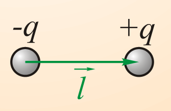

    - $$\vec{p_e}=q \cdot l \qquad (2.1)$$
- 如果在没有外电场的情况下，分子中正电荷和负电荷的分布中心重合，则称为非极性电介质（非极性分子的电介质）。
    - 

    - $$\vec{l}=0 \quad \Rightarrow \quad \vec{p_e}=0$$
    - 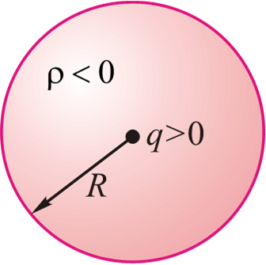

    - $$R\approx10^{-10}m$$
    - $$\rho=-\frac{3q}{4\pi R^3}

    - 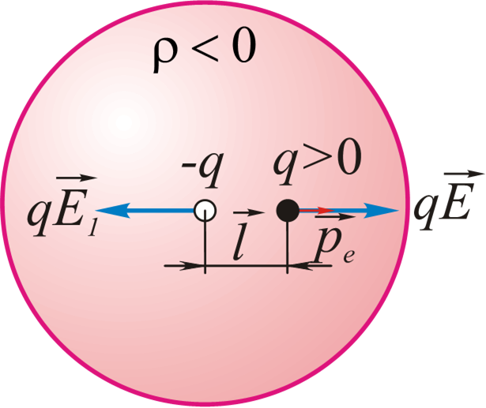

    - $$q\vec{E}+q\vec{E_1}=0\quad \Rightarrow \quad E=E_1$$
    - $$При\quad l<R$$
    - $$E_1=-\frac{\rho l}{3\varepsilon _0}=\frac{ql}{4\pi \varepsilon_0R^3}$$
    - $$p_e=ql=4\pi \varepsilon_0R^3E$$
    - $$\vec {p_e}=αε_0\vec{E}\qquad(2.2)$$    
    - $$α=4πR^3$$
    最高可达$E=10^7–10^8 В/м\quad l~10^{-13}м.$
- 极性电介质是一种分子即使在没有外场的情况下，分子的偶极矩也不同于零的电介质，
    - $$\vec{l}≠0 \quad \Rightarrow \quad \vec{p_e}≠0$$
#### §1.2. 外部静电场中的偶极子
- 

- $$L=l\sin\alpha$$
- $$M=F\cdot L=qE\cdot l\cdot \sin\alpha=p_eE\cdot\sin\alpha$$
- $$\vec{M}=\vec{p_e}\times\vec{E}\qquad(2.3)$$
- 偶极子的势能：当偶极子旋转一个小角度$d\alpha$时，由于势能相应减少，场力做功$dA$。
    - $$dA=\vec{M}\cdot d\vec{\alpha}=p_eE\cdot\sin\alpha\cdot d\alpha=-dW_П$$
    - $$W_П=0 при \alpha=\frac{\pi}{2}$$
    - $$W_П=\int_{W_П}^{0}dW_П=-\int_{\alpha}^{\frac{\pi}{2}}p_eE\cdot\sin\alpha\cdot d\alpha$$
    - $$=p_eE\cdot\cos\alpha\mid_{\alpha}^{\frac{\pi}{2}}=-p_eE\cdot\cos\alpha$$
    - 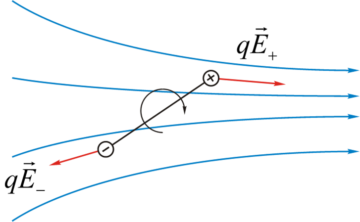
    
    - $$W_П=-\vec{p_e}\cdot\vec{E}\qquad(2.4)$$
    - $$\vec{F}=q\vec{E_+}-q\vec{E_-}=ql\cdot\frac{\partial\vec{E}}{\partial l}=p_e\cdot\frac{\partial\vec{E}}{\partial l}$$
    - $$vec{F}=grad(\vec{p_e\cdot\vec{E}})\qquad(2.5)$$

#### §1.3. 电介质极化
- 电介质极化
    - 定义：电介质极化是指外电场作用下，电介质显示电性的现象
    - 解释：理想的绝缘介质内部没有自由电荷，但实际的电介质内部总是存在少量自由电荷，它们是造成电介质漏电的原因。 一般情形下，未经电场作用的电介质内部的正负束缚电荷平均说来处处抵消，宏观上并不显示电性。在外电场的作用下，束缚电荷的局部移动导致宏观上显示出电性，在电介质的表面和内部不均匀的地方出现电荷，这种现象称为极化，出现的电荷称为极化电荷。这些极化电荷改变原来的电场。
    - 当外部电场$E=0$时：
        - 非极性电介质：$p_{ei}=0$
        - 极性电介质：
            - 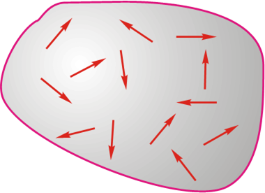
            
        - 在这两种情况下：
            $$\sum_{\Delta V}\vec{p_{ei}}$$
    - 当外部电场*E*≠0时：
        - 非极性电介质：$\vec{p_{ei}}=\alpha\varepsilon_0\vec{E}$
            - 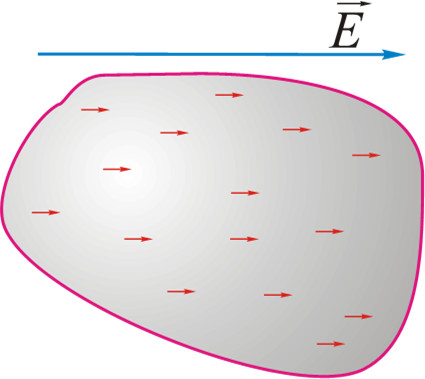
            
        - 极性电介质：
            - 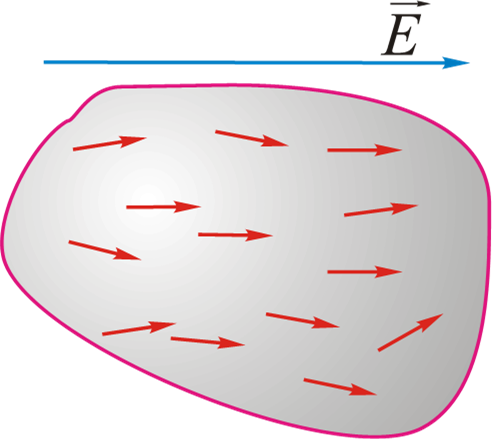
            
- 极化强度
    - 不同电介质的极化程度是不一样的。为了分析电介质极化的宏观效应，常引入极化强度P这一物理量来表征电介质的极化特性。极化强度是一个矢量，定义单位体积内电偶极矩的矢量和为极化强度，即电介质体积的总偶极矩与该体积之比：
    - $$\vec{P}=\frac{\sum_i^n\vec{p_{ei}}}{\Delta V}\qquad(2.6)$$
    - $$\vec{P}=к\varepsilon_0\vec{E}$$
    - κ为介电敏感度。
        - 对于非极化电介质：
        $$к=\alpha\cdot n_0$$
        - 对于极化电介质：
        $$к=\frac{n_0p_e^2}{3\varepsilon_0k_БT}$$
    - 未补偿的极化电荷是由于在其表面薄层的介电极化而产生的。
        
        
    - 表面电荷密度：
        - $$\sigma_p=\frac{dq_p}{dS}$$
        - $$dn=n_0ldS\cdot\cos\alpha\qquad(2.8)$$
        - $$dq_p=q\cdot dn=n_0ql\cdot dS\cdot\cos\alpha=n_0p_e\cdot dS\cdot\cos\alpha$$
        - $$\begin{aligned}
            \vec{P}=n_0\vec{p_e}\\
            P_n=P\cdot\cos\alpha\\
            \end{aligned}
            \Big\}\longrightarrow \sigma_p=\frac{dq_p}{dS}=P_n$$
        - $$\sigma_p=P_n\qquad(2.9)$$
    - 在不均匀的电场中也会产生体积极化电荷。    
        - $\sigma_p=\frac{dq_p}{dV}$ - 体积电荷密度
        - $$\sigma_p=-\frac{\partial P_x}{\partial x}-\frac{\partial P_y}{\partial y}-\frac{\partial P_z}{\partial z}=-div\vec{P}\qquad(2.10)$$

#### §1.4 电感应矢量

- $$\vec{E}_{микро}=\vec{E}_{своб}+\vec{E}_{связ}\qquad(2.11)$$
- $$\vec{E}=<\vec{E}_{микро}>=<\vec{E}_{своб}>+<\vec{E}_{связ}>$$
- $$\underset{(S)}{\oint}\vec{E}\cdot d\vec{S}=\frac{1}{\varepsilon_0}(q_{охв}^{своб}+q_{охв}^{связ})\qquad(2.12)$$
- 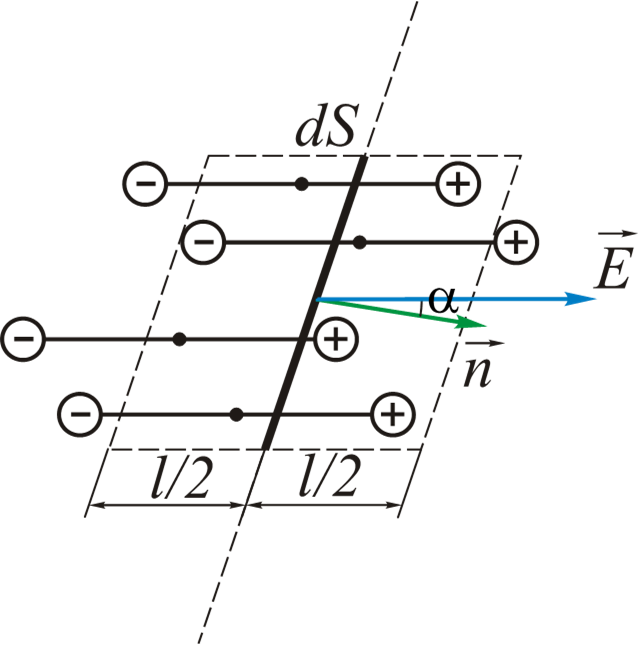

- $$d\vec{S}=dS\cdot\vec{n}$$
- $$dn=n_0ldS\cdot\cos\alpha\qquad(2.13)$$
- $$dq_{охв}^{связ}=-q\cdot dn=-n_0ql\cdot dS\cdot\cos\alpha=$$
- $$-n_0p_e\cdot dS\cdot\cos\alpha=-PdS\cdot\cos\alpha=-\vec{P}\cdot d\vec{S}$$
- $$q_{охв}^{связ}=-\underset{(S)}{\oint}\vec{P}\cdot d\vec{S}\qquad(2.14)$$
- $$\varepsilon_0\underset{(S)}{\oint}\vec{E}d\vec{S}=q_{охв}^{своб}-\underset{(S)}{\oint}\vec{P}d\vec{S}$$
- $$\underset{(S)}{\oint}\varepsilon_0\vec{E}d\vec{S}+\underset{(S)}{\oint}\vec{P}d\vec{S}=q_{охв}^{своб}$$
- $$\underset{(S)}{\oint}(\varepsilon_0\vec{E}+\vec{P})\cdot d\vec{S}=q_{охв}^{своб}\qquad(2.15)$$
- $\vec{D}=\varepsilon_0\vec{E}+\vec{P}$ - 电感应矢量
- $$\underset{(S)}{\oint}\vec{D}\cdot d\vec{S}=q_{охв}^{своб}\qquad(2.16)$$
- 静电场的电感应矢量通过任意封闭表面的通量等于这个表面所覆盖的自由电荷的代数和。
- $$\vec{P}=к\varepsilon_0\vec{E}$$
- $$\vec{D}=\varepsilon_0\vec{E}+к\varepsilon_0\vec{E}=(1+к)\varepsilon_0\vec-{E}=\varepsilon\varepsilon_0\vec{E}\qquad(2.17)$$
- $\varepsilon=1+к$ - 相对介电常数

#### §1.5 在两种介质之间的界面处产生静电场的条件

- 第一种媒介——$E_1,D_1\varepsilon_1$
- 第二种媒介——$E_2,D_2,\varepsilon_2$
- 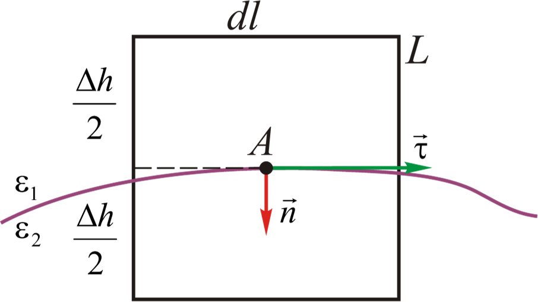

- $$\underset{(L)}{\oint}\vec{E}d\vec{l}=0$$
- $$\lim_{\Delta h\to 0}\underset{(L)}{\oint}\vec{E}d\vec{l}=(E_{2\tau}-E_{1\tau})\cdot dl=0$$
- $$E_{2\tau}=E_{1\tau}\qquad(2.18)$$
- 穿过该表面时，与两种介质之间的界面相切的场强分量不变。
- $$D=\varepsilon\varepsilon_0E$$
- $$\frac{D_{2\tau}}{D_1\tau}=\frac{\varepsilon_2\varepsilon_0E_{2\tau}}{\varepsilon_1\varepsilon_0E_{1\tau}}\quad\Rightarrow\quad D_{1\tau}=\frac{\varepsilon_2}{\varepsilon_1}D_{1\tau}\qquad(2.19)$$
- 

- $$\underset{(S)}{\oint}\vec{D}d\vec{S}=q_{охв}^{своб}$$
- $$\lim_{\Delta h\to 0}\underset{(S)}{\oint}\vec{D}d\vec{S}=\lim_{\Delta h\to 0}q_{охв}^{своб}$$

- 如果在界面上没有自由电荷

- $$\lim_{\Delta h\to 0}q_{охв}^{своб}=0$$
- $$\lim_{\Delta h\to 0}\underset{(S)}{\oint}\vec{D}d\vec{S}=(D_{2n}-D_{1n})d\vec{S}=0$$
- $$D_{2n}=D_{1n}\qquad(2.20)$$
- 当穿过两种介质之间的界面时，在没有表面自由电荷的情况下，电位移的法向分量不会改变。
- $$\frac{E_{2n}}{E_{1n}}=\frac{D_{2n}/\varepsilon_2\varepsilon_0}{D_{1n}/\varepsilon_1\varepsilon_0}\quad\Rightarrow\quad E_{2n}=\frac{\varepsilon_1}{\varepsilon_2}E_{1n}\qquad(2.21)$$

#### §1.6 铁电体（中文译名不确定）
- 铁电体 (Сегнетоэлектрики) 是一组在一定温度范围内具有自发（自发）极化的晶体电介质，它们在电场，变形，温度变化等外部影响的影响下发生很大变化。
    - сегнетова соль    $NaKC_4H_4O_6\cdot4H_2O$
    - титанат бария    $BaTiO_3$
        - 
        - 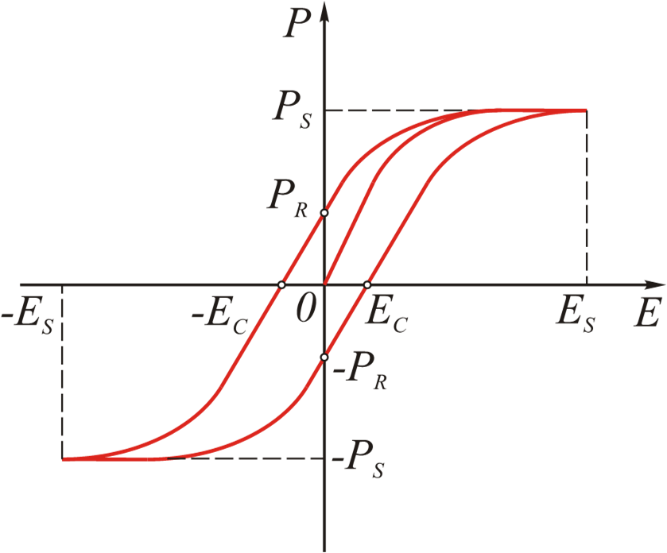
        - $P_S$ - 饱和极化
        - $P_R$ - 残余极化
        - $E_C$ - 矫顽磁力
        $K_{max}~10^3$
        - 在$T>TC$（居里温度）时，隔离电介质变成了普通的极性电介质
            - $BaTiO_3-T_C=406K$
            - $LiNbO_3-T_C=1483K$

### 第二章：静电场中的导体

#### 3.1. 导体中的电荷分布
- 存在大量自由电荷的物质叫做导体
    - 金属 —— 自由电子
    - 电解质 —— 正负离子
    - 气体（离子化） —— 电子和正离子
- 在静电场的作用下，导体中电荷的重新分布称为[静电感应](https://baike.baidu.com/item/%E9%9D%99%E7%94%B5%E6%84%9F%E5%BA%94/5484462?fr=aladdin)：
    - $\overrightarrow{F}=q\overrightarrow{E}_{0}$
        - 
    - $\overrightarrow{E}=\overrightarrow{E}_{0}+\overrightarrow{E_{i}}$
        > $\overrightarrow{E}=0$
        - 
    - 1.导体内部的电场为0，表面上的电场沿法线方向
        > $E=E_{n}\quad\quad\quad\quad\quad\quad E_{τ}=0$
        - 
    - 2.导体范围内电势相等
        > $\frac{d\varphi}{dl}=-E_{l}=0$
    - 3.导体的表面是等势的
        > $\frac{d\varphi}{dl}=-E_{τ}=0$
    - 4.未补偿的（未抵消的）感应电荷分布于导体表面
        - 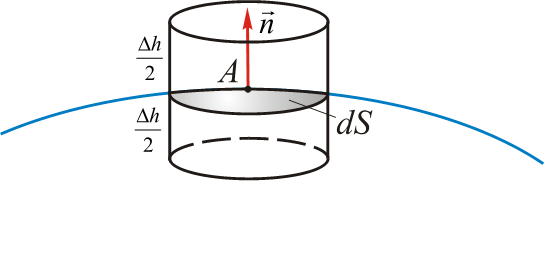
            > - $q =\underset{(s)}{\oint}\varepsilon_{0}\overrightarrow{E}d\overrightarrow{S}=0$
            > - $\underset{(s)}{\oint}\overrightarrow{D}d\overrightarrow{S}=q^{своб}_{охв}$
            > - $\underset{∆h\rightarrow0}{\lim}\underset{(s)}{\oint}\overrightarrow{D}d\overrightarrow{S}=D_{n}dS$
            > - $q^{своб}_{охв}=\sigma dS$
            > - $D_{n}=\sigma\qquad\qquad E_{n}=\frac{\sigma}{\varepsilon\varepsilon_{0}}\qquad(3.1)$

#### 3.2. 孤导体的电容量
- 孤导体（绝缘导体，隐蔽导体）（уединенный проводник）是指距离其他物体很远，可以忽略其电场影响的导体
    - $\sigma=k\cdot q$
    - $k=k(x,y,z)$
    - $\varphi=\frac{1}{4\pi\varepsilon\varepsilon_{0}}\underset{(S_{пров})}{\int}\frac{\sigma dS}{r}=\frac{q}{4\pi\varepsilon\varepsilon_{0}}\underset{(S_{пров})}{\int}\frac{kdS}{r}$
- 孤导体的电荷 $q$ 与电位 $\varphi$ 的比值 $C$,称为该导体的电容.
    - $C=\frac{q}{\varphi}\qquad(3.2)$
        > 国际单位：容量 - $1F$(Фарад 法拉)
        - $1F$ 是这种孤立导体的容量，当向其传递 $1C$ 电荷时，它获得 $1V$ 的电势。
- 例题：
    - 让我们来求一个位于介电常数为 $ε$ 的均质的，各向同性介质中的孤立导电球的电容。
        - $r\geq R$
        - $E_{r}=\frac{q}{4\piεε_{0}r^{2}}$
        - $\varphi=-\int\limits_{R}^{\infty}E'{R}dr=\frac{q}{4\piεε_{0}R}$
    - $C=4\piεε_{0}R\qquad(3.3)$
    > 地球的电容：$C=4\pi\cdot8.85\cdot10^{-12}F/m\cdot6.4\cdot10^{6}m=7\cdot10^{-4}F=700mkF$

#### 3.3. 电容器
- 
    > - $E'_{r}<E_{r}=\frac{q}{4\piεε_{0}r^{2}}$
- 
    > - $\varphi'=\frac{q}{C'}=\int\limits_{R}^{\infty}E'_{r}dr<\int\limits_{R}^{\infty} \frac{qdr}{4\piεε_{0}r^{2}}=\frac{q}{4\piεε_{0}R}=\frac{q}{C}=\varphi$
    > - $C'>C$
- 未连接的导体的电容量始终大于单独使用时同一导体的电容量
- 电容器是由两个导体（称为极板）组成的系统，由电介质层隔开
    - 
- 一个极板的电荷与极板之间的电势差的比值称为电容器的电容
    - $C=\frac{q}{\varphi_{1}-\varphi_{2}}\qquad(3.4)$
- 例子：
    - 1.扁平电容器
        - $0\le x\le d$
        - 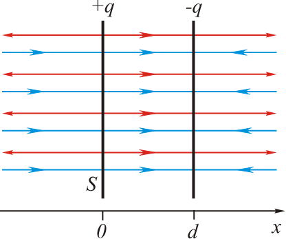
            > - $E_{x}=\frac{\sigma}{2\varepsilon \varepsilon_{0}}+\frac{\sigma}{2\varepsilon\varepsilon_{0}}=\frac{\sigma}{\varepsilon \varepsilon_{0}}$
            > - $\sigma=\frac{q}{S}$
            > - $\varphi_{1}-\varphi_{2}=\int\limits_{0}^{d}E_{x}dx=\frac{\sigma}{\varepsilon\varepsilon_{0}}\int\limits_{0}^{d}dx=\frac{qd}{\varepsilon\varepsilon_{0}S}$
        - $C=\frac{\varepsilon \varepsilon_{0}S}{d}\qquad(3.5)$
    - 2.球形电容器
        - 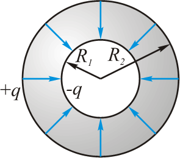
            - $E_{r}=\frac{q}{4\pi\varepsilon\varepsilon_{0}r^{2}}$
            - $\varphi_{1}-\varphi_{2}=\int\limits_{R_{1}}^{R_{2}}E_{r}dr=\frac{q}{4\piεε_{0}}\int\limits_{R_{1}}^{R_{2}}\frac{dr}{r^{2}}=\frac{q}{4\piεε_{0}}(\frac{1}{R_{1}}-\frac{1}{R_{2}})$
        - $C=\frac{4\pi\varepsilon\varepsilon_{0}R_{1}R_{2}}{R_{2}-R_{1}}\qquad(3.6)$
    - 3.圆柱形电容器
        - 
            - $τ=q/l$
            - $E_{r}=\frac{τ}{2\pi\varepsilon\varepsilon_{0}r}=\frac{q}{2\pi\varepsilon\varepsilon_{0}lr}$
            - $\varphi_{1}-\varphi_{2}=\int\limits_{R_{1}}^{R_{2}}E_{r}dr=\frac{q}{2\piεε_{0}l}\int\limits_{R_{1}}^{R_{2}}\frac{dr}{r}=\frac{q}{2\piεε_{0}l}\ln{\frac{R_{2}}{R_{1}}}$
        - $C=\frac{2\pi\varepsilon\varepsilon_{0}l}{\ln{(R_{2}/R_{1})}}\qquad(3.7)$
- 击穿电压(击穿电压)是指电容器的电极之间的最小电位差，在这个电位差上，通过电容器中的介电层发生放电。

#### 3.4. 电容器的连接
- 并联(Параллельное соединение)
    - 
        > - $q_{i}=C_{i}\cdot∆\varphi$
        > - $q=C\cdot∆\varphi$
        > - $q=\sum_{i=1}^{n}C_{i}\cdot\varphi=∆\varphi\cdot\sum_{i=1}^{n}C_{i}$
    - $C=\sum_{i=1}^{n}C_{i}\qquad(3.8)$
- 串联(Последовательное соединение)
    - 
        > - $∆\varphi_{i}=\frac{q}{C_{i}}$
        > - $∆\varphi=\sum_{i=1}^{n}∆\varphi_{i}=\sum_{i=1}^{n}\frac{q}{C_{i}}=q\cdot\sum_{i=1}^{n}\frac{1}{C_{i}}$
        > - $∆\varphi=\frac{q}{C}$
    - $\frac{1}{C}=\sum_{i=1}^{n}\frac{1}{C_{1}}\qquad(3.9)$
    - 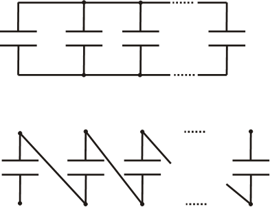
        > - $∆\varphi_{посл}=n\cdot∆\varphi_{пар}$

## 参考文献：

- 预科物理课件
    - 《статика_(теория).pdf》
    - 《Динамика материальной точки. Силы в механике.pptx》
    - 《1.08_МКТ.ppt》
    - 《02_Эл_поле в диэлектриках.ppt》
    - 《03_Эл_поле в прводниках.ppt》
    

