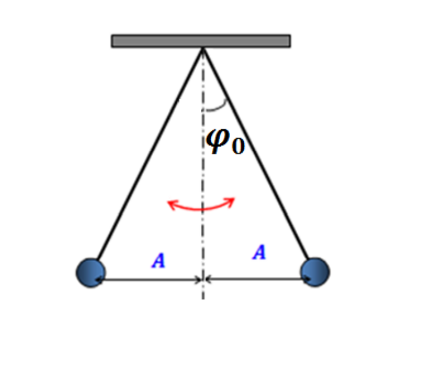
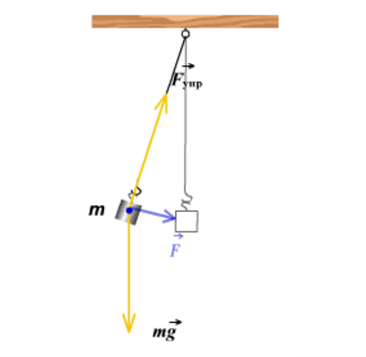
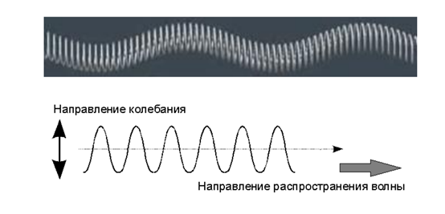

# 预科物理教材(动力学)

## 第一章 振荡

### §1.1 振荡以及相关知识点
 - 振荡
     - 定义：振荡运动是一种周期性运动，其特征在于一些物理参数在时间上有规律地重复出现。 振荡运动的特征在于振荡的幅度，周期和频率，为了使身体开始振荡运动，它需要传达（传递）一些初始能量。 该能量可以是动能，势能或两者的组合。
 - 振幅
     - 振动幅度A，[m]是振动体与其平衡位置的最大偏差。 振动幅度是一个标量值，以米（m）为单位进行测量。
 - 周期
     - 振荡周期T，[s]是最小时间间隔，在此之后，振荡体返回到其初始时刻的相同状态。 振荡周期是一个完整的振荡发生的时间。 振荡周期是一个标量值，以秒为单位进行测量。
 - 振荡频率
     - 振荡频率ν[Hz]是每单位时间（每1秒）发生的振荡次数。 振荡频率是一个标量，其单位是赫兹（Hz）。 1 Hz的振荡频率表示在1秒钟内发生1次振荡，该振荡频率与振荡周期的比率为：ν=1/T
 - 循环频率
     - 循环频率ω，[rad/s]为2π秒内进行的振荡次数。循环频率是一个标量，其计量单位是每秒弧度（rad/s）。循环频率又称圆周频率。循环频率与振荡周期的关系为：ω=2π/T
 - 初始相位
     - 振荡的初始相位φ0[rad]是描述振荡过程或波动过程的周期性变化函数的初始变量。 振荡的初始相位是一个标量，以弧度（rad）为单位。

     
### §1.2 谐波振荡
 - 谐波振荡
     - 定义：谐波振荡是指某些物理量x在时间上按周期性规律变化的振荡。x(t) = Asin ( ωt + φ ) ω和φ0的量是恒定的，谐波振荡定律中的sin或cos函数由原点的选择决定。
 - 振荡相位
     - 定义：振荡相位φ，[rad]是描述振荡或波浪过程的周期性变化函数的参数，它是一个以弧度（rad）为单位的标量，由关系式定义：φ = ωt + φ0 
     - 给定振幅的相位可随时确定振动系统的状态。
     - 特点
         - 自由（自然）振动是物体的谐波振动，仅在没有外部影响的情况下才通过初始传递的能量来执行。 可以通过例如机械系统中的初始位移（势能）或初始速度（动能）来赋予势能或动能。
         - 自由振荡的物体通常会与其他物体相互作用，并与其他物体一起形成一个物体系统，称为振动系统。 内力作用在振荡系统的主体之间，并且所有其他主体作用在振荡系统上的力都称为外力。 发生自由振动的条件是：由于最初传递的能量，物体被带离初始位置后，有使物体会到原位置的力， 系统中缺乏摩擦。
 - 数学摆
     - 定义：数学摆锤是质量为m的绝对刚体，它悬挂在长度为l的无重量且不可伸长的绳子上，并在两个力（重力和螺纹弹力）的作用下产生无谐波振动。 重力和弹性力的总和指向系统的平衡位置。
     
     - 对于数学摆，谐波自由振荡的循环频率由以下关系式确定：ω = $\sqrt{\frac{g}{l}}$
     - 振荡中能量变化
         - 在振荡运动期间，势能会连续转换为动能，反之亦然。 如果系统中没有介质的摩擦和阻力，则根据总机械能守恒定律，振动的总能量将保持不变。
         - 在偏离平衡位置最大的位置，势能最大，动能为零。 当它回到平衡位置时，振荡体的速度增加，动能也随之增加，达到平衡位置的最大值。 然后，势能降为零。
         - 进一步的运动会随着速度的降低而发生，当偏差达到第二个最大值时，速度会降低为零。 此处的势能增加到其初始（最大值）值（在没有非势力的情况下：摩擦，介质的阻力）。
 - 弹簧摆
    
     - 对于弹簧摆，谐波自由振荡的循环频率由以下比率确定：ω = $\sqrt{\frac{k}{m}}$
 - 由于存在介质的摩擦和阻力，自由振荡会衰减，这意味着系统的能量和振荡幅度会随着时间的推移而降低。
   
### §1.3 波
 - 弹性波
     - 定义：弹性波是由于介质中存在弹力而在固体，液体或气体介质中传播的振动。 在任何弹性介质中，同时存在两种类型的运动：介质颗粒的振动和干扰（振动）的传播。 弹性波有两种类型：纵向和横向。
         - 纵向波是一种弹性波，其中介质的粒子沿其传播方向（平行）振动。
           
         - 横波是一种弹性波，介质中的粒子与其传播方向横向（垂直）振荡。
           
 - 波长与波速
     - 波速：波速$\overrightarrow{c}$是扰动在介质中传播的速度。 波速由该波在其中传播的介质的属性决定。 波在介质中的运动是均匀的，因为波的速度对于给定的介质是恒定值。
     - 波长：波长λ[m]是在相同的振荡相位中，在等于振荡周期T.的时间内，波以恒定速度c在介质中传播的距离。 波长由以下关系确定：λ= cT（或v = f λ  其中 v 是波速, f 是频率, λ 是波长。）
     - 特点
         - 液体中的波速大于气体中的波速。 固体中的波速大于液体和气体中的波速；
         - 当波从一种介质传播到另一种介质时，速度和波长会发生变化，但波频率保持不变。

    

## 第二章：动态物理学的基本原理

### §1.牛顿第一定律。伽利略的相对性原理
- 牛顿第一运动定律（简称牛顿第一定律，又称惯性定律）：任何物体都要保持匀速直线运动或静止状态，直到外力迫使它改变运动状态为止。
- 力学相对性原理（伽利略相对性原理）：运动规律在所有惯性参照系中都是相同的。指经典力学定律在任何惯性参考系（惯性系）中数学形式不变，换言之，所有惯性系都是等价（平权）的。
### §2.牛顿第二定律
- 牛顿第二运动定律（简称牛顿第二定律）：物体加速度的大小跟作用力成正比，跟物体的质量成反比，且与物体质量的倒数成正比；加速度的方向跟作用力的方向相同。
- 物质密度是一个物理量，等于身体质量与体积之比

$$\rho = \frac{m}{V}.$$

密度的单位是$[\rho] = kg/m^3$
- 力是一个矢量，它是其他物体对某一特定物体的机械作用的量度。它用$\vec{F}$表示。力是物体相互作用时产生的加速度的原因。在实验的基础上，牛顿制定了最重要的力学定律，称为牛顿第二定律。

$$\vec{a} = \frac{\vec{F}}{m}$$
### §3.牛顿第三定律
- 牛顿第三运动定律（简称牛顿第三定律）：相互作用的两个物体之间的作用力和反作用力总是大小相等，方向相反，作用在同一条直线上。作用力和反作用力是相互的，互相依赖相为依存，均以对方存在为自已存在的前提，没有反作用力的作用力是不存在的；力具有物质性，不能脱离开物体（物质）而存在；力总是两个以上物体之间的相互作用产生的。

$$\vec{F_1} = - \vec{F_2} $$
